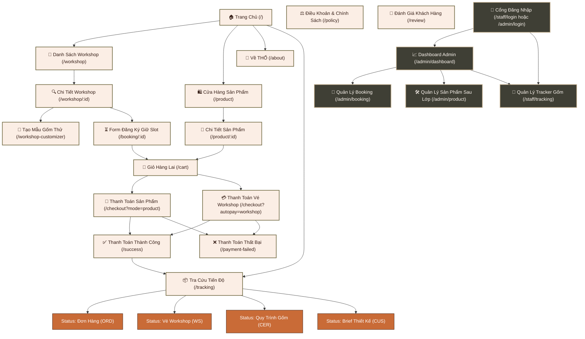

# THỔ Studio — Web Thương Mại & Booking Workshop Gốm

<p align="center">
  
</p>

> **THỔ Studio** là một giải pháp website toàn diện dành cho studio gốm thủ công nghệ thuật. Nền tảng kết hợp hài hòa giữa thương mại điện tử sản phẩm gốm mộc độc bản, hệ thống đặt lịch workshop trải nghiệm thực tế, trợ lý AI tư vấn cá nhân hóa và hệ thống quản trị vận hành nội bộ dành cho nhân viên (Staff/Admin).

---

## 1. Giới thiệu

**THỔ Studio** được phát triển nhằm mục đích số hóa và nâng cao trải nghiệm dịch vụ của một studio gốm thủ công. Tên gọi **"THỔ"** đại diện cho chất đất mộc mạc — khởi nguồn của mọi tác phẩm gốm nghệ thuật.

Hệ thống được thiết kế tỉ mỉ từ hệ thống nhận diện thương hiệu, Figma Design Tokens cho đến các tính năng tương tác thực tế như:
* 🛍️ **Cửa hàng trực tuyến** mua sắm sản phẩm gốm mộc, lọc theo bộ sưu tập và thanh toán QR tiện lợi.
* 🎨 **Hệ thống đặt lịch Workshop** trải nghiệm tự tay tạo hình, tráng men.
* 🤖 **AI Chatbot** hỏi về nhu cầu, phong cách và kinh nghiệm để đề xuất workshop phù hợp.
* 📦 **Ceramic Tracker** đột phá giúp khách hàng tra cứu trạng thái hoàn thiện sản phẩm của mình qua 7 giai đoạn sản xuất tại xưởng.

---

## 2. Phạm vi, mục tiêu

### 🎯 Mục tiêu dự án
* **Đối với Khách hàng**: Mang lại trải nghiệm đặt lịch và mua sắm mượt mà, trực quan. Giúp khách hàng dễ dàng theo dõi sản phẩm gốm tự làm của mình sau buổi học mà không cần liên hệ trực tiếp.
* **Đối với Studio**: Số hóa quy trình quản lý booking, check-in khách hàng, quản lý đơn hàng vật lý và cập nhật tiến độ sản xuất gốm sau workshop. Giảm thiểu sai sót do quản lý thủ công (Excel/sổ tay).
* **Định hướng Dữ liệu**: Khai thác dữ liệu phi cấu trúc thông qua hành vi tương tác và hội thoại chatbot để tự động hóa đề xuất (recommendation) sản phẩm/workshop phù hợp nhất.

### 🗺️ Phạm vi chức năng
* **Phân hệ Storefront (Khách hàng)**:
  * Trang chủ giới thiệu thương hiệu và quy trình gốm.
  * Danh sách & Chi tiết Sản phẩm (chọn biến thể, giỏ hàng).
  * Danh sách & Chi tiết Workshop (chọn ngày, giờ, kiểm tra số slot trống theo thời gian thực).
  * Trình cá nhân hóa Workshop (Workshop Customizer) cho phép chọn phôi gốm, màu men và kỹ thuật trước khi đến lớp.
  * Giỏ hàng lai (Hybrid Cart) tách biệt: Giỏ sản phẩm vật lý & Giỏ booking workshop.
  * Tra cứu tiến độ (Tracking Page) bằng mã đơn hàng, vé workshop, hoặc mã sản phẩm gốm (`THO-xxxx`).
  * AI Chatbot tư vấn workshop và ghi nhận thông tin khách hàng vào cơ sở dữ liệu.
* **Phân hệ Quản trị (Staff / Admin Dashboard)**:
  * Trang tổng quan hiển thị doanh thu, tổng số booking hôm nay, số sản phẩm cần kiểm tra chất lượng (QC) hoặc đang kẹt ở lò nung.
  * Quản lý Booking: Xác nhận, hủy hoặc check-in khách đến lớp.
  * Quản lý Ceramic Tracker: Cập nhật giai đoạn của sản phẩm (7 bước), tự động cập nhật timeline đồng bộ sang trang tra cứu của khách.
  * Quản lý Đơn hàng sản phẩm vật lý.

---

## 3. Công cụ & Công nghệ sử dụng

Dự án được xây dựng trên một ngăn xếp công nghệ hiện đại, đảm bảo tốc độ phản hồi nhanh và khả năng mở rộng tốt:

| Lớp | Công nghệ / Thư viện | Phiên bản | Mô tả |
|---|---|---|---|
| **Frontend** | React + TypeScript + Vite | 18.3 / 6.3 | Entry point & HMR cực nhanh |
| **Styling** | Tailwind CSS v4 + Custom CSS | 4.1.12 | Tối ưu hóa UI/UX, hỗ trợ biến token |
| **UI Components** | shadcn/ui, Radix UI, MUI | — | Bộ components chuẩn hóa, dễ tùy biến |
| **Animation** | Motion (Framer Motion v12) | 12.x | Hiệu ứng mượt mà, scroll reveal |
| **Routing** | React Router v7 | 7.13 | Điều hướng trang mượt mà không load lại |
| **Charts** | Recharts | 2.15 | Trực quan hóa dữ liệu trên Dashboard |
| **Backend** | FastAPI (Python) | 0.1.0 | RESTful API, tốc độ xử lý cao, auto-docs |
| **Cơ sở dữ liệu** | SQLite (local) | — | Thích hợp chạy local, tương thích PostgreSQL |
| **Container** | Docker + Docker Compose | — | Đóng gói môi trường chạy backend nhanh chóng |
| **Thiết kế** | Figma | — | Thiết kế chi tiết UI/UX, Wireframes & Prototypes |

---

## 4. Các nghiệp vụ chính ngắn gọn

### 🛒 Giỏ hàng lai & Thanh toán
Hệ thống xử lý thông minh bằng cách tách biệt **Giỏ hàng Sản phẩm** và **Giỏ hàng Workshop** tại trang checkout. Sản phẩm vật lý đi kèm quy trình giao hàng, trong khi vé workshop đi kèm quy trình đặt lịch giữ chỗ và check-in tại studio. Thanh toán được mô phỏng qua mã QR động kèm hiệu ứng confetti ăn mừng khi thành công.

### 🏺 Workshop Customizer
Khách hàng có thể cá nhân hóa trải nghiệm của mình trước khi lớp học bắt đầu bằng cách chọn loại đất sét, kỹ thuật tạo hình (bàn xoay hay nặn tay), màu men mong muốn và mô tả ý tưởng sản phẩm.

### 🤖 AI Chatbot tư vấn chuyên sâu
Chatbot nằm ở góc phải màn hình sẽ dẫn dắt người dùng qua các câu hỏi: phong cách yêu thích ➔ mức độ kinh nghiệm ➔ mục đích tham gia. Từ đó đề xuất workshop phù hợp và lưu ghi chú thiết kế trực tiếp vào thông tin booking để nghệ nhân đứng lớp chuẩn bị sẵn phôi gốm và nguyên liệu.

### 🔄 Ceramic Tracker (7 giai đoạn sản xuất)
Quy trình đặc thù của gốm sau khi tạo hình cần thời gian phơi, nung và tráng men. Hệ thống cung cấp timeline trực quan 7 bước để khách hàng tự tra cứu tiến độ sản phẩm của mình:
1. **Đã tạo hình** (Shaped)
2. **Đang phơi khô** (Drying)
3. **Nung sơ lần 1** (Bisque Firing)
4. **Tráng men** (Glazing)
5. **Nung hoàn thiện lần 2** (Glaze Firing)
6. **Kiểm tra chất lượng QC** (Quality Control)
7. **Sẵn sàng nhận / Giao hàng** (Ready / Shipping)

---

## 5. Cách xây dựng, Bảng màu, Site map

### 📁 Cấu trúc thư mục dự án
```
phatrienwebkinhdoanh/
├── src/                          # Mã nguồn Frontend (React + TS)
│   ├── main.tsx                  # Entry point React
│   ├── app/
│   │   ├── App.tsx               # Root Component, Router, Providers
│   │   ├── components/           # Các page & UI component cốt lõi
│   │   ├── contexts/             # React Context (State giỏ hàng)
│   │   └── lib/                  # Helpers & API client
│   └── styles/                   # CSS toàn cục & design tokens
├── backend/                      # Mã nguồn Backend (FastAPI + Python)
│   ├── app/                      # Routes, models, schemas, services
│   ├── tests/                    # Pytest test cases
│   └── requirements.txt          # Danh sách dependencies Python
├── db/                           # SQL schema và database SQLite local
└── doc/                          # Tài liệu thuyết minh & thiết kế UI/UX
```

### 🛠️ Cách xây dựng & Khởi chạy dự án

#### Chạy Frontend:
```bash
# 1. Cài đặt các thư viện phụ thuộc
npm install

# 2. Khởi chạy môi trường phát triển (http://localhost:5173)
npm run dev
```

#### Chạy Backend:
```bash
cd backend

# 1. Tạo và kích hoạt môi trường ảo Python
python -m venv .venv
.venv\Scripts\activate  # Trên Windows
# source .venv/bin/activate  # Trên macOS/Linux

# 2. Cài đặt các gói phụ thuộc
pip install -r requirements.txt

# 3. Tạo file cấu hình môi trường
copy .env.example .env

# 4. Chạy backend API server (http://localhost:8000)
uvicorn app.main:app --reload --host 0.0.0.0 --port 8000
```
*(Bạn cũng có thể chạy backend thông qua Docker bằng cách gõ lệnh `docker compose up --build` trong thư mục `backend`)*

---

### 🎨 Bảng màu chủ đạo (Color Palette)

Bảng màu của THỔ Studio được lấy cảm hứng từ chất liệu tự nhiên tại xưởng gốm: đất sét mộc, đất nung, men celadon và tro củi nung.

* 🟤 **Màu Nền Chính (Background)**: `#FBEEE5` (Tone màu be đất sét mềm ấm, mang lại cảm giác mộc mạc, thư thái, bảo vệ mắt).
* 🟫 **Màu Chữ Chính (Text Primary)**: `#361F17` (Nâu đất nung đậm, thay thế màu đen tuyền để giảm độ chói lóa trên nền kem).
* 🟢 **Màu Thương Hiệu Chủ Đạo (Primary)**: `#716942` (Màu vàng đất olive chín nung, dùng cho các nút CTA chính, tiêu đề phụ và trạng thái hoàn thành).
* 🟠 **Màu Nhấn Mạnh (Accent)**: `#C96B37` (Màu cam đất nung rực lửa, dùng cho các tag nổi bật như "Bán chạy", "Hot", hoặc các cảnh báo quan trọng).
* 🔘 **Màu Phụ Trợ (Muted)**: `#8B765D` / `#EFE2D6` (Dùng cho các đường kẻ border, nền khung phụ, chữ ghi chú).

---

### 🗺️ Sơ đồ phân cấp trang (Site Map)

Dưới đây là sơ đồ phân cấp thông tin và luồng di chuyển chính trên hệ thống THỔ Studio:



---

## 6. Thông tin thêm

### 📚 Tài liệu chi tiết dự án (Thư mục `/doc`)
Bạn có thể tham khảo các tài liệu thuyết minh chi tiết của đồ án tại các liên kết sau:
* 📄 [Báo Cáo Đồ Án Đầy Đủ (Chương 1–5)](file:///d:/UIUX/phatrienwebkinhdoanh/doc/BAO_CAO_THO_STUDIO.md) — Chi tiết về khảo sát thực trạng, đặc tả yêu cầu, thiết kế hệ thống và đánh giá.
* 🗺️ [Sitemap & Wireframe](file:///d:/UIUX/phatrienwebkinhdoanh/doc/01_sitemap_wireframe.md) — Sơ đồ luồng trang chi tiết và bố cục khung xương giao diện.
* 🎨 [Đặc Tả Figma Prototype UI](file:///d:/UIUX/phatrienwebkinhdoanh/doc/02_prototype_ui.md) — Chi tiết về Design Primitives, chuyển động micro-interactions.
* 🔄 [Case Study & BPMN](file:///d:/UIUX/phatrienwebkinhdoanh/doc/03_case_study.md) — Phân tích quy trình nghiệp vụ thực tế của workshop gốm.
* 👥 [Đặc Tả Chi Tiết Use Case](file:///d:/UIUX/phatrienwebkinhdoanh/doc/04_use_case_detail.md) — Kịch bản tương tác cụ thể của từng Actor (Khách hàng, Nhân viên, Nghệ nhân, Admin).

### 🔗 Liên kết & Thông tin hữu ích
* **Tài liệu hướng dẫn phát triển API**: `http://localhost:8000/docs` (Swagger UI sau khi đã khởi chạy backend).
* **Trang Token Figma**: `/figma-export` dùng để xuất mã màu CSS token sang Figma.

---
<p align="center">
  Được hoàn thiện với ❤️ dành riêng cho dự án <strong>THỔ Studio</strong> — Nơi đất sét tìm về nghệ thuật thủ công.
</p>
