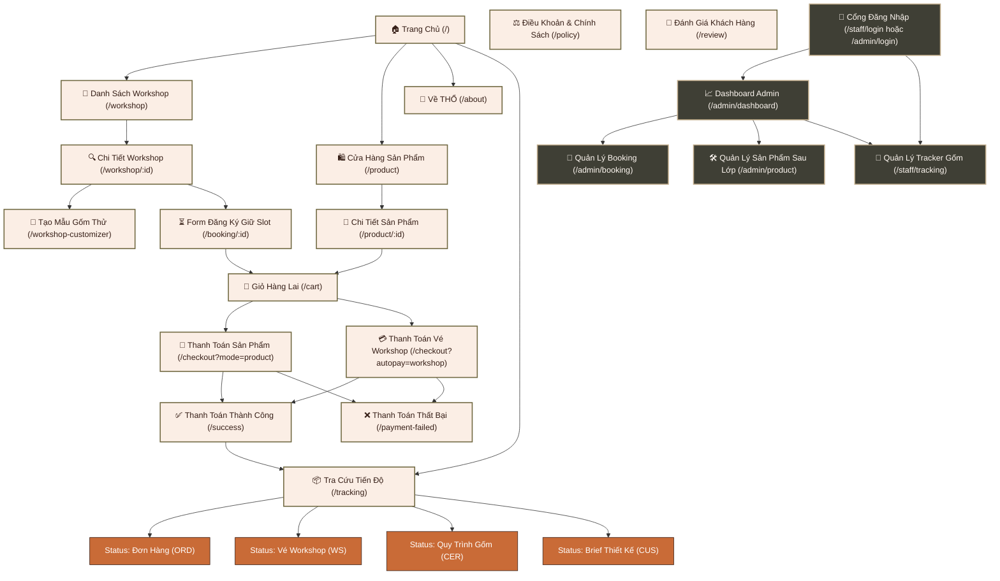

# Báo cáo Thiết kế: Sitemap & Wireframe - THỔ Studio

Tài liệu này phác thảo sơ đồ cấu trúc phân cấp thông tin (Sitemap) cùng bản phác thảo cấu trúc giao diện (Wireframe) cho toàn bộ hệ thống website của THỔ Studio bao gồm cả phân hệ cửa hàng (Storefront) dành cho khách hàng và phân hệ quản trị (Dashboard) dành cho nghệ nhân & admin.

---

## 1. Sơ đồ phân cấp trang web (Sitemap)

Sơ đồ phân cấp dưới đây thể hiện luồng di chuyển và liên kết giữa các trang chính trên hệ thống THỔ Studio:



---

## 2. Phác thảo cấu trúc các màn hình chính (Wireframe Layout)

Dưới đây là cấu trúc khung xương (Wireframes) của các màn hình cốt lõi nhằm định vị bố cục lưới, tỷ lệ hình ảnh và các điểm chạm tương tác (Call to Action - CTA).

### 2.1. Trang Chủ (Homepage)
* **Bố cục lưới**: 12 cột, căn giữa (`max-w-[1440px]`).
* **Đặc tả trải nghiệm**: Trải nghiệm điện ảnh ở khu vực Hero (chạy video nền nhẹ nhàng về nghệ nhân xoay gốm), chuyển tiếp mượt mà qua các phần kể chuyện thương hiệu (Storytelling) và hiển thị trực quan lộ trình lớp học của khách hàng.

```
+-----------------------------------------------------------------------------------+
|  [THỔ LOGO]      Workshop     Sản Phẩm     Về THỔ     Tra Cứu Tiến Độ    [Giỏ Hàng]   |
+-----------------------------------------------------------------------------------+
|                                                                                   |
|                                     HERO SECTION                                  |
|  +-----------------------------------------------------------------------------+  |
|  | [Video Nghệ Nhân Tạo Hình Gốm Nền - Opacity 62%]                            |  |
|  |                                                                             |  |
|  |   ⚡ TRẢI NGHIỆM GỐM THỦ CÔNG                                                |  |
|  |   THỔ STUDIO                                                                |  |
|  |   "Một lát cắt chậm của đất, nước, bàn tay và ký ức..."                     |  |
|  |                                                                             |  |
|  |   [ Khám phá workshop -> ]                                                  |  |
|  +-----------------------------------------------------------------------------+  |
|                                                                                   |
+-----------------------------------------------------------------------------------+
|                                                                                   |
|  ABOUT WORKSHOP (Grid 2 Cột)                                                      |
|  +---------------------------------------+  +----------------------------------+  |
|  | H2: Workshop tại THỔ                  |  | P: THỔ là không gian để bạn chạm |  |
|  |                                       |  | vào đất sét, thử tạo hình và tự  |  |
|  | [Ảnh 1: Bàn xoay]   [Ảnh 2: Vuốt gốm] |  | trang trí bình gốm cá nhân...    |  |
|  | [Ảnh 3: Vẽ men]     [Ảnh 4: Lên lò]   |  | [ Xem tất cả workshop -> ]       |  |
|  +---------------------------------------+  +----------------------------------+  |
|                                                                                   |
+-----------------------------------------------------------------------------------+
|                                                                                   |
|  HÀNH TRÌNH TRẢI NGHIỆM TẠI THỔ                                                   |
|  +-----------------------------------------------------------------------------+  |
|  | [Chọn Workshop] -> [Đặt lịch & Pay] -> [Tham Gia Lớp] -> [Theo Dõi Xưởng] -> [Nhận Gốm] |
|  +-----------------------------------------------------------------------------+  |
|                                                                                   |
+-----------------------------------------------------------------------------------+
|                                                                                   |
|  LỰA CHỌN TRẢI NGHIỆM WORKSHOP NỔI BẬT (3 Cột)                                     |
|  +--------------------+  +--------------------+  +--------------------+           |
|  | [Ảnh - Lớp Cơ Bản] |  | [Ảnh - Cặp Đôi]    |  | [Ảnh - Tô Men Rêu] |           |
|  | ⭐ Phù hợp người mới|  | 🔥 Đi cùng người iu|  | ⭐ Men màu hút khách|           |
|  | T7 - 03/06         |  | CN - 04/06         |  | T7 - 10/06         |           |
|  | Nặn Gốm Cơ Bản     |  | Tạc Gốm Đôi        |  | Men Sắc Celadon    |           |
|  | [Chi tiết] [Đặt]   |  | [Chi tiết] [Đặt]   |  | [Chi tiết] [Đặt]   |           |
|  +--------------------+  +--------------------+  +--------------------+           |
|                                                                                   |
+-----------------------------------------------------------------------------------+
|  [FOOTER: Bản quyền & Liên kết chính sách, liên hệ nhanh]                         |
+-----------------------------------------------------------------------------------+
```

---

### 2.2. Trang Chi Tiết Workshop (Workshop Detail Page)
* **Bố cục lưới**: Split 2 cột tỉ lệ `45% : 55%` trên Desktop, thu gọn về 1 cột trên Mobile.
* **Đặc tả trải nghiệm**: Nhấn mạnh sự cấp bách về số lượng chỗ trống còn lại (`slots available`), chính sách giữ chỗ minh bạch 15 phút ngăn chặn đầu cơ vé ảo, và tùy chọn liên kết thử nghiệm thiết kế mẫu gốm 3D trước khi đặt lịch.

```
+-----------------------------------------------------------------------------------+
|  [THỔ LOGO]      < Quay Lại Danh Sách Workshop                                     |
+-----------------------------------------------------------------------------------+
|                                                                                   |
|  +-----------------------------------+  +--------------------------------------+  |
|  |                                   |  | PHÙ HỢP CẶP ĐÔI / NGƯỜI MỚI          |  |
|  |                                   |  | H1: Workshop Tạc Gốm Đôi Yêu Thương  |  |
|  |                                   |  | P: Trải nghiệm vuốt gốm thủ công kết |  |
|  |                                   |  | hợp khắc chữ kỷ niệm cùng người yêu. |  |
|  |             ẢNH LỚN               |  |                                      |  |
|  |          SẢN PHẨM MẪU             |  | THÔNG TIN (Grid 2x2):                |  |
|  |         CỦA WORKSHOP              |  | +-----------------+----------------+ |  |
|  |      (Tỷ lệ 4:5 dọc mộc)          |  | | 📅 03/06/2026   | 🕒 18:30 - 21:00| |  |
|  |                                   |  | +-----------------+----------------+ |  |
|  |                                   |  | | 🎨 Anh Quân     | 👥 Còn 3/10 slot| |  |
|  |                                   |  | +-----------------+----------------+ |  |
|  |                                   |  |                                      |  |
|  |                                   |  | CHÍNH SÁCH GIỮ CHỖ                   |  |
|  |                                   |  | * Hệ thống tự động khóa slot giữ 15p |  |
|  |                                   |  | * Hủy thanh toán trả lại slot ngay   |  |
|  |                                   |  |                                      |  |
|  |                                   |  | ĐƠN GIÁ: 980,000đ                    |  |
|  |                                   |  | [ ĐẶT CHỖ VÀ THANH TOÁN (CTA Nổi) ]  |  |
|  |                                   |  | [ Tạo mẫu gốm thử 3D ]               |  |
|  +-----------------------------------+  +--------------------------------------+  |
|                                                                                   |
+-----------------------------------------------------------------------------------+
```

---

### 2.3. Giỏ Hàng Lai (Hybrid Cart Page)
* **Bố cục lưới**: Cột nội dung giỏ hàng bên trái (`70%`), sidebar tóm tắt và thực hiện thanh toán bên phải (`30%`).
* **Đặc tả trải nghiệm**: Tách biệt rõ ràng 2 danh mục có tính chất vận hành khác nhau: Vé Workshop (không có địa chỉ giao hàng vật lý, có thời hạn giữ slot 15 phút) và Sản phẩm vật lý (cần địa chỉ giao hàng). Hỗ trợ tùy chọn bọc quà tặng và tùy biến thông số gốm đặt làm theo yêu cầu (custom brief).

```
+-----------------------------------------------------------------------------------+
|  [THỔ LOGO]      Giỏ Hàng Của Bạn                             [Tiếp tục mua sắm]   |
+-----------------------------------------------------------------------------------+
|                                                                                   |
|  +---------------------------------------------+  +----------------------------+  |
|  | DANH MỤC VÉ WORKSHOP (Đặt chỗ giữ slot 15p)  |  | TÓM TẮT ĐƠN HÀNG           |  |
|  | ⏳ Giữ chỗ còn: 14:20 phút                   |  |                            |  |
|  | +-----------------------------------------+ |  | Workshop (2 vé):   980,000đ |  |
|  | | [Ảnh] Workshop Tạc Gốm Đôi              | |  | Sản phẩm (1 món):  350,000đ |  |
|  | | Ngày: 03/06/2026 | Giờ: 18:30           | |  |                            |  |
|  | | Số slot: [ - ]  2  [ + ]     980,000đ   | |  | -------------------------- |  |
|  | +-----------------------------------------+ |  | Tạm tính:        1,330,000đ |  |
|  |                                             |  |                            |  |
|  | DANH MỤC SẢN PHẨM VẬT LÝ (Giao tận nơi)      |  | [!] Đơn hàng chứa cả sản   |  |
|  | [ ] Chọn tất cả sản phẩm                    |  | phẩm và vé học. Hệ thống   |  |
|  | +-----------------------------------------+ |  | tách thành 2 luồng thanh   |  |
|  | | [x] [Ảnh] Bình Gốm Mộc Celadon          | |  | toán riêng để xử lý địa chỉ|  |
|  | | Quà tặng: Tân gia | Bọc quà: Có         | |  | giao hàng & giữ chỗ lò.    |  |
|  | | Số lượng: [ - ]  1  [ + ]    350,000đ   | |  |                            |  |
|  | +-----------------------------------------+ |  | [ THANH TOÁN SẢN PHẨM ]    |  |
|  | +-----------------------------------------+ |  | [ THANH TOÁN VÉ WORKSHOP ] |  |
|  | | [x] [Ảnh] Bình Hoa Custom Dáng Thuôn    | |  |                            |  |
|  | | Men ngọc rêu | Ký hiệu khắc: "An & Chi" | |  |                            |  |
|  | | Yêu cầu thêm: Làm cổ bình hẹp hơn       | |  |                            |  |
|  | | Trạng thái: Chờ nghệ nhân phản hồi      | |  |                            |  |
|  | +-----------------------------------------+ |  |                            |  |
|  +---------------------------------------------+  +----------------------------+  |
|                                                                                   |
+-----------------------------------------------------------------------------------+
```

---

### 2.4. Màn Hình Tracker Tiến Độ (Progress Tracker Page)
* **Bố cục lưới**: Khu vực nhập liệu nằm ở Header; khu vực kết quả hiển thị dạng cột dọc chia hai phân hệ (Lộ trình thời gian/Timeline ở bên trái và Thư viện hình ảnh/Media Moments bên phải).
* **Đặc tả trải nghiệm**: Cung cấp bằng chứng thực tế cho khách hàng bằng hình ảnh chụp trực tiếp sản phẩm tại xưởng tương ứng với từng giai đoạn sấy khô, nung sơ, tráng men. Cho phép tải xuống mini-vlog kỷ niệm hoặc chia sẻ nhanh lên MXH.

```
+-----------------------------------------------------------------------------------+
|  [THỔ LOGO]      MÃ TRA CỨU: [ CER-2026-0897               ]    [ TRA CỨU ]       |
+-----------------------------------------------------------------------------------+
|                                                                                   |
|  KẾT QUẢ TRA CỨU: SẢN PHẨM BÌNH GỐM MỘC CELADON                                   |
|  Mã: CER-2026-0897 | Trạng thái: Nung sơ | Phụ trách: Anh Quân                    |
|                                                                                   |
|  +------------------------------------------+  +-------------------------------+  |
|  | HÀNH TRÌNH TẠI XƯỞNG                     |  | WORKSHOP MOMENTS              |  |
|  |                                          |  |                               |  |
|  | (o) Đã tham gia workshop (03/06/2026)    |  | +--------------+------------+ |  |
|  |     Khách check-in và vuốt phôi đầu tiên |  | | [Ảnh Lớp]    | [Ảnh Phơi] | |  |
|  |                                          |  | | Tạo hình phôi| Đất se khô | |  |
|  | (o) Tạo hình hoàn tất (05/06/2026)       |  | +--------------+------------+ |  |
|  |     Đã gọt chân đế, khắc dấu mã xưởng     |  | | [Ảnh Lò Nung]| [Mẫu Men]  | |  |
|  |                                          |  | | Nhiệt độ lò  | Lên màu men| |  |
|  | (o) Phơi khô tự nhiên (07/06/2026)       |  | +--------------+------------+ |  |
|  |     Phơi gió ổn định độ ẩm trong xưởng   |  |                               |  |
|  |                                          |  | [🎥 Tải Xuống Mini Vlog Lớp]  |  |
|  | (•) Đang nung sơ (09/06/2026)            |  | [❤️ Lưu bộ sưu tập khoảnh khắc]|  |
|  |     Lò nung sơ chạy ở mức nhiệt 900°C    |  |                               |  |
|  |                                          |  | KHÁCH HÀNG PHẢN HỒI           |  |
|  | ( ) Tráng men (Chờ dự kiến 12/06)        |  | * Sản phẩm gặp sự cố nứt vỡ?  |  |
|  |     Phủ men Celadon theo yêu cầu         |  |   [ Gửi yêu cầu hỗ trợ ngay ] |  |
|  |                                          |  |                               |  |
|  | ( ) Sẵn sàng giao (Chờ dự kiến 15/06)     |  | * Viết cảm nhận sau buổi học  |  |
|  |     QC kiểm nghiệm bề mặt và đóng gói    |  |   [ Viết đánh giá chất lượng ]|  |
|  +------------------------------------------+  +-------------------------------+  |
|                                                                                   |
+-----------------------------------------------------------------------------------+
```

---

### 2.5. Dashboard Admin & Staff
* **Bố cục lưới**: Thanh Sidebar điều hướng bên trái; Vùng nội dung hiển thị số liệu phân tích và danh sách tác nghiệp bên phải.
* **Đặc tả trải nghiệm**: Cung cấp cái nhìn tổng quan về doanh thu và hoạt động vận hành của xưởng. Hiển thị thông báo ngay khi có đánh giá điểm thấp (<= 3 sao) để bộ phận chăm sóc khách hàng (CSKH) có thể xử lý lập tức. Hỗ trợ thao tác cập nhật quy trình sản xuất của xưởng và upload trực tiếp ảnh chụp cho khách hàng.

```
+-----------------------------------------------------------------------------------+
|  [THỔ WORKSPACE]  |  [📈 Dashboard]  [📅 Booking]  [🏺 Sản Phẩm]  [🔄 Lò Gốm]      |
+-----------------------------------------------------------------------------------+
|  TÌM KIẾM NHANH: [ Tìm mã đơn, tên khách...                       ]  0912.784.507 |
+-----------------------------------------------------------------------------------+
|                                                                                   |
|  KẾT QUẢ PHÂN TÍCH VẬN HÀNH & KINH DOANH                                          |
|  +------------------+  +------------------+  +------------------+  +------------+ |
|  | Khách Hôm Nay    |  | Doanh Thu Tuần   |  | Chờ Check-in     |  | Lỗi Nứt Lò | |
|  | 12 Khách         |  | 24.5M            |  | 5 Slot           |  | 2 Sản phẩm | |
|  +------------------+  +------------------+  +------------------+  +------------+ |
|                                                                                   |
|  🔔 KHẨN CẤP: YÊU CẦU PHẢN HỒI CSKH                                               |
|  +-----------------------------------------------------------------------------+ |
|  | [⚠️ RATING 2 SAO] Khách hàng: Lê Minh Anh - Đơn hàng: ORD-992               | |
|  | "Men ra lò không giống màu rêu đăng ký, bị loang vệt đen..."                | |
|  | [ Liên hệ xử lý đổi trả/bồi hoàn ]          [ Gửi mail giải thích ]        | |
|  +-----------------------------------------------------------------------------+ |
|                                                                                   |
|  PHÂN TÍCH PHÂN KHÚC VÀ YÊU CẦU KHÁCH HÀNG (Grid 3 Cột)                            |
|  +-------------------------+  +--------------------------+  +------------------+ |
|  | Địa chỉ khách (Quận)    |  | Sản phẩm theo phong cách  |  | Dịp tặng quà     | |
|  | * Quận 1: [=========] 8 |  | * Minimal: [===========] 9|  | * Tân gia: [====]| |
|  | * Quận 3: [======] 5    |  | * Wabi:    [========] 6   |  | * Sinh nhật: [==]| |
|  +-------------------------+  +--------------------------+  +------------------+ |
|                                                                                   |
|  TÁC VỤ LÒ GỐM (Staff Update)                                                     |
|  +-----------------------------------------------------------------------------+ |
|  | Mã Gốm       Khách Hàng    Mẫu Đăng Ký     Giai Đoạn Hiện Tại    QC     Tác Vụ  | |
|  | CER-9812     Minh Trí      Chén Trà Mộc    [ Nung sơ    ]        [OK]   [Upload]| |
|  | CER-9813     Hương Giang   Bình Hoa Rêu    [ Tráng men  ]        [Nứt]  [Đền lò]| |
|  +-----------------------------------------------------------------------------+ |
|                                                                                   |
+-----------------------------------------------------------------------------------+
```
