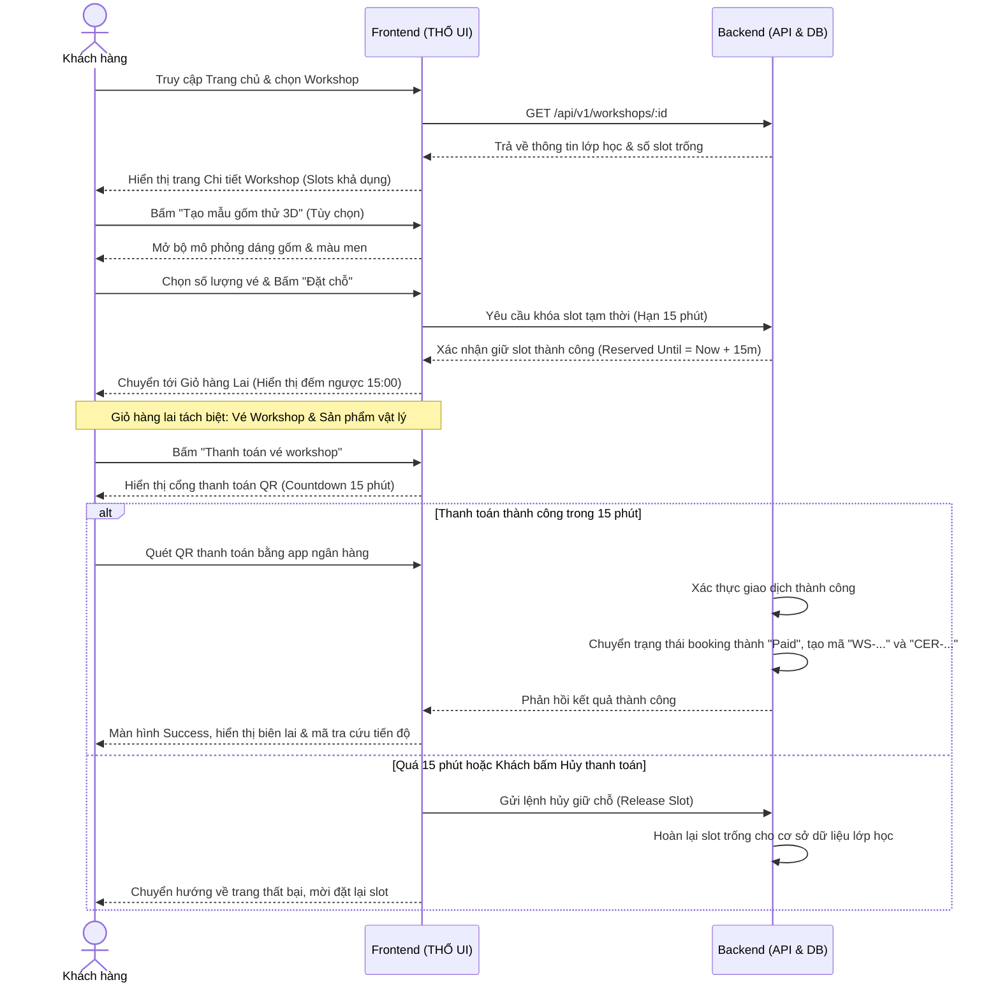
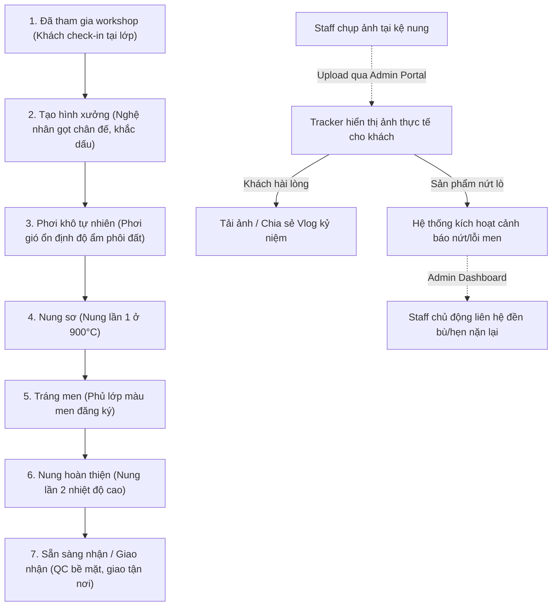

# Trình Bày Case Study: Luồng Trải Nghiệm Khách Hàng - THỔ Studio

Tài liệu này cung cấp danh sách bản đồ hình ảnh trích xuất từ Figma (Figma Captures) cùng kịch bản chi tiết cho 2 luồng trải nghiệm cốt lõi của website THỔ Studio: **Luồng Mua sắm/Booking** và **Luồng Theo dõi quy trình hoàn thiện gốm (Progress Tracking)**. Khách hàng có thể sao chép trực tiếp nội dung này để đưa vào báo cáo slide hoặc tài liệu thuyết trình dự án.

---

## 1. Bản Đồ Trích Xuất Hình Ảnh Thiết Kế (Figma Captures Map)

Các ảnh chụp thiết kế được phân loại theo kích thước thiết bị để chứng minh tính đáp ứng thiết kế (Responsive Web Design).

| Màn Hình UI | Phiên Bản Desktop (1440px) | Phiên Bản Tablet (768px) | Phiên Bản Mobile (375px) | Mô Tả Ý Tưởng Thiết Kế |
| :--- | :--- | :--- | :--- | :--- |
| **Trang Chủ (Home)** | [desktop-home.png](file:///d:/UIUX/phatrienwebkinhdoanh/figma-captures/desktop-home.png) | [tablet-home.png](file:///d:/UIUX/phatrienwebkinhdoanh/figma-captures/tablet-home.png) | [mobile-home.png](file:///d:/UIUX/phatrienwebkinhdoanh/figma-captures/mobile-home.png) | Hero video nền chạy mượt, bố cục lưới kể câu chuyện mộc mạc của đất sét. |
| **Danh Sách Workshop** | [desktop-workshop.png](file:///d:/UIUX/phatrienwebkinhdoanh/figma-captures/desktop-workshop.png) | [tablet-workshop.png](file:///d:/UIUX/phatrienwebkinhdoanh/figma-captures/tablet-workshop.png) | [mobile-workshop.png](file:///d:/UIUX/phatrienwebkinhdoanh/figma-captures/mobile-workshop.png) | Bộ lọc nâng cao (kiểu thanh trượt du lịch, phân loại nhóm khách hàng cặp đôi/gia đình). |
| **Chi Tiết Workshop** | [desktop-workshop-detail.png](file:///d:/UIUX/phatrienwebkinhdoanh/figma-captures/desktop-workshop-detail.png) | [tablet-workshop-detail.png](file:///d:/UIUX/phatrienwebkinhdoanh/figma-captures/tablet-workshop-detail.png) | [mobile-workshop-detail.png](file:///d:/UIUX/phatrienwebkinhdoanh/figma-captures/mobile-workshop-detail.png) | Chi tiết về giảng viên, lịch trình và cảnh báo giới hạn giữ slot trong 15 phút. |
| **Giỏ Hàng Lai (Cart)** | [desktop-cart.png](file:///d:/UIUX/phatrienwebkinhdoanh/figma-captures/desktop-cart.png) | [tablet-cart.png](file:///d:/UIUX/phatrienwebkinhdoanh/figma-captures/tablet-cart.png) | [mobile-cart.png](file:///d:/UIUX/phatrienwebkinhdoanh/figma-captures/mobile-cart.png) | Phân tách giỏ hàng thành 2 khu vực: Vé Workshop giữ slot đếm ngược và Sản phẩm vật lý. |
| **Thanh Toán (Checkout)** | [desktop-booking.png](file:///d:/UIUX/phatrienwebkinhdoanh/figma-captures/desktop-booking.png) | [tablet-booking.png](file:///d:/UIUX/phatrienwebkinhdoanh/figma-captures/tablet-booking.png) | [mobile-booking.png](file:///d:/UIUX/phatrienwebkinhdoanh/figma-captures/mobile-booking.png) | Form nhập thông tin nhanh chóng, cổng hiển thị mã QR thanh toán có countdown 15 phút. |
| **Kết Quả Thanh Toán** | [desktop-success.png](file:///d:/UIUX/phatrienwebkinhdoanh/figma-captures/desktop-success.png) | [tablet-success.png](file:///d:/UIUX/phatrienwebkinhdoanh/figma-captures/tablet-success.png) | [mobile-success.png](file:///d:/UIUX/phatrienwebkinhdoanh/figma-captures/mobile-success.png) | Hiển thị mã hóa đơn kèm mã tra cứu tiến độ tự động kích hoạt. |
| **Tracker Tiến Độ** | [desktop-tracking.png](file:///d:/UIUX/phatrienwebkinhdoanh/figma-captures/desktop-tracking.png) | [tablet-tracking.png](file:///d:/UIUX/phatrienwebkinhdoanh/figma-captures/tablet-tracking.png) | [mobile-tracking.png](file:///d:/UIUX/phatrienwebkinhdoanh/figma-captures/mobile-tracking.png) | Tra cứu timeline 7 giai đoạn lò nung kèm ảnh chụp thực tế tại xưởng và mini-vlog lớp học. |
| **Đánh Giá (Review)** | [desktop-review.png](file:///d:/UIUX/phatrienwebkinhdoanh/figma-captures/desktop-review.png) | [tablet-review.png](file:///d:/UIUX/phatrienwebkinhdoanh/figma-captures/tablet-review.png) | [mobile-review.png](file:///d:/UIUX/phatrienwebkinhdoanh/figma-captures/mobile-review.png) | Khu vực viết cảm nhận thực tế sau khi nhận sản phẩm hoặc kết thúc buổi học gốm. |

---

## 2. Kịch Bản Luồng Mua Sắm / Đặt Chỗ (Shopping & Booking Flow)

Kịch bản mô tả hành trình từ khi người dùng truy cập trang chủ, lựa chọn sản phẩm/workshop, tương tác tùy biến, quản lý giỏ hàng lai và hoàn tất đặt chỗ trong thời gian khóa slot 15 phút.

### Sơ đồ luồng (Flowchart)

### Kịch Bản Tương Tác Chi Tiết (User Story Script)
1. **Bước 1: Tiếp Cận Lớp Học**
   * Khách hàng lướt xem danh sách các gói workshop trên trang chủ. Bị thu hút bởi lớp "Tạc Gốm Đôi Yêu Thương".
   * Khách hàng bấm xem chi tiết, hệ thống kiểm tra và báo còn `3/10` slot. Có một dòng cảnh báo rõ ràng về việc slot chỉ được giữ tạm 15 phút để đảm bảo quyền lợi cho những người khác.
2. **Bước 2: Cá Nhân Hóa Ý Tưởng**
   * Trước khi đặt chỗ, khách hàng mở trình Customizer 3D để xoay thử dáng bình hoa mộc, quét lớp men sắc ngọc bích lên thử để hình dung thành phẩm tương lai. Khách hàng cảm thấy ưng ý và lưu cấu hình thiết kế này.
3. **Bước 3: Đặt Giữ Slot & Quản Lý Giỏ Hàng Lai**
   * Khách hàng tăng số lượng lên 2 slot và bấm đặt vé. Hệ thống gửi yêu cầu khóa 2 slot này lên cơ sở dữ liệu và bắt đầu chạy đồng hồ đếm ngược 15:00 phút ở đầu giỏ hàng.
   * Tại Giỏ hàng lai, ngoài 2 vé workshop đang đếm ngược, khách hàng có thêm 1 chiếc cốc đất nung có sẵn trong giỏ. Khách hàng thấy ghi chú: *Do tính chất giao nhận vật lý khác biệt, hệ thống đề xuất tách thanh toán. Khách hàng thực hiện thanh toán vé trước để giữ slot xưởng nung, sản phẩm vật lý sẽ điền địa chỉ giao nhận ở luồng tiếp theo.*
4. **Bước 4: Thanh Toán QR Tác Vụ Động**
   * Khách bấm thanh toán vé workshop, màn hình Checkout hiện mã QR chuyển khoản chứa số tiền động chính xác kèm nội dung chuyển khoản tự động. Đồng hồ đếm ngược báo còn `14:20`.
   * Khách quét QR trên điện thoại. Giao dịch thành công, màn hình tự động chuyển sang trang **Payment Success**. Khách hàng nhận được mã hóa đơn `WS052826` và mã theo dõi gốm nung xưởng `CER-2026-0897`.

---

## 3. Kịch Bản Luồng Theo Dõi Quy Trình Gốm (Kiln Progress Tracking Flow)

Đặc tả quy trình 7 giai đoạn vật lý biến đất sét ẩm thành bình gốm bóng bẩy, đi kèm kịch bản theo dõi bằng chứng trực quan cho khách hàng qua trang Progress Tracker.

### Sơ đồ luồng (Flowchart)

### Kịch Bản Theo Dõi Chi Tiết (User Story Script)
1. **Bước 1: Tra Cứu Mã Quy Trình**
   * 3 ngày sau buổi học, khách hàng tò mò không biết sản phẩm của mình hiện ra sao. Khách truy cập trang **Tra Cứu Tiến Độ** và nhập mã `CER-2026-0897`.
   * Hệ thống tự động nhận diện mã và đưa ra giao diện quy trình 7 giai đoạn chuyên sâu của xưởng gốm THỔ.
2. **Bước 2: Kiểm Chứng Bằng Chứng Trực Quan**
   * Màn hình hiển thị giai đoạn hiện tại là **Nung Sơ**. Khách hàng nhìn thấy rõ:
     * Tên nhân viên phụ trách lò nung sơ: *Anh Quân*.
     * Ghi chú từ xưởng: *Lò nung sơ đang chạy ở mức nhiệt 900°C, bề mặt phôi đất ổn định.*
     * **Ảnh chụp thực tế**: Một bức ảnh chụp phôi đất của khách hàng xếp gọn gàng trong lò nung điện kế bên ảnh chụp của những người học cùng buổi. Khách hàng cảm thấy an tâm vì sản phẩm của mình đang được chăm sóc cẩn thận.
3. **Bước 3: Tương Tác Kỷ Niệm**
   * Khách hàng nhìn thấy mục **Workshop Moments** tổng hợp các ảnh chụp lúc mình đang tập trung vuốt gốm và cười tươi do nhân viên chụp lưu niệm. Khách bấm nút "Lưu khoảnh khắc" để tải ảnh chất lượng cao về điện thoại.
   * Khách hàng tải đoạn **Mini-vlog lớp học** dài 15 giây tự động ghép nhạc mộc mạc và chia sẻ lên tin tức (Story) cá nhân để khoe với bạn bè.
4. **Bước 4: Xử Lý Rủi Ro Vận Hành (QC Exception)**
   * *Giả lập trường hợp rủi ro*: Đến ngày thứ 5 (Giai đoạn Nung Hoàn Thiện), sản phẩm n nứt do bọt khí trong đất nặn không kỹ.
   * Nhân viên xưởng cập nhật trạng thái QC trên Dashboard Admin là `cracked` (Nứt).
   * Màn hình Tracker của khách hàng lập tức chuyển sang trạng thái cảnh báo nhẹ nhàng kèm thông tin: *THỔ rất tiếc vì sản phẩm gặp sự cố nứt lò ngoài ý muốn. Nghệ nhân đang chuẩn bị lại phôi đất mới để tạc đền cho bạn hoặc hẹn bạn một buổi trải nghiệm bù hoàn toàn miễn phí.* Đồng thời, thông báo CSKH khẩn cấp hiển thị trên Dashboard của Admin để nhân viên gọi điện trực tiếp xin lỗi khách hàng trong vòng 2 giờ.
5. **Bước 5: Hoàn Tất Bàn Giao & Review**
   * Sản phẩm đạt chuẩn QC, đóng gói đẹp đẽ và gửi qua đơn vị vận chuyển đến nhà khách.
   * Khi shipper cập nhật đã giao thành công, nút **"Viết cảm nhận về workshop"** trên trang Tracker sẽ sáng lên. Khách bấm vào để đánh giá sao và gửi phản hồi trải nghiệm thực tế về lớp học.
