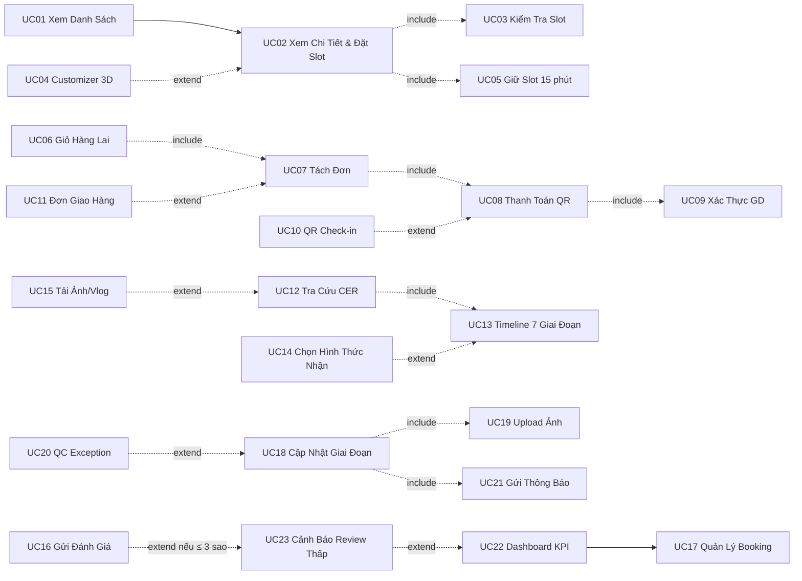

# Đặc Tả Use Case Chi Tiết — THỔ Studio

> **Dự án**: THỔ Studio — Ceramic Commerce & Workshop Platform  
> **Phiên bản tài liệu**: 2.1  
> **Ngày cập nhật**: 09/06/2026  
> **Liên kết Diagram**: [Webkinhdoanh-USE CASE.drawio.xml](file:///d:/UIUX/phatrienwebkinhdoanh/doc/Webkinhdoanh-USE%20CASE.drawio.xml)

---

## 1. Tổng Quan Actor

| Actor | Loại | Mô Tả |
|:---|:---|:---|
| **Khách Hàng** | Primary | Người dùng cuối truy cập web, xem/đặt workshop, mua sản phẩm và tra cứu tiến độ gốm |
| **Studio Admin** | Primary | Quản lý booking, xem dashboard KPI, xử lý khủng hoảng review thấp, cài slot |
| **Nghệ Nhân / Staff** | Primary | Cập nhật giai đoạn sản xuất gốm, upload ảnh tại xưởng, xử lý lỗi lò |
| **Payment Gateway** | Secondary | Hệ thống bên thứ ba xác thực giao dịch chuyển khoản QR |
| **Đơn Vị Vận Chuyển** | Secondary | Đối tác logistics nhận đơn giao hàng vật lý từ hệ thống |

---

## 2. Bảng Tổng Quan Use Case (24 UC)

> **Lưu ý v2.1**: Bỏ Giỏ Hàng Lai. Workshop có luồng riêng (đặt → xác nhận thông tin → thanh toán). Sản phẩm vật lý có luồng riêng (giỏ hàng → checkout → logistics).

| Mã UC | Tên Use Case | Actor Chính | Nhóm | Loại |
|:---|:---|:---|:---|:---|
| **UC01** | Xem Danh Sách Workshop | Khách Hàng | 📅 Booking | Chính |
| **UC02** | Xem Chi Tiết Workshop & Đặt Slot | Khách Hàng | 📅 Booking | Chính |
| **UC03** | Kiểm Tra Slot Khả Dụng | Hệ thống | 📅 Booking | include |
| **UC04** | Tạo Mẫu Gốm 3D Customizer | Khách Hàng | 📅 Booking | extend |
| **UC05** | Giữ Slot Tạm 15 Phút | Hệ thống | 📅 Booking | include |
| **UC06** | Xác Nhận Thông Tin & Chọn Thanh Toán Workshop | Khách Hàng | 💳 Workshop Checkout | Chính |
| **UC07** | Thanh Toán Workshop QR | Khách Hàng | 💳 Workshop Checkout | include |
| **UC08** | Tạo Mã QR Check-in Workshop | Hệ thống | 💳 Workshop Checkout | include |
| **UC09** | Xác Thực Giao Dịch (Payment Gateway) | Payment Gateway | 💳 Workshop Checkout | include |
| **UC10** | Quản Lý Giỏ Hàng Sản Phẩm Vật Lý | Khách Hàng | 🛒 Product Checkout | Chính |
| **UC11** | Thanh Toán Sản Phẩm QR | Khách Hàng | 🛒 Product Checkout | Chính |
| **UC12** | Tạo Đơn Giao Hàng Vật Lý | Đơn Vị Vận Chuyển | 🛒 Product Checkout | include |
| **UC13** | Tra Cứu Tiến Độ Gốm (CER) | Khách Hàng | 📦 Tracking | Chính |
| **UC14** | Xem Timeline 7 Giai Đoạn Lò | Hệ thống | 📦 Tracking | include |
| **UC15** | Chọn Nhận Tại Xưởng / Giao Về Nhà | Khách Hàng | 📦 Tracking | extend |
| **UC16** | Tải Ảnh / Mini-Vlog Kỷ Niệm | Khách Hàng | 📦 Tracking | extend |
| **UC17** | Gửi Đánh Giá Workshop / Sản Phẩm | Khách Hàng | 📦 Tracking | Chính |
| **UC18** | Quản Lý Booking & Slot | Studio Admin | 🔑 Admin | Chính |
| **UC19** | Cập Nhật Giai Đoạn Lò Gốm | Nghệ Nhân / Staff | 🔑 Admin | Chính |
| **UC20** | Upload Ảnh Thực Tế Xưởng Nung | Nghệ Nhân / Staff | 🔑 Admin | include |
| **UC21** | Xử Lý Ngoại Lệ Nứt Lò (QC Exception) | Nghệ Nhân / Staff | 🔑 Admin | extend |
| **UC22** | Gửi Thông Báo Giai Đoạn Cho Khách | Hệ thống | 🔑 Admin | include |
| **UC23** | Xem Dashboard & Phân Tích KPI | Studio Admin | 🔑 Admin | Chính |
| **UC24** | Cảnh Báo Đánh Giá Thấp (dưới 3 sao) | Hệ thống | 🔑 Admin | extend |

---

## 3. Đặc Tả Use Case Chi Tiết (Fully Dressed)

---

### UC02 — Xem Chi Tiết Workshop & Thanh Toán Ngay

| Trường | Nội dung |
|:---|:---|
| **Mã UC** | UC02 |
| **Tên** | Xem Chi Tiết Workshop & Thanh Toán Ngay |
| **Actor Chính** | Khách Hàng |
| **Actor Phụ** | Hệ thống (slot lock) |
| **Mức độ** | User Goal |

**Mô tả ngắn:** Khách xem thông tin workshop, điền thông tin người đặt ngay trên trang chi tiết và bấm **"Thanh toán ngay"**. Hệ thống ngầm khóa slot 15 phút và chuyển thẳng đến màn hình xác nhận phương thức thanh toán (UC06). Không có bước "giữ chỗ" riêng.

**Tiền điều kiện:**
- Khách đang ở trang Danh Sách Workshop.
- Workshop được chọn còn ít nhất 1 slot trống.

**Hậu điều kiện — Thành công:** Slot được khóa ngầm 15 phút, khách chuyển sang UC06 với thông tin đã nhập được giữ nguyên.

**Hậu điều kiện — Thất bại:** Slot đã hết khi bấm nút, thông báo lỗi hiển thị ngay trên trang.

**Luồng Chính:**

| Bước | Actor | Hành động |
|:---|:---|:---|
| 1 | Khách Hàng | Bấm vào thẻ workshop từ danh sách |
| 2 | Hệ thống | (include) UC03 — Kiểm tra slot khả dụng, hiển thị số ghế còn lại real-time |
| 3 | Hệ thống | Hiển thị trang Chi Tiết: ảnh, ngày/giờ/nghệ nhân/slot, giá |
| 4 | Khách Hàng | (Tùy chọn) Bấm "Tạo mẫu gốm thử 3D" — (extend) UC04 |
| 5 | Khách Hàng | Điền thông tin người đặt trực tiếp trên trang: họ tên, SĐT, số lượng vé, ghi chú (tùy chọn) |
| 6 | Khách Hàng | Bấm **"Thanh toán ngay"** |
| 7 | Hệ thống | (include) UC05 — Ngầm khóa slot (reserved_until = now + 15 phút) |
| 8 | Hệ thống | Chuyển màn hình sang UC06, mang theo toàn bộ thông tin khách vừa nhập |

**Luồng Thay Thế:**

| Nhánh | Điều kiện | Xử lý |
|:---|:---|:---|
| A1 | Bước 2 hoặc 7: Slot hết khi bấm nút | Hiển thị thông báo inline trên trang "Rất tiếc — slot vừa được lấy hết", đề xuất buổi tương tự |
| A2 | Bước 7: Lỗi API khóa slot | Toast lỗi, nút "Thử lại" giữ nguyên form đã điền |

**Ghi chú UX:**
- Số slot ≤ 3 hiển thị màu đỏ cam (`#C96B37`) tạo urgency tự nhiên.
- Form nhập thông tin nằm ngay trên trang chi tiết (không mở popup riêng) — họ tên + SĐT tự điền sẵn nếu đã đăng nhập.
- Nút **"Thanh toán ngay"** là CTA duy nhất, thay thế hoàn toàn flow cũ "Giữ chỗ 15p" → "Đặt chỗ" 2 bước.

---

### UC06 — Xác Nhận Phương Thức Thanh Toán Workshop

| Trường | Nội dung |
|:---|:---|
| **Mã UC** | UC06 |
| **Tên** | Xác Nhận Phương Thức Thanh Toán Workshop |
| **Actor Chính** | Khách Hàng |
| **Actor Phụ** | Payment Gateway (MoMo / VNPay), Hệ thống |
| **Mức độ** | User Goal |

**Mô tả ngắn:** Sau khi khách bấm "Thanh toán ngay" ở trang chi tiết, hệ thống chuyển sang màn hình 2 bước:
- **Bước A — Xác nhận & Chọn phương thức**: Thông tin đặt chỗ được điền sẵn từ bước trước (pre-fill), khách chọn MoMo hoặc VNPay. Có nút **Back** để quay lại trang chi tiết chỉnh sửa.
- **Bước B — Quét QR**: Hiển thị mã QR theo đúng phương thức đã chọn. Có nút **Back** để quay về chọn lại phương thức.

**Tiền điều kiện:**
- Slot đã được khóa ngầm 15 phút (UC05 từ UC02).
- Hệ thống nhận được thông tin người đặt từ UC02.

**Hậu điều kiện — Thành công:** Booking PAID, sinh mã `WS-...` và `CER-...`, khách được chuyển đến màn hình Success.

**Hậu điều kiện — Thất bại:** Countdown hết 15 phút hoặc giao dịch lỗi — slot được giải phóng, khách được mời đặt lại.

**Luồng Chính:**

| Bước | Actor | Hành động |
|:---|:---|:---|
| 1 | Hệ thống | **[Màn hình A]** Hiển thị tóm tắt đặt chỗ: tên workshop, ngày/giờ, số slot, tổng tiền, countdown 15:00 |
| 2 | Hệ thống | Điền sẵn thông tin người đặt từ bước UC02 (họ tên, SĐT, ghi chú) — khách có thể chỉnh trực tiếp |
| 3 | Khách Hàng | Chọn phương thức thanh toán: **MoMo** hoặc **VNPay** |
| 4 | Khách Hàng | Bấm **"Tiến hành thanh toán"** |
| 5 | Hệ thống | **[Màn hình B]** Sinh QR động theo đúng phương thức đã chọn (MoMo deeplink QR hoặc VNPay QR). Hiển thị countdown còn lại |
| 6 | Khách Hàng | Mở app MoMo / VNPay, quét QR và xác nhận thanh toán |
| 7 | Payment Gateway | (include) UC09 — Xác thực giao dịch, gửi webhook thành công |
| 8 | Hệ thống | Cập nhật booking → PAID |
| 9 | Hệ thống | (include) UC08 — Tạo mã QR Check-in điện tử |
| 10 | Hệ thống | Chuyển đến màn hình **Payment Success** với biên lai `WS-...` và mã tra cứu `CER-...` |

**Luồng Thay Thế:**

| Nhánh | Điều kiện | Xử lý |
|:---|:---|:---|
| A1 | Màn hình A: Khách bấm **Back** | Quay lại trang Chi Tiết Workshop (UC02), form nhập thông tin được khôi phục đầy đủ |
| A2 | Màn hình B: Khách bấm **Back** | Quay lại Màn hình A để chọn lại phương thức (MoMo ↔ VNPay), countdown tiếp tục chạy |
| A3 | Countdown hết 15 phút | Hủy slot, toast cảnh báo, nút "Đặt lại" dẫn về trang Chi Tiết Workshop |
| A4 | Webhook lỗi / timeout | Retry tối đa 3 lần, badge "Đang xác thực..." — không chuyển trang |
| A5 | Giao dịch thất bại | Thông báo lỗi + giải thích lý do, giải phóng slot |

**Ghi chú UX:**
- **Màn hình A**: Layout 2 cột — bên trái tóm tắt booking (readonly) + countdown, bên phải form chỉnh thông tin + 2 nút chọn phương thức (MoMo logo / VNPay logo) dạng card chọn được.
- **Màn hình B**: QR chiếm 70% màn hình, logo ngân hàng/ví nhỏ ở góc. Nút **"← Chọn lại phương thức"** ở trên cùng rõ ràng. Countdown MM:SS nhấp nháy đỏ khi < 3 phút.
- Auto-polling webhook mỗi 3 giây → tự chuyển Success mà không cần khách bấm nút.
- Không dùng popup/dialog — toàn bộ flow là điều hướng full-screen để tránh mất countdown context.

---

### UC10 — Quản Lý Giỏ Hàng Sản Phẩm Vật Lý

| Trường | Nội dung |
|:---|:---|
| **Mã UC** | UC10 |
| **Tên** | Quản Lý Giỏ Hàng Sản Phẩm Vật Lý |
| **Actor Chính** | Khách Hàng |
| **Actor Phụ** | Đơn Vị Vận Chuyển, Hệ thống |
| **Mức độ** | User Goal |

**Mô tả ngắn:** Khách thêm sản phẩm gốm bán sẵn vào giỏ hàng, điền địa chỉ giao hàng, chọn đơn vị vận chuyển, hoàn tất thanh toán. Hệ thống tạo đơn giao hàng và gửi cho logistics partner.

**Tiền điều kiện:**
- Khách đã bấm "Thêm vào giỏ" từ trang chi tiết sản phẩm.
- Ít nhất 1 sản phẩm vật lý trong giỏ hàng.

**Hậu điều kiện — Thành công:** Đơn hàng PAID, mã `ORD-...` được tạo, thông tin giao hàng được gửi đến đơn vị vận chuyển (UC12).

**Hậu điều kiện — Thất bại:** Giao dịch lỗi, đơn hàng không được tạo.

**Luồng Chính:**

| Bước | Actor | Hành động |
|:---|:---|:---|
| 1 | Khách Hàng | Xem giỏ hàng, kiểm tra sản phẩm (tên, số lượng, giá) |
| 2 | Khách Hàng | Nhập địa chỉ giao hàng và chọn đơn vị vận chuyển |
| 3 | Hệ thống | Tính phí ship và hiển thị tổng đơn hàng cuối cùng |
| 4 | Khách Hàng | Bấm **"Thanh Toán"**, hệ thống sinh QR động |
| 5 | Khách Hàng | Quét QR, xác nhận chuyển khoản qua app ngân hàng |
| 6 | Payment Gateway | Xác thực giao dịch, gửi webhook thành công |
| 7 | Hệ thống | Cập nhật đơn hàng → PAID, sinh mã `ORD-...` |
| 8 | Hệ thống | (include) UC12 — Tạo và gửi đơn giao hàng cho đơn vị logistics |
| 9 | Hệ thống | Chuyển đến màn hình **Payment Success** với biên lai và link theo dõi giao hàng |

**Luồng Thay Thế:**

| Nhánh | Điều kiện | Xử lý |
|:---|:---|:---|
| A1 | Sản phẩm hết hàng khi checkout | Thông báo hết hàng, đề xuất sản phẩm tương tự |
| A2 | Giao dịch thất bại | Thông báo lỗi, giữ nguyên giỏ hàng để thử lại |
| A3 | Địa chỉ ngoài vùng ship | Thông báo khu vực chưa hỗ trợ, gợi ý nhận tại xưởng |

**Ghi chú UX:** Không có countdown — sản phẩm vật lý không bị giới hạn thời gian thanh toán. Phí ship tính tự động theo địa chỉ (không để khách tự nhập). Hỗ trợ ghi chú gói quà, thiệp mừng.

---

### UC12 — Tra Cứu Tiến Độ Gốm

| Trường | Nội dung |
|:---|:---|
| **Mã UC** | UC12 |
| **Tên** | Tra Cứu Tiến Độ Gốm (CER) |
| **Actor Chính** | Khách Hàng |
| **Mức độ** | User Goal |

**Mô tả ngắn:** Khách nhập mã CER, hệ thống nhận dạng và hiển thị timeline 7 giai đoạn lò nung kèm ảnh thực tế và vlog kỷ niệm.

**Tiền điều kiện:** Khách đã có mã CER được cấp sau thanh toán vé workshop.

**Hậu điều kiện — Thành công:** Timeline giai đoạn hiển thị đúng, ảnh xưởng đồng bộ. Nếu hoàn tất: nút viết đánh giá và tùy chọn chọn hình thức nhận được kích hoạt.

**Luồng Chính:**

| Bước | Actor | Hành động |
|:---|:---|:---|
| 1 | Khách Hàng | Truy cập /tracking, nhập mã CER-2026-0897 |
| 2 | Hệ thống | Nhận dạng tiền tố CER-, gọi API lấy dữ liệu quy trình |
| 3 | Hệ thống | (include) UC13 — Render Timeline 7 giai đoạn kèm tên nhân viên phụ trách |
| 4 | Hệ thống | Hiển thị thư viện ảnh thực tế và mini-vlog lớp học |
| 5 | Khách Hàng | (Tùy chọn) Bấm "Tải ảnh / Vlog" — (extend) UC15 |
| 6 | Khách Hàng | (Tùy chọn, khi giai đoạn 7 hoàn tất) Chọn hình thức nhận — (extend) UC14 |
| 7 | Hệ thống | Sau khi giao hàng: kích hoạt nút "Viết đánh giá" — dẫn đến UC16 |

**Luồng Thay Thế:**

| Nhánh | Điều kiện | Xử lý |
|:---|:---|:---|
| A1 | Mã WS- | Hiển thị vé điện tử và mã QR check-in tại lớp |
| A2 | Mã ORD- | Hiển thị trạng thái đơn hàng và thông tin shipper |
| A3 | Mã CUS- | Hiển thị brief custom và báo giá nghệ nhân |
| A4 | Mã không tồn tại | Thông báo "Không tìm thấy mã", gợi ý kiểm tra email xác nhận |

**Ghi chú UX:** Ô nhập mã có placeholder gợi ý các tiền tố. Trạng thái QC Exception hiển thị nhẹ nhàng, không gây hoảng sợ, kèm phương án đền bù ngay trong thông báo.

---

### UC18 — Cập Nhật Giai Đoạn Lò Gốm (Staff)

| Trường | Nội dung |
|:---|:---|
| **Mã UC** | UC18 |
| **Tên** | Cập Nhật Giai Đoạn Lò Gốm |
| **Actor Chính** | Nghệ Nhân / Staff |
| **Mức độ** | Staff Goal |

**Mô tả ngắn:** Staff tìm mã CER, cập nhật giai đoạn, upload ảnh tại xưởng. Hệ thống tự đồng bộ sang Tracker của khách và gửi thông báo.

**Tiền điều kiện:** Staff đã đăng nhập /staff/tracking. Mã CER tồn tại và đang ở giai đoạn trước.

**Hậu điều kiện — Thành công:** Giai đoạn CER được cập nhật, ảnh đồng bộ sang Tracker khách, thông báo được gửi đi.

**Luồng Chính:**

| Bước | Actor | Hành động |
|:---|:---|:---|
| 1 | Staff | Tìm kiếm mã CER trên Staff Portal |
| 2 | Hệ thống | Trả về thẻ thông tin: giai đoạn hiện tại, khách hàng, mẫu đăng ký |
| 3 | Staff | Chọn giai đoạn mới |
| 4 | Staff | (include) UC19 — Upload Ảnh |
| 5 | Staff | Nhập ghi chú, bấm "Lưu & Cập Nhật" |
| 6 | Hệ thống | Đồng bộ Tracker, (include) UC22 — Gửi thông báo cho khách |
| 7 | Hệ thống | Nếu QC lỗi: (extend) UC21 — Xử lý ngoại lệ |

---

### UC21 — Xử Lý Ngoại Lệ Nứt Lò (QC Exception)

| Trường | Nội dung |
|:---|:---|
| **Mã UC** | UC21 |
| **Tên** | Xử Lý Ngoại Lệ Nứt Lò (QC Exception) |
| **Actor Chính** | Nghệ Nhân / Staff |
| **Actor Phụ** | Studio Admin, Khách Hàng (nhận thông báo) |
| **Mức độ** | Subfunction (extend từ UC18) |

**Mô tả ngắn:** Khi sản phẩm bị nứt/lỗi men, hệ thống kích hoạt cảnh báo khẩn trên Dashboard Admin, thông báo nhẹ nhàng cho khách, và mở quy trình đền bù.

**Tiền điều kiện:** UC18 đang thực hiện. QC của sản phẩm phát sinh: cracked, glaze_error, deformed.

**Hậu điều kiện — Thành công:** Trạng thái CER chuyển sang QC_EXCEPTION. Admin nhận cảnh báo khẩn. Khách thấy thông báo kèm phương án đền bù.

**Luồng Chính:**

| Bước | Actor | Hành động |
|:---|:---|:---|
| 1 | Staff | Trong UC18, chọn trạng thái QC = cracked |
| 2 | Hệ thống | Chuyển trạng thái CER sang QC_EXCEPTION, ghi timestamp |
| 3 | Hệ thống | Tạo cảnh báo KHẨN CẤP trên Dashboard Admin (thẻ đỏ nhạt viền đỏ) |
| 4 | Hệ thống | Gửi thông báo đến Tracker và email khách: "THỔ rất tiếc — sản phẩm gặp sự cố. Đây là các phương án hỗ trợ..." |
| 5 | Studio Admin | Liên hệ khách trong vòng 2 giờ, xin lỗi và thống nhất phương án |
| 6 | Studio Admin | Ghi nhận: remake (nặn lại miễn phí) hoặc refund (hoàn tiền) |
| 7 | Hệ thống | Cập nhật trạng thái CER theo phương án đã chọn |

**Luồng Thay Thế:**

| Nhánh | Điều kiện | Xử lý |
|:---|:---|:---|
| A1 | Admin không phản hồi sau 2 giờ | Hệ thống gửi nhắc nhở lần 2 (Dashboard + email nội bộ) |
| A2 | Khách chọn hoàn tiền | Tạo phiếu hoàn tiền, gửi về tài khoản gốc trong 3-5 ngày làm việc |
| A3 | Khách chọn nặn lại | Tạo mã CER mới, xếp lịch buổi học bù miễn phí |

**Ghi chú UX:** Ngôn ngữ thông báo ấm áp, chân thành. Phương án đền bù cụ thể ngay trong thông báo. Admin Dashboard có âm báo nhẹ khi QC Exception để không bỏ lỡ.

---

## 4. Sơ Đồ Quan Hệ Include / Extend Tóm Tắt

---

## 5. Gợi Ý Trình Bày Bài Báo Cáo

> **Nếu bài yêu cầu 1 UC "fully dressed" dài nhất**, chọn **UC06 — Xác Nhận Thông Tin & Chọn Thanh Toán Workshop** vì:
> - Thể hiện đặc trưng riêng nhất của THỔ (đặt thẳng không qua giỏ, countdown 15 phút, QR động)
> - Có đủ actor phụ (Payment Gateway) + hệ thống con (UC07, UC08, UC09)
> - Luồng thay thế phong phú (timeout, giao dịch lỗi, webhook retry)

**Cấu trúc đề xuất cho phần Use Case trong báo cáo:**

1. Giới thiệu Actor (Bảng mục 1)
2. Use Case Diagram Tổng — xuất PNG từ file .drawio.xml
3. Bảng tổng quan 24 UC (mục 2)
4. Đặc tả chi tiết 3 UC đại diện: **UC02 + UC06 + UC13** (đủ Customer Journey từ đặt chỗ → thanh toán → theo dõi gốm)
5. Sơ đồ quan hệ Include/Extend (mục 4)
