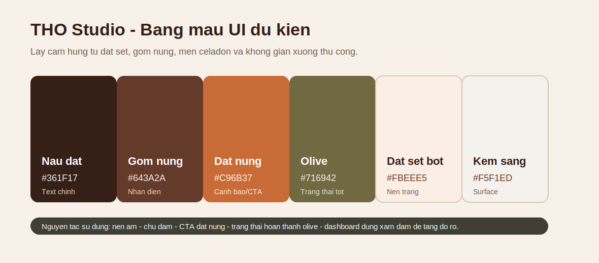

# BÁO CÁO THỔ STUDIO

# CHƯƠNG 1. TỔNG QUAN VÀ THỰC TRẠNG ĐỀ TÀI

## 1.1. Giới thiệu tổng quan đề tài
Trong những năm gần đây, các hoạt động workshop thủ công như làm gốm, vẽ tranh, làm nến, tufting hoặc làm đồ handmade ngày càng thu hút sự quan tâm của giới trẻ, đặc biệt là nhóm khách hàng tại khu vực đô thị. Đối với nhóm khách này, sản phẩm thủ công không chỉ có giá trị sử dụng mà còn mang giá trị trải nghiệm, cảm xúc và cá nhân hóa. Khách hàng không chỉ muốn mua một món đồ hoàn chỉnh, mà còn muốn trực tiếp tham gia vào quá trình tạo ra sản phẩm, lưu giữ kỷ niệm, chụp ảnh, quay vlog hoặc làm quà tặng mang dấu ấn cá nhân.
Từ thực tế đó, đề tài THỔ – website thương mại điện tử kết hợp booking workshop cho studio gốm thủ công được đề xuất nhằm xây dựng một hệ thống hỗ trợ hoạt động kinh doanh và vận hành của một studio gốm. Đây không chỉ là một website bán sản phẩm gốm thông thường, mà còn là nền tảng hỗ trợ khách hàng đặt lịch workshop, mô tả ý tưởng sản phẩm mong muốn, theo dõi tiến độ hoàn thiện sản phẩm sau workshop và tương tác với studio trong quá trình sử dụng dịch vụ.
Đề tài tập trung vào một studio gốm thủ công cụ thể, thay vì phát triển thành marketplace nhiều studio. Cách tiếp cận này giúp phạm vi đề tài thực tế hơn, phù hợp với quy mô đồ án và phản ánh rõ hơn quy trình vận hành của một đơn vị kinh doanh dịch vụ trải nghiệm. Hệ thống hướng đến việc số hóa các quy trình còn đang thực hiện thủ công như tư vấn workshop, kiểm tra lịch trống, đặt slot, xác nhận vé, check-in, cập nhật trạng thái sản phẩm sau workshop và chăm sóc khách hàng.
Điểm nổi bật của đề tài nằm ở việc kết hợp giữa thương mại điện tử và dịch vụ trải nghiệm workshop. Khách hàng có thể mua sản phẩm gốm có sẵn, đồng thời cũng có thể đặt lịch tham gia workshop để tự tay tạo ra sản phẩm của riêng mình. Bên cạnh đó, hệ thống còn định hướng phát triển tính năng chatbot tư vấn, giúp khách hàng mô tả mong muốn về sản phẩm lý tưởng, từ đó hỗ trợ studio lưu lại thông tin, chuẩn bị nguyên liệu, phân công staff hoặc nghệ nhân phù hợp trước khi buổi workshop diễn ra.
Như vậy, THỔ không chỉ giải quyết bài toán bán hàng trực tuyến, mà còn hướng đến bài toán lớn hơn: nâng cao trải nghiệm dịch vụ và quản lý toàn bộ hành trình khách hàng trước – trong – sau workshop gốm thủ công. Đây cũng là điểm giúp đề tài có tính ứng dụng thực tế và tạo sự khác biệt so với một website thương mại điện tử thông thường.

## 1.2. Bối cảnh thực tế của studio gốm hiện nay
Hiện nay, nhiều studio gốm thủ công vẫn vận hành chủ yếu thông qua các kênh mạng xã hội như Facebook, Instagram, TikTok, Zalo hoặc hotline. Khi khách hàng muốn đặt lịch workshop, họ thường phải nhắn tin trực tiếp để hỏi thông tin về lịch trống, giá vé, số lượng người tham gia, hình thức thanh toán và thời gian nhận sản phẩm sau workshop. Quy trình này phụ thuộc nhiều vào nhân viên tư vấn, dễ tạo ra độ trễ trong phản hồi và có thể khiến khách hàng mất hứng thú nếu phải chờ quá lâu.
Ở phía studio, việc quản lý lịch workshop cũng gặp nhiều khó khăn. Nhân viên cần kiểm tra thủ công số lượng khách đăng ký, tình trạng slot, lịch của instructor hoặc nghệ nhân, tình trạng thiết bị như bàn xoay, dụng cụ, lò nung và không gian tổ chức. Nếu các thông tin này được quản lý bằng sổ tay, Excel hoặc tin nhắn rời rạc, studio dễ gặp các vấn đề như trùng lịch, nhận quá số lượng, thiếu người hướng dẫn hoặc không kiểm soát được thiết bị đang bảo trì.
Một đặc thù quan trọng của workshop gốm là sản phẩm không thể hoàn thiện ngay sau khi khách tham gia buổi học. Sau khi khách tạo hình, sản phẩm cần trải qua nhiều công đoạn như phơi khô, nung sơ, tráng men, nung hoàn thiện và kiểm tra chất lượng. Quá trình này có thể kéo dài nhiều ngày hoặc nhiều tuần tùy vào quy trình của studio. Nếu không có hệ thống theo dõi rõ ràng, khách hàng thường phải nhắn tin hỏi lại: “Sản phẩm của em xong chưa?”, “Đã nung chưa?”, “Khi nào nhận được?”. Điều này vừa làm giảm trải nghiệm của khách, vừa tăng khối lượng chăm sóc khách hàng cho studio.
Ngoài ra, trong xu hướng hiện nay, khách hàng đến workshop không chỉ để làm sản phẩm mà còn để có trải nghiệm đáng nhớ. Họ có thể muốn quay vlog, chụp ảnh check-in, làm quà tặng cho người thân, đi cùng người yêu, bạn bè hoặc đồng nghiệp. Nhiều khách hàng chưa có ý tưởng rõ ràng về sản phẩm muốn làm, chưa biết nên chọn loại workshop nào, màu men nào, kiểu dáng nào hoặc mức độ khó ra sao. Vì vậy, studio cần một công cụ hỗ trợ tư vấn trước, lưu lại mong muốn của khách và giúp staff hoặc nghệ nhân chuẩn bị tốt hơn.
Từ những vấn đề trên, có thể thấy nhu cầu xây dựng một website hỗ trợ bán hàng, đặt lịch workshop, tư vấn ý tưởng, quản lý vận hành và theo dõi sản phẩm sau workshop là cần thiết. Đây là cơ sở thực tiễn để đề tài THỔ được hình thành.

## 1.3. Vấn đề nghiệp vụ của đề tài
Vấn đề nghiệp vụ chính của đề tài nằm ở việc quy trình kinh doanh và vận hành của studio gốm còn rời rạc, phụ thuộc nhiều vào thao tác thủ công và chưa được số hóa đồng bộ.
Thứ nhất, ở phía khách hàng, quy trình đặt workshop hiện tại còn thiếu tính chủ động. Khách thường phải nhắn tin để hỏi lịch, chờ nhân viên phản hồi, xác nhận thủ công rồi mới được hướng dẫn thanh toán hoặc đặt cọc. Trong khi đó, nhóm khách trẻ thường mong muốn thao tác nhanh, xem được lịch trống, chọn slot, thanh toán và nhận xác nhận ngay trên website. Nếu quy trình đặt lịch quá phức tạp, khách hàng có thể bỏ qua và chuyển sang lựa chọn khác.
Thứ hai, khách hàng thường gặp khó khăn trong việc hình dung sản phẩm mình muốn làm. Không phải ai cũng có kinh nghiệm về gốm, màu men, kiểu dáng hoặc kỹ thuật tạo hình. Nhiều khách chỉ có mong muốn chung như làm quà sinh nhật, làm cốc đôi, làm đồ trang trí hoặc tạo một sản phẩm theo phong cách tối giản. Nếu không có công cụ hỗ trợ tư vấn, khách có thể chọn sai workshop, kỳ vọng không phù hợp hoặc cảm thấy thiếu tự tin khi tham gia.
Thứ ba, ở phía studio, việc quản lý workshop cần xử lý nhiều yếu tố cùng lúc như slot, capacity, instructor, thiết bị, nguyên liệu, thông tin khách, thanh toán, check-in và sản phẩm sau workshop. Nếu không có hệ thống quản lý tập trung, studio dễ gặp tình trạng thiếu thông tin, cập nhật trễ hoặc khó kiểm soát tiến độ xử lý.
Thứ tư, quy trình sau workshop là một nghiệp vụ đặc thù nhưng thường chưa được quản lý rõ ràng. Sản phẩm gốm do khách làm cần được theo dõi qua nhiều giai đoạn. Nếu thiếu hệ thống tracking, cả khách hàng và studio đều khó nắm được sản phẩm đang ở bước nào. Vì vậy, việc xây dựng chức năng ceramic tracker là cần thiết để phản ánh đúng vòng đời của sản phẩm gốm sau workshop.
Thứ năm, nếu website chỉ tập trung vào giao diện phía khách hàng mà thiếu góc nhìn quản lý, hệ thống sẽ chưa đủ chiều sâu. Studio cần khai thác dữ liệu khách hàng như nhu cầu làm quà, độ tuổi, khu vực, hành vi chọn workshop, phong cách sản phẩm yêu thích hoặc tần suất quay lại để phục vụ hoạt động recommend, chăm sóc khách hàng và xây dựng chương trình ưu đãi phù hợp.
Vì vậy, bài toán đặt ra là: làm thế nào để xây dựng một hệ thống website vừa hỗ trợ thương mại điện tử, vừa hỗ trợ booking workshop, vừa nâng cao trải nghiệm khách hàng và quản lý được quy trình vận hành đặc thù của studio gốm thủ công.

## 1.4. Mục tiêu của đề tài
Mục tiêu tổng quát của đề tài là xây dựng một website hỗ trợ studio gốm thủ công trong hoạt động bán hàng, đặt lịch workshop, tư vấn ý tưởng cá nhân hóa, quản lý vận hành và theo dõi sản phẩm sau workshop.
Các mục tiêu cụ thể bao gồm:
Thứ nhất, xây dựng website thương mại điện tử cho phép khách hàng xem danh sách sản phẩm gốm, xem chi tiết sản phẩm, chọn biến thể, thêm vào giỏ hàng và thực hiện đặt mua sản phẩm.
Thứ hai, xây dựng chức năng booking workshop để khách hàng có thể xem thông tin workshop, chọn ngày giờ, số lượng người tham gia, kiểm tra slot còn trống và đặt lịch trực tuyến thay vì phải nhắn tin thủ công.
Thứ ba, xây dựng cơ chế hai giỏ hàng tách biệt, bao gồm giỏ hàng sản phẩm vật lý và giỏ hàng workshop. Việc tách hai giỏ hàng giúp hệ thống xử lý đúng bản chất nghiệp vụ, vì sản phẩm vật lý cần quy trình giao hàng, còn workshop cần quy trình đặt slot, tạo vé, check-in và theo dõi sản phẩm sau buổi học.
Thứ tư, xây dựng chức năng chatbot tư vấn workshop nhằm hỗ trợ khách hàng mô tả mong muốn về sản phẩm lý tưởng. Thông tin này có thể được lưu vào cơ sở dữ liệu để staff hoặc nghệ nhân kiểm tra, tư vấn và chuẩn bị trước buổi workshop.
Thứ năm, xây dựng chức năng ceramic tracker để khách hàng có thể theo dõi tiến độ hoàn thiện sản phẩm sau workshop. Tracker giúp hiển thị các trạng thái như đã tạo hình, đang phơi khô, nung sơ, tráng men, nung hoàn thiện, kiểm tra chất lượng, sẵn sàng nhận hoặc đang giao.
Thứ sáu, xây dựng các chức năng quản lý dành cho admin, staff và nghệ nhân, bao gồm quản lý sản phẩm, workshop, slot, booking, ticket, check-in, đơn hàng, thiết bị, tracker và phản hồi khách hàng.
Thứ bảy, định hướng khai thác dữ liệu khách hàng để hỗ trợ recommend sản phẩm, workshop hoặc ưu đãi phù hợp. Hệ thống không yêu cầu khách điền form dài, mà có thể thu thập dữ liệu thông qua hành vi sử dụng, lựa chọn workshop, mục đích mua hàng, nhu cầu làm quà hoặc thông tin từ đăng nhập mạng xã hội.
Thông qua các mục tiêu trên, đề tài hướng đến việc xây dựng một hệ thống không chỉ có tính trình diễn giao diện, mà còn phản ánh được quy trình nghiệp vụ thực tế của studio gốm.

## 1.5. Đối tượng người dùng của hệ thống
Hệ thống THỔ hướng đến nhiều nhóm người dùng khác nhau, bao gồm khách hàng bên ngoài và các đối tượng quản lý nội bộ của studio.

### 1.5.1. Khách hàng
Khách hàng là nhóm người dùng chính của website. Đối tượng này chủ yếu là người trẻ trong độ tuổi khoảng 18 đến 35, bao gồm sinh viên, nhân viên văn phòng, cặp đôi, nhóm bạn, gia đình nhỏ hoặc những người yêu thích hoạt động thủ công. Họ có nhu cầu mua sản phẩm gốm, đặt lịch workshop, làm quà tặng, tham gia trải nghiệm sáng tạo hoặc tìm kiếm hoạt động thư giãn vào cuối tuần.
Đặc điểm của nhóm khách hàng này là quen với việc tìm kiếm thông tin và đặt dịch vụ trực tuyến. Họ mong muốn giao diện dễ sử dụng, thông tin rõ ràng, thao tác nhanh và không phải trải qua quá nhiều bước đăng ký phức tạp. Vì vậy, hệ thống cần hỗ trợ guest checkout để khách có thể đặt hàng hoặc đặt workshop mà không bắt buộc tạo tài khoản.
Tuy nhiên, đối với những khách có nhu cầu lưu lịch sử đặt workshop, nhận ưu đãi, theo dõi nhiều sản phẩm hoặc sử dụng dịch vụ thường xuyên, website có thể cung cấp tùy chọn đăng nhập bằng mạng xã hội như Google hoặc Facebook.

### 1.5.2. Staff
Staff là nhân viên vận hành của studio, chịu trách nhiệm kiểm tra booking, xác nhận thông tin khách hàng, hỗ trợ check-in, cập nhật trạng thái đơn hàng và theo dõi phản hồi của khách. Staff cần có giao diện quản lý rõ ràng để biết hôm nay có những workshop nào, slot nào sắp diễn ra, khách nào đã thanh toán, khách nào cần hỗ trợ và sản phẩm nào cần cập nhật tiến độ.

### 1.5.3. Nghệ nhân hoặc người hướng dẫn
Nghệ nhân hoặc người hướng dẫn là người trực tiếp hướng dẫn khách trong buổi workshop và tham gia xử lý sản phẩm sau workshop. Nhóm người dùng này cần xem được thông tin về số lượng khách, loại workshop, ý tưởng sản phẩm mà khách đã mô tả trước, ghi chú đặc biệt và trạng thái sản phẩm sau khi workshop kết thúc.
Ví dụ, nếu khách đã mô tả mong muốn làm một chiếc ly gốm màu be có họa tiết mèo để làm quà sinh nhật, nghệ nhân có thể xem trước thông tin này để chuẩn bị tư vấn phù hợp trong buổi workshop.

### 1.5.4. Admin hoặc chủ studio
Admin hoặc chủ studio là người quản lý toàn bộ hệ thống. Admin cần theo dõi sản phẩm, workshop, lịch đặt, doanh thu, phản hồi khách hàng, tình trạng thiết bị, hiệu suất slot và dữ liệu khách hàng. Dưới góc nhìn quản lý, website không chỉ là kênh bán hàng mà còn là công cụ hỗ trợ ra quyết định.
Admin có thể khai thác dữ liệu để biết workshop nào được quan tâm nhiều, nhóm khách nào thường đặt lịch, sản phẩm nào thường được mua làm quà, khách hàng thích phong cách nào hoặc thời điểm nào có nhu cầu cao. Những thông tin này có thể phục vụ cho hoạt động recommend, khuyến mãi, chăm sóc khách hàng và phát triển dịch vụ mới.

### 1.5.5. Nhà phát triển hệ thống
Nhà phát triển hệ thống là nhóm chịu trách nhiệm phân tích, thiết kế, xây dựng và kiểm thử website. Nhóm này cần đảm bảo giao diện phù hợp với trải nghiệm người dùng, luồng nghiệp vụ hợp lý, dữ liệu được tổ chức rõ ràng và các chức năng chính hoạt động đúng theo yêu cầu.
Trong quá trình thực hiện, nhóm phát triển cần vừa đóng vai trò người dùng để kiểm thử giao diện Figma, vừa đóng vai trò BA để đối chiếu giao diện với các mô hình nghiệp vụ như Use Case, BPMN, DFD và ERD. Việc đối chiếu này giúp đảm bảo sản phẩm triển khai không bị lệch so với phân tích ban đầu.

## 1.6. Phạm vi đề tài
Trong phạm vi đồ án, đề tài tập trung vào việc xây dựng website cho một studio gốm thủ công cụ thể. Hệ thống không phát triển thành marketplace nhiều studio và chưa triển khai ứng dụng di động riêng.
Các chức năng chính dự định phát triển trong phạm vi đề tài gồm:
Xem danh sách sản phẩm gốm.
Xem chi tiết sản phẩm.
Thêm sản phẩm vào giỏ hàng sản phẩm.
Xem danh sách workshop.
Xem chi tiết workshop.
Chatbot tư vấn ý tưởng workshop.
Lưu thông tin mong muốn của khách hàng về sản phẩm lý tưởng.
Chọn ngày giờ và số lượng người tham gia workshop.
Kiểm tra slot, capacity, instructor và equipment.
Thêm workshop vào giỏ hàng workshop.
Checkout với thông tin khách hàng.
Hỗ trợ guest checkout và đăng nhập mạng xã hội ở mức định hướng.
Tạo mã đơn duy nhất.
Tách mã xử lý cho sản phẩm, vé workshop và ceramic tracker.
Tạo QR check-in cho vé workshop.
Staff xác nhận khách tham gia workshop.
Tạo ceramic tracker sau workshop.
Staff hoặc nghệ nhân cập nhật tiến độ sản phẩm.
Khách tra cứu tiến độ sản phẩm bằng mã tracking.
Khách bình luận, đánh giá sản phẩm hoặc workshop.
Staff phản hồi comment/review.
Admin quản lý sản phẩm, workshop, slot, booking, order và tracker.
Các chức năng chưa ưu tiên trong phạm vi chính gồm:
Marketplace nhiều studio.
Mobile app riêng.
Tích hợp thanh toán thật.
Tích hợp đơn vị vận chuyển thật.
Hệ thống CRM nâng cao.
Loyalty point.
Hoàn tiền phức tạp.
Dashboard phân tích dữ liệu chuyên sâu.
AI tạo ảnh sản phẩm hoàn chỉnh theo mô tả.
Những chức năng chưa triển khai được trình bày trong phần hướng phát triển của Chương 5.

## 1.7. Điểm khác biệt và tính mới của đề tài
Điểm khác biệt của THỔ nằm ở việc hệ thống không chỉ dừng lại ở chức năng bán sản phẩm, mà còn tập trung vào trải nghiệm workshop và quản lý vòng đời sản phẩm sau workshop.
Thứ nhất, đề tài có chức năng tư vấn ý tưởng workshop cá nhân hóa. Khách hàng có thể mô tả mong muốn của mình, chẳng hạn như muốn làm quà tặng, muốn làm ly gốm đôi, muốn sản phẩm có màu sắc tối giản hoặc muốn quay vlog trong quá trình làm gốm. Hệ thống chatbot sẽ hỗ trợ gợi ý loại workshop phù hợp, mức độ khó, thời lượng, chi phí dự kiến và lưu lại thông tin để staff hoặc nghệ nhân kiểm tra.
Thứ hai, hệ thống sử dụng hai giỏ hàng tách biệt: giỏ hàng sản phẩm vật lý và giỏ hàng workshop. Cách thiết kế này giúp xử lý rõ hai loại nghiệp vụ có vòng đời khác nhau. Sản phẩm vật lý cần giao hàng, mã vận chuyển và trạng thái vận chuyển. Trong khi đó, workshop cần đặt slot, tạo vé, check-in và có thể phát sinh ceramic tracker sau buổi học.
Thứ ba, đề tài có chức năng ceramic tracker, giúp khách hàng theo dõi tiến độ sản phẩm sau workshop. Đây là điểm phản ánh đặc thù ngành gốm, vì sản phẩm không thể hoàn thiện ngay sau khi khách tạo hình mà cần trải qua nhiều công đoạn xử lý.
Thứ tư, hệ thống chú trọng góc nhìn quản lý. Admin không chỉ quản lý sản phẩm và đơn hàng, mà còn có thể theo dõi booking, slot, instructor, equipment, tracker, phản hồi khách hàng và dữ liệu hành vi để phục vụ recommend.
Thứ năm, đề tài có định hướng khai thác yếu tố trải nghiệm như quay vlog, chụp ảnh, làm quà tặng và cá nhân hóa sản phẩm. Đây là các yếu tố phù hợp với hành vi của nhóm khách hàng trẻ hiện nay, giúp studio không chỉ bán dịch vụ workshop mà còn bán trải nghiệm cảm xúc.

## 1.8. Ý nghĩa thực tiễn của đề tài
Về phía khách hàng, hệ thống giúp quá trình mua sản phẩm và đặt workshop trở nên thuận tiện hơn. Khách có thể chủ động xem thông tin, chọn lịch, thanh toán, nhận mã vé, check-in và theo dõi sản phẩm sau workshop mà không cần phụ thuộc hoàn toàn vào việc nhắn tin với studio.
Về phía studio, hệ thống giúp giảm bớt thao tác thủ công trong quản lý booking, slot, khách hàng, đơn hàng và sản phẩm sau workshop. Staff có thể dễ dàng theo dõi lịch workshop, kiểm tra thông tin khách, cập nhật trạng thái sản phẩm và phản hồi khách hàng. Nghệ nhân có thể xem trước mong muốn của khách để chuẩn bị tư vấn tốt hơn.
Về phía quản lý, hệ thống giúp studio có dữ liệu để phân tích hành vi khách hàng. Thông qua thông tin về sản phẩm được quan tâm, workshop được đặt nhiều, mục đích mua hàng, nhu cầu làm quà hoặc phản hồi sau workshop, studio có thể cải thiện dịch vụ, xây dựng ưu đãi và phát triển các gói trải nghiệm phù hợp hơn.
Về phía học thuật, đề tài giúp vận dụng các kiến thức về phân tích và thiết kế hệ thống, thương mại điện tử, UI/UX, mô hình hóa nghiệp vụ, cơ sở dữ liệu và xây dựng website. Các mô hình như Use Case, BPMN, DFD, ERD, sitemap và prototype Figma được sử dụng để chuyển hóa yêu cầu thực tế thành thiết kế hệ thống cụ thể.

## 1.9. Định hướng triển khai đề tài
Đề tài được triển khai theo hướng kết hợp giữa phân tích nghiệp vụ và thiết kế giao diện. Trước hết, nhóm xác định các actor chính của hệ thống, bao gồm khách hàng, staff, nghệ nhân, admin và nhà phát triển. Sau đó, nhóm phân tích các luồng nghiệp vụ quan trọng như mua sản phẩm, đặt workshop, tư vấn ý tưởng, thanh toán, check-in, tạo tracker và cập nhật tiến độ sản phẩm.
Trên cơ sở đó, nhóm xây dựng các mô hình phân tích như Use Case Diagram, BPMN, DFD, ERD hoặc Class Diagram. Các mô hình này giúp làm rõ hệ thống cần có những chức năng nào, dữ liệu được lưu trữ ra sao và các đối tượng trong hệ thống tương tác với nhau như thế nào.
Song song với quá trình phân tích, nhóm thiết kế sitemap và prototype giao diện trên Figma. Việc thiết kế prototype giúp kiểm tra luồng thao tác của người dùng trước khi triển khai. Nhóm vừa đóng vai trò người dùng để trải nghiệm giao diện, vừa đóng vai trò BA để đối chiếu prototype với quy trình nghiệp vụ. Nếu phát hiện giao diện chưa phản ánh đúng luồng phân tích, nhóm sẽ điều chỉnh lại để đảm bảo tính nhất quán giữa thiết kế và triển khai.
Trong phần xây dựng website, nhóm dự kiến trình bày các màn hình chính như trang chủ, trang sản phẩm, trang chi tiết sản phẩm, trang workshop, trang chi tiết workshop, chatbot tư vấn, giỏ hàng sản phẩm, giỏ hàng workshop, checkout, trang ticket, trang tracker và dashboard quản lý. Một số case chính sẽ được chọn để mô tả chi tiết quá trình vận hành của hệ thống.

# CHƯƠNG 2. CƠ SỞ LÝ THUYẾT VÀ LỰA CHỌN CÔNG CỤ

## 2.1. Tiêu chí lựa chọn công cụ
Việc lựa chọn công cụ cho đề tài THỔ Studio không chỉ dựa trên mức độ phổ biến của công nghệ, mà còn dựa trên sự phù hợp với phạm vi đồ án, khả năng triển khai thực tế, mức độ dễ bảo trì và tính rõ ràng khi trình bày trong báo cáo. Vì hệ thống hướng đến một studio gốm thủ công quy mô nhỏ đến vừa, nhóm ưu tiên các công cụ có khả năng hỗ trợ nhanh quá trình phân tích, thiết kế giao diện, mô hình hóa nghiệp vụ và xây dựng phiên bản MVP.

Các tiêu chí lựa chọn gồm: dễ tiếp cận đối với nhóm phát triển, phù hợp với quy mô website thương mại điện tử kết hợp booking workshop, hỗ trợ mô hình hóa rõ nghiệp vụ đặc thù như Guest Checkout, Hybrid Commerce Flow và Ceramic Tracker, có chi phí thấp hoặc miễn phí, dễ trình bày trong môi trường học thuật và có khả năng mở rộng khi hệ thống phát triển trong tương lai.

**Bảng 2.1. Tiêu chí lựa chọn công cụ**
| Tiêu chí | Ý nghĩa đối với đề tài |
|---|---|
| Phù hợp phạm vi đồ án | Công cụ cần đủ mạnh để triển khai website studio gốm nhưng không làm tăng độ phức tạp quá mức. |
| Dễ học và dễ sử dụng | Nhóm có thể nhanh chóng thiết kế, mô hình hóa và triển khai mà không mất quá nhiều thời gian cấu hình. |
| Hỗ trợ làm việc nhóm | Công cụ cần hỗ trợ chia sẻ, kiểm tra, chỉnh sửa và quản lý phiên bản trong quá trình thực hiện. |
| Chi phí hợp lý | Ưu tiên công cụ miễn phí hoặc có gói miễn phí phù hợp với sinh viên. |
| Khả năng mở rộng | Công cụ được chọn vẫn có thể nâng cấp hoặc thay thế khi hệ thống phát triển lớn hơn. |

## 2.2. Figma trong thiết kế UI/UX
Figma được sử dụng để thiết kế giao diện, xây dựng hệ thống thiết kế và tạo prototype cho các màn hình chính của website như Trang chủ, Chi tiết workshop, Checkout, Ceramic Tracker và Dashboard Admin. Công cụ này giúp nhóm kiểm tra trước luồng thao tác của người dùng, đánh giá bố cục, màu sắc, form nhập liệu và các trạng thái giao diện trước khi lập trình.

Lý do chọn Figma là vì công cụ này hoạt động trực tuyến, hỗ trợ làm việc nhóm theo thời gian thực, dễ chia sẻ prototype cho giảng viên hoặc người dùng thử nghiệm và có hệ thống component/style phù hợp để xây dựng giao diện nhất quán. Đối với đề tài THỔ Studio, Figma đặc biệt phù hợp vì giao diện cần truyền tải cảm giác thủ công, ấm áp và có nhiều màn hình cần kiểm tra trải nghiệm trước như đặt workshop, thanh toán QR, tracking tiến độ gốm và dashboard vận hành.

Nhóm không chọn Adobe XD vì hệ sinh thái hiện nay không còn thuận tiện bằng Figma cho làm việc nhóm trực tuyến. Sketch mạnh trong thiết kế UI nhưng phụ thuộc nhiều vào môi trường macOS, không phù hợp nếu nhóm sử dụng nhiều thiết bị khác nhau. Canva dễ dùng cho thiết kế poster hoặc nội dung truyền thông, nhưng không phù hợp để xây dựng prototype tương tác, design system và cấu trúc component cho sản phẩm web.

**Bảng 2.2. So sánh Figma với một số công cụ thiết kế khác**
| Công cụ | Ưu điểm | Hạn chế | Kết luận lựa chọn |
|---|---|---|---|
| Figma | Làm việc nhóm trực tuyến, prototype tốt, hỗ trợ component và style. | Cần internet để cộng tác hiệu quả. | Được chọn vì phù hợp nhất với thiết kế UI/UX và prototype của đồ án. |
| Adobe XD | Dễ dùng, quen thuộc với nhóm thiết kế Adobe. | Khả năng cộng tác và hệ sinh thái hiện không thuận tiện bằng Figma. | Không chọn. |
| Sketch | Mạnh về UI design, nhiều plugin. | Chủ yếu phù hợp với macOS. | Không chọn vì hạn chế môi trường sử dụng. |
| Canva | Nhanh cho poster, banner, social media. | Không phù hợp cho prototype sản phẩm web phức tạp. | Không chọn cho UI/UX chính. |

## 2.3. Draw.io trong mô hình hóa hệ thống
Draw.io được sử dụng để vẽ các sơ đồ phân tích và thiết kế hệ thống như Use Case, BPMN, DFD, ERD và sơ đồ trạng thái. Đây là các mô hình giúp chuyển hóa yêu cầu nghiệp vụ của studio gốm thành cấu trúc trực quan, dễ hiểu và dễ đối chiếu với phần giao diện Figma.

Lý do chọn Draw.io là vì công cụ này miễn phí, chạy trực tiếp trên trình duyệt, hỗ trợ nhiều loại sơ đồ và dễ xuất hình ảnh để đưa vào báo cáo. Với đề tài THỔ Studio, Draw.io đủ đáp ứng nhu cầu mô hình hóa các luồng Guest Checkout, Hybrid Commerce Flow, Ceramic Tracker, phân tách Shipping Order và Workshop Ticket, cũng như mô tả quan hệ dữ liệu trong ERD.

Nhóm không chọn StarUML làm công cụ chính vì StarUML phù hợp hơn với mô hình UML chuyên sâu, trong khi đề tài cần kết hợp nhiều loại sơ đồ khác nhau như DFD, ERD và BPMN. Lucidchart có giao diện đẹp và khả năng cộng tác tốt nhưng nhiều tính năng nâng cao bị giới hạn ở gói trả phí. Vì vậy, Draw.io là lựa chọn hợp lý hơn trong bối cảnh đồ án sinh viên.

**Bảng 2.3. So sánh Draw.io với các công cụ mô hình hóa khác**
| Công cụ | Ưu điểm | Hạn chế | Kết luận lựa chọn |
|---|---|---|---|
| Draw.io | Miễn phí, hỗ trợ nhiều loại sơ đồ, dễ xuất ảnh. | Cần tự căn chỉnh để sơ đồ đẹp và thống nhất. | Được chọn vì đủ chức năng và phù hợp báo cáo. |
| StarUML | Mạnh về UML, phù hợp thiết kế hướng đối tượng. | Ít thuận tiện hơn cho DFD/BPMN/ERD tổng hợp. | Không chọn làm công cụ chính. |
| Lucidchart | Giao diện đẹp, cộng tác tốt. | Nhiều tính năng bị giới hạn bởi gói trả phí. | Không chọn vì chi phí không phù hợp. |

## 2.4. Nền tảng Web: HTML, CSS và JavaScript
HTML, CSS và JavaScript là nền tảng cốt lõi để xây dựng giao diện website. HTML đảm nhiệm cấu trúc nội dung, CSS phụ trách bố cục và phong cách hiển thị, còn JavaScript xử lý tương tác như thêm sản phẩm vào giỏ hàng, chọn slot workshop, kiểm tra trạng thái thanh toán, hiển thị timeline Ceramic Tracker và cập nhật dữ liệu động.

Lý do chọn nền tảng web thuần là vì phạm vi đồ án tập trung vào việc thể hiện rõ luồng nghiệp vụ và trải nghiệm người dùng, không nhất thiết cần sử dụng framework phức tạp ngay từ đầu. HTML/CSS/JS giúp nhóm kiểm soát trực tiếp cấu trúc giao diện, dễ giải thích trong báo cáo và phù hợp với các màn hình cần minh họa rõ như checkout, tracker và dashboard.

Nhóm chưa chọn React hoặc Vue làm nền tảng chính cho giai đoạn đầu vì các framework này yêu cầu tổ chức component, build tool và quản lý trạng thái phức tạp hơn. Nếu hệ thống mở rộng thành sản phẩm vận hành thật với nhiều màn hình, nhiều trạng thái và nhiều người dùng đồng thời, React hoặc Vue có thể được cân nhắc trong hướng phát triển để tăng khả năng tái sử dụng component và quản lý frontend tốt hơn.

**Bảng 2.4. So sánh HTML/CSS/JavaScript thuần với framework frontend**
| Công nghệ | Ưu điểm | Hạn chế | Kết luận lựa chọn |
|---|---|---|---|
| HTML/CSS/JavaScript | Dễ học, dễ trình bày, kiểm soát trực tiếp giao diện. | Khi hệ thống lớn có thể khó quản lý component. | Được chọn cho MVP và đồ án. |
| React | Component hóa tốt, hệ sinh thái lớn. | Cần build tool và quản lý state phức tạp hơn. | Chưa chọn ở giai đoạn đầu. |
| Vue | Dễ tiếp cận hơn React, phù hợp SPA. | Vẫn cần cấu trúc dự án và công cụ build. | Có thể dùng ở giai đoạn mở rộng. |

## 2.5. Node.js và Express.js
Node.js và Express.js được sử dụng để xây dựng tầng backend cho website. Backend chịu trách nhiệm xử lý các nghiệp vụ như quản lý sản phẩm, kiểm tra tồn kho, kiểm tra slot workshop, giữ chỗ tạm thời trong 15 phút, xử lý đơn hàng, tạo mã QR check-in, cập nhật Ceramic Tracker và cung cấp API cho frontend.

Lý do chọn Node.js và Express.js là vì JavaScript có thể được sử dụng thống nhất ở cả frontend và backend, giúp nhóm giảm chi phí học thêm ngôn ngữ mới. Express.js có cấu trúc gọn, dễ tạo API REST và phù hợp với quy mô MVP của một website studio gốm. Các nghiệp vụ của THỔ Studio như đặt chỗ, tracking, cập nhật trạng thái và dashboard có thể được tổ chức thành các route/service rõ ràng.

Nhóm không chọn các framework backend lớn như Spring Boot hoặc ASP.NET Core vì chúng phù hợp hơn với hệ thống doanh nghiệp quy mô lớn, yêu cầu nhiều cấu hình và kiến trúc chặt chẽ hơn. Laravel cũng là lựa chọn tốt cho web truyền thống, nhưng việc dùng Node.js giúp đồng bộ ngôn ngữ với frontend và phù hợp với định hướng xây dựng API nhẹ cho đồ án.

## 2.6. SQLite trong lưu trữ dữ liệu
SQLite được sử dụng để lưu trữ dữ liệu cho phiên bản đồ án/MVP của hệ thống. Cơ sở dữ liệu cần quản lý các nhóm thông tin như người dùng, sản phẩm, biến thể sản phẩm, giỏ hàng, đơn hàng, thanh toán, workshop, booking, workshop ticket, QR check-in, ceramic tracker, tracking history, media, review và notification.

Lý do chọn SQLite là vì công cụ này gọn nhẹ, dễ triển khai, không cần cài đặt máy chủ cơ sở dữ liệu riêng và phù hợp với quy mô một studio gốm trong phạm vi đồ án. SQLite vẫn hỗ trợ mô hình dữ liệu quan hệ, câu lệnh SQL, khóa chính, khóa ngoại, transaction và các truy vấn đủ đáp ứng các nghiệp vụ chính như kiểm tra tồn kho, kiểm tra slot, tạo đơn hàng, tạo vé workshop và cập nhật trạng thái Ceramic Tracker.

So với MySQL hoặc PostgreSQL, SQLite đơn giản hơn trong cài đặt và vận hành, phù hợp khi hệ thống chưa có lượng truy cập lớn và chưa cần nhiều kết nối đồng thời. Nhóm không chọn MongoDB vì dữ liệu của hệ thống có nhiều quan hệ rõ ràng giữa users, orders, workshop_tickets, ceramic_trackers và shipping_orders; mô hình quan hệ sẽ dễ biểu diễn ERD và đảm bảo tính nhất quán hơn. Firebase có thể triển khai nhanh nhưng phụ thuộc nhiều vào dịch vụ bên ngoài và không thuận lợi bằng SQLite khi cần trình bày ERD quan hệ trong báo cáo.

Tuy nhiên, SQLite cũng có giới hạn. Nếu hệ thống phát triển thành marketplace nhiều studio, có nhiều chi nhánh, nhiều nhân viên thao tác đồng thời hoặc lượng truy cập lớn, nhóm có thể nâng cấp cơ sở dữ liệu sang PostgreSQL hoặc MySQL để tăng khả năng xử lý đồng thời, phân quyền, sao lưu và vận hành trên máy chủ.

**Bảng 2.5. So sánh SQLite với các hệ quản trị cơ sở dữ liệu khác**
| Công nghệ | Ưu điểm | Hạn chế | Kết luận lựa chọn |
|---|---|---|---|
| SQLite | Nhẹ, không cần server riêng, dễ triển khai, hỗ trợ SQL quan hệ. | Không tối ưu cho hệ thống nhiều ghi đồng thời quy mô lớn. | Được chọn cho đồ án/MVP một studio. |
| MySQL | Phổ biến, ổn định, phù hợp web production. | Cần cài đặt và quản trị server DB. | Dành cho giai đoạn mở rộng. |
| PostgreSQL | Mạnh, chuẩn SQL tốt, phù hợp dữ liệu phức tạp. | Cấu hình và vận hành nặng hơn SQLite. | Có thể nâng cấp khi hệ thống lớn. |
| MongoDB | Linh hoạt với dữ liệu phi cấu trúc. | Không tối ưu để trình bày ERD quan hệ của đề tài. | Không chọn. |
| Firebase | Nhanh cho realtime/app nhỏ. | Phụ thuộc dịch vụ bên ngoài, mô hình dữ liệu khác SQL. | Không chọn cho báo cáo hiện tại. |

## 2.7. Git và GitHub
Git và GitHub được sử dụng để quản lý mã nguồn và hỗ trợ làm việc nhóm. Git giúp theo dõi lịch sử thay đổi, quay lại phiên bản trước khi cần và hạn chế mất mát mã nguồn. GitHub hỗ trợ lưu trữ repository, chia sẻ mã, quản lý issue và phối hợp giữa các thành viên.

Lý do chọn Git/GitHub là vì đây là bộ công cụ phổ biến, miễn phí cho nhu cầu học tập và phù hợp với quy trình phát triển phần mềm hiện đại. Trong đề tài THỔ Studio, GitHub giúp nhóm lưu lại quá trình phát triển website, kiểm soát thay đổi giữa giao diện, backend, database schema và tài liệu báo cáo.

Nhóm không chọn cách quản lý thủ công bằng file nén hoặc gửi mã qua tin nhắn vì dễ mất phiên bản, khó kiểm soát thay đổi và dễ xảy ra xung đột khi nhiều thành viên cùng chỉnh sửa. Các nền tảng khác như GitLab hoặc Bitbucket cũng có thể sử dụng, nhưng GitHub được chọn vì quen thuộc, dễ tiếp cận và có cộng đồng hỗ trợ lớn.

## 2.8. Tổng kết lựa chọn công nghệ
Tổng thể, bộ công cụ được lựa chọn cho đề tài gồm Figma cho thiết kế UI/UX, Draw.io cho mô hình hóa hệ thống, HTML/CSS/JavaScript cho giao diện web, Node.js/Express.js cho backend, SQLite cho cơ sở dữ liệu và Git/GitHub cho quản lý mã nguồn. Cách lựa chọn này phù hợp với mục tiêu xây dựng một website MVP cho studio gốm thủ công, vừa đủ để thể hiện nghiệp vụ đặc thù, vừa tránh làm hệ thống trở nên quá phức tạp so với phạm vi đồ án.

Bộ công cụ này cũng tạo ra sự liên kết rõ ràng giữa các chương của báo cáo: Figma phục vụ Chương 4 về prototype và UI, Draw.io phục vụ Chương 3 về mô hình hóa nghiệp vụ, SQLite phục vụ phần ERD và lưu trữ dữ liệu, còn nền tảng Web cùng Node.js/Express.js phục vụ phần triển khai hệ thống. Khi hệ thống phát triển trong tương lai, các công nghệ như React, PostgreSQL, tích hợp thanh toán thật hoặc CRM có thể được bổ sung theo nhu cầu mở rộng.

# CHƯƠNG 3. PHÂN TÍCH HỆ THỐNG VÀ UI/UX

## 3.1. Phân tích UI/UX
Phần UI/UX của hệ thống được tách thành hai lớp rõ ràng: UI tập trung vào phần nhìn, màu sắc, bố cục và thành phần giao diện; UX tập trung vào luồng thao tác, mức độ dễ hiểu và khả năng hoàn thành nhiệm vụ của người dùng. Cách tách này giúp báo cáo không chỉ mô tả giao diện đẹp hay xấu, mà còn giải thích vì sao giao diện đó hỗ trợ đúng hành vi của khách hàng và nhân viên studio.

### 3.1.1. UI - Định hướng giao diện và hệ màu
Về UI, website THỔ Studio được thiết kế theo phong cách tối giản, ấm áp và thủ công. Giao diện không sử dụng quá nhiều hiệu ứng trang trí, mà ưu tiên khoảng trắng, hình ảnh sản phẩm gốm, typography rõ ràng và các mảng màu lấy cảm hứng từ chất liệu thật trong xưởng gốm.

Bảng màu chủ đạo gồm nâu đất, nâu gốm nung, be đất sét, kem sáng, xanh olive và xám đậm. Nâu đất và nâu gốm nung được dùng cho chữ chính, thanh điều hướng, nút quan trọng và các điểm nhấn thương hiệu. Nhóm màu be và kem sáng được dùng làm nền để tạo cảm giác nhẹ, sạch và gần với màu đất sét tự nhiên. Xanh olive đóng vai trò màu cân bằng, dùng cho CTA phụ, trạng thái hoàn thành hoặc các điểm nhấn không cần gây căng thẳng. Xám đậm dùng cho chữ phụ, đường viền và các thông tin kỹ thuật trong dashboard.

*Hình 3.1 - Bảng màu chính dự kiến sử dụng cho giao diện THỔ Studio.*

Việc xếp các màu thành từng thẻ hình chữ nhật giúp người đọc thấy rõ hệ màu của website như một khối thống nhất. Các màu không được chọn ngẫu nhiên mà có liên hệ trực tiếp với vật liệu gốm: đất sét thô, đất nung, men celadon, nền xưởng và tro gốm. Nhờ vậy, giao diện tạo cảm giác gần gũi với sản phẩm thủ công thay vì giống một website thương mại điện tử đại trà.

Về bố cục UI, các màn hình dành cho khách hàng ưu tiên hình ảnh lớn, nút CTA rõ và thông tin được chia thành từng cụm dễ quét mắt. Trang chủ và trang workshop cần tạo cảm giác truyền cảm hứng, trong khi trang checkout và tracker cần rõ ràng, ít nhiễu và dễ thao tác. Đối với Dashboard Admin, giao diện được thiết kế thực dụng hơn: nhiều bảng, badge trạng thái, cảnh báo và bộ lọc để nhân viên xử lý công việc nhanh.

### 3.1.2. UX - Định hướng trải nghiệm người dùng
Về UX, hệ thống tập trung vào ba nhóm hành trình chính: mua sản phẩm gốm, đặt lịch workshop và theo dõi thành phẩm sau workshop. Mục tiêu là giúp người dùng hoàn thành tác vụ với số bước ít nhất, nhưng vẫn đủ thông tin để ra quyết định.

Đối với khách hàng tham gia workshop, trải nghiệm được thiết kế theo hướng xem nhanh thông tin lớp học, kiểm tra slot trống, chọn thời gian phù hợp và thanh toán trực tuyến mà không cần nhắn tin thủ công với studio. Những thông tin ảnh hưởng trực tiếp đến quyết định đặt chỗ như giá, thời lượng, số slot còn lại, địa điểm, nội dung workshop và mã QR check-in được đặt ở vị trí dễ thấy.

Đối với khách hàng mua sản phẩm gốm, UX tập trung vào việc xem ảnh sản phẩm, đọc mô tả, chọn biến thể, thêm vào giỏ hàng và theo dõi trạng thái đơn hàng. Những thao tác có rủi ro cao như thanh toán, nhập địa chỉ giao hàng hoặc xác nhận đơn cần được trình bày rõ ràng để hạn chế nhập sai thông tin.

Đối với Ceramic Tracker, UX giải quyết một vấn đề đặc thù của ngành gốm: khách không thể nhận sản phẩm ngay sau workshop và thường phải chờ nhiều ngày. Thay vì để khách nhắn tin hỏi lại, hệ thống cung cấp timeline theo từng giai đoạn như tạo hình, phơi khô, nung sơ, tráng men, nung hoàn thiện và sẵn sàng nhận. Timeline giúp thời gian chờ đợi trở nên minh bạch hơn và giảm áp lực chăm sóc khách hàng cho staff.

Từ góc độ quản trị, UX của dashboard được thiết kế theo hướng thao tác nhanh. Admin và staff không cần trải nghiệm kể chuyện như khách hàng, mà cần biết ngay hôm nay có booking nào, tracker nào cần cập nhật, sản phẩm nào lỗi QC, đơn nào cần giao và đánh giá nào cần phản hồi. Vì vậy dashboard ưu tiên bảng dữ liệu, bộ lọc, badge trạng thái và cảnh báo nổi bật.

### 3.1.3. Quy tắc tối giản form checkout cho khách vãng lai
Đối với nghiệp vụ đặt workshop, hệ thống chỉ yêu cầu các thông tin cần thiết như họ tên, số điện thoại, email và số lượng người tham gia. Sau khi thanh toán thành công, khách hàng sẽ nhận mã QR điện tử để check-in tại studio. Do không phát sinh hoạt động giao nhận vật lý nên biểu mẫu không yêu cầu địa chỉ nhận hàng, giúp quá trình đặt chỗ diễn ra nhanh chóng và thuận tiện hơn.
Ngược lại, đối với đơn hàng sản phẩm gốm vật lý, hệ thống cần thu thập đầy đủ thông tin giao nhận như địa chỉ, khu vực vận chuyển và ghi chú đơn hàng để phục vụ quá trình giao hàng sau thanh toán. Vì vậy, biểu mẫu checkout được thiết kế chi tiết hơn nhằm đảm bảo tính chính xác trong khâu vận chuyển.
Việc tách biệt hai loại biểu mẫu theo từng nghiệp vụ giúp hệ thống phản ánh đúng nhu cầu thực tế của người dùng, đồng thời hạn chế việc yêu cầu nhập những thông tin không cần thiết, từ đó nâng cao trải nghiệm sử dụng website.

## 3.2. Quy trình nghiệp vụ

### 3.2.1. Quy trình 1: Mua bán và thanh toán sản phẩm vật lý
Quy trình bao gồm kiểm soát toàn bộ vòng đời từ lúc khách hàng tìm kiếm, chọn lựa sản phẩm gốm có sẵn, sản phẩm tự làm (DIY Kit) hoặc khởi tạo sản phẩm cá nhân hóa cho đến khi hoàn tất giao dịch thanh toán và điều phối giao vận.
Luồng nghiệp vụ
Khách hàng đăng nhập website, xem danh sách sản phẩm và sử dụng thanh tìm kiếm hoặc bộ lọc để phân loại theo dòng men, màu sắc, kích thước, mức giá hoặc mục đích sử dụng.
Khách hàng bấm xem chi tiết sản phẩm để đọc mô tả, chất liệu, kích thước, cách bảo quản và chọn biến thể mong muốn.
Hệ thống thực hiện kiểm tra số lượng hàng còn lại trong kho tự động. Nếu sản phẩm đã hết hàng, hệ thống lập tức ẩn hoặc vô hiệu hóa nút “Thêm giỏ” và nút “Mua ngay”, đồng thời hiển thị nhãn “Hết hàng” để chặn không cho người dùng đưa sản phẩm vào giỏ hay tiến hành thanh toán từ đầu. Nếu sản phẩm còn hàng, hệ thống cho phép khách hàng nhấn “Thêm giỏ” và điều hướng sang trang thanh toán.
Khách hàng nhập hoặc lựa chọn địa chỉ nhận hàng từ danh sách có sẵn trong tài khoản cá nhân.
Hệ thống áp dụng mức phí ship tiêu chuẩn cố định là 35.000đ. Hệ thống tổng hợp lại và hiển thị công khai tổng chi phí rõ ràng ngay từ đầu trên giao diện trước khi khách hàng thực hiện thanh toán.
Khách hàng tiến hành bấm nút thanh toán và thực hiện giao dịch qua cổng MoMo hoặc VNPAY. Hệ thống tiếp nhận tín hiệu phản hồi, ghi nhận trạng thái giao dịch thành công, trừ trực tiếp số lượng trong kho dữ liệu và gửi thông báo xác nhận đơn hàng thành công đến cho khách hàng.
Quy tắc nghiệp vụ
Nếu sản phẩm đã hết hàng trong cơ sở dữ liệu, hệ thống bắt buộc phải tự động ẩn hoặc vô hiệu hóa nút “Thêm vào giỏ” và “Mua ngay”, đồng thời hiển thị nhãn “Hết hàng”. Hệ thống tuyệt đối không cho phép người dùng đưa sản phẩm vào giỏ hay tiến hành bất kỳ bước thanh toán nào từ đầu.
Mọi đơn hàng chứa sản phẩm vật lý bắt buộc phải được hiển thị đầy đủ, minh bạch tổng chi phí (gồm giá sản phẩm, phí giao hàng) tại bước kiểm tra hóa đơn trước khi thanh toán.
Đối với các đơn hàng chứa sản phẩm là bộ tự làm gốm (DIY Kit), ngay sau khi hệ thống nhận được tín hiệu thanh toán thành công từ cổng thanh toán bên thứ ba, hệ thống bắt buộc phải tự động mở khóa phân quyền cho tài khoản khách hàng truy cập vào kho video hướng dẫn độc quyền do nghệ nhân biên soạn.
Tình huống ngoại lệ
Nếu sản phẩm đang nằm trong giỏ hàng của khách A, nhưng khách B thực hiện bấm nút thanh toán trước thành công, hệ thống phải lập tức chặn lệnh thanh toán của khách A, đưa ra thông báo lỗi “Sản phẩm đã hết hàng” và tự động xóa item đó khỏi giỏ của khách A.
Nếu khách hàng nhận sản phẩm gốm từ Shipper nhưng bị nứt, vỡ do va đập, khách hàng chụp ảnh chụp minh chứng và gửi yêu cầu. Hệ thống tự động kích hoạt quy trình khiếu nại lỗi logistics, gửi cảnh báo đến Admin để thực hiện các thủ tục đền bù hoặc giao bù sản phẩm độc bản khác cho khách.

### 3.2.2. Quy trình 2: Đặt lịch và thanh toán vé workshop
Quy trình bao gồm quản lý toàn bộ hành trình trải nghiệm dịch vụ của khách hàng từ lúc tìm kiếm, lọc khung giờ trống theo thời gian thực cho đến khi hoàn tất giao dịch mua vé trực tuyến và nhận mã QR check-in.
Luồng nghiệp vụ
Luồng 1: Tra cứu, kiểm tra điều kiện tài nguyên và giữ chỗ (Hold vé)
Khách hàng truy cập mục Workshop trên website, xem danh sách các loại hình lớp học kèm các thông tin về thời lượng, mức giá và địa điểm.
Khách hàng sử dụng bộ lọc chuyên sâu của hệ thống để tìm kiếm khung giờ phù hợp dựa trên các tiêu chí: loại hình workshop, ngày giờ mong muốn.
Hệ thống chạy lệnh quét và kiểm tra đồng thời ba điều kiện nghiêm ngặt theo thời gian thực: sức chứa của phòng học còn chỗ không, giảng viên phụ trách có lịch rảnh không, và trang thiết bị kỹ thuật (bàn xoay, dụng cụ) có đủ số lượng hoạt động không. Nếu bất kỳ điều kiện nào không thỏa mãn, hệ thống sẽ lập tức ẩn hoàn toàn và không hiển thị khung giờ hoặc lớp học đó trên lịch trống (Slot Calendar).
Hệ thống chỉ hiển thị công khai các khung giờ và lớp học đáp ứng hoàn hảo cả 3 tiêu chí tài nguyên kể trên. Khách hàng chọn một khung giờ khả dụng, chọn số lượng vé tham gia và tiến hành điền thông tin vào Form.
Ngay khi thông tin được xác nhận đưa vào bước xử lý giao dịch, hệ thống tự động kích hoạt lệnh khóa tạm thời (Hold) số lượng slot và tài nguyên tương ứng trong vòng 15 phút để chờ khách hàng thực hiện nghĩa vụ thanh toán.
Luồng 2: Xử lý giao dịch tài chính vàc cấp phát vé điện tử
Khách hàng tiến hành quét mã để thanh toán trực tuyến toàn bộ giá trị vé thông qua cổng thanh toán tích hợp MoMo hoặc VNPAY.
Hệ thống tiếp nhận tín hiệu phản hồi giao dịch thành công từ cổng thanh toán bên thứ ba, lập tức cập nhật trạng thái đơn đặt lịch thành “Đã thanh toán”.
Hệ thống tự động sinh ra mã QR Code check-in chứa thông tin định danh ca học và lưu trữ trực tiếp vào tài khoản cá nhân của khách hàng, đồng thời gửi một bản sao xác nhận kèm mã QR qua Email.
Lịch làm việc của Giảng viên phụ trách ca đó tự động được cập nhật thêm thông tin của học viên mới. Hệ thống tự động tính toán và cộng thêm một khoảng thời gian trống cố định (Buffer Time) vào ngay sau ca học vừa đặt để làm khoảng nghỉ bắt buộc cho xưởng.
Quy tắc nghiệp vụ
Hệ thống bắt buộc phải vận hành dựa trên cơ chế kiểm tra đồng thời ba yếu tố (Sức chứa - Giảng viên - Thiết bị). Thiếu bất kỳ một trong ba yếu tố này, hệ thống tuyệt đối không được hiển thị khung giờ đó là khả dụng cho khách hàng.
Hệ thống áp dụng nghiêm ngặt Quy tắc cấp phát tài nguyên kép để tính toán số lượng slot thực tế hiển thị trên lịch học theo công thức:
Số Slot thực tế bán ra = Min (Số bàn xoay trống, Số giảng viên trống x Số học viên tối đa mỗi giảng viên).
Quy tắc thời gian đệm (Buffer Time): Hệ thống bắt buộc phải tự động chừa ra một khoảng thời gian từ 15 đến 30 phút giữa các ca học liên tiếp. Khoảng thời gian này được khóa trên lịch hệ thống để đảm bảo nghệ nhân có đủ thời gian dọn dẹp bàn xoay, vệ sinh dụng cụ và chuẩn bị đất sét mới, không cho phép xếp khách hàng liên tục sát giờ nhau.
Quy tắc giới hạn Hold vé: Tài nguyên lớp học bị khóa tạm thời trong giỏ hàng sẽ có thời gian hết hạn nghiêm ngặt là 15 phút. Nếu quá thời hạn này mà khách hàng không hoàn tất thanh toán, hệ thống tự động thực hiện lệnh giải phóng (Release), trả các slot và thiết bị về trạng thái trống trên lịch công khai.
Quy tắc phân quyền hiển thị dữ liệu: Giảng viên/Nghệ nhân chỉ được cấp quyền truy cập ứng dụng để xem danh sách học viên, thông tin ca dạy của chính mình nhằm thực hiện điểm danh; tuyệt đối không được phép xem các báo cáo tài chính hoặc dữ liệu doanh thu tổng của studio.
Tình huống ngoại lệ
Khi có một số lượng lớn khách hàng cùng truy cập và nhấn nút đặt chỗ vào một khung giờ workshop đang hot ở cùng một giây, hệ thống phải kích hoạt cơ chế kiểm soát xử lý đồng thời. Hệ thống sẽ xếp hàng đợi dựa trên thời gian máy chủ nhận lệnh; lệnh nào đến trước sẽ được giữ tài nguyên, các lệnh đến sau vượt quá số lượng slot tính toán sẽ bị hệ thống từ chối lập tức và hiển thị thông báo “Khung giờ này vừa hết chỗ, vui lòng chọn khung giờ khác”.
Khách hàng đã nhấn nút thanh toán và tiền trong tài khoản ngân hàng đã bị trừ, nhưng cổng thanh toán (VNPAY/MoMo) gặp sự cố gián đoạn internet không thể truyền tín hiệu thành công về cho website THỔ trước khi hết 15 phút Hold vé. Hệ thống lúc này không tự động giải phóng tài nguyên mà chuyển trạng thái vé sang “Chờ thanh toán”, giữ nguyên slot cho khách hàng và gửi một ticket cảnh báo đến màn hình của Admin để xử lý duyệt thủ công sau khi kiểm tra bảng sao kê.
Nếu lớp học sắp diễn ra trong vòng dưới 30 phút mà hệ thống kiểm tra vẫn còn slot trống và đáp ứng đủ quy tắc tài nguyên, hệ thống cho phép nhân viên tại quầy hướng dẫn khách vãng lai dùng điện thoại quét mã QR tại xưởng để truy cập nhanh, điền form và thanh toán trực tiếp để tham gia ngay lớp học mà không bị chặn bởi quy tắc khóa sổ giờ chót.

### 3.2.3. Quy trình 3: Theo dõi vòng đời sản phẩm
Thay vì khách hàng phải nhắn tin liên tục để hỏi thăm tình trạng sản phẩm, hệ thống sử dụng mã định danh (Tracker) để biến thời gian chờ đợi thành một trải nghiệm theo dõi trực quan, đồng thời giúp xưởng tối ưu hóa công suất nung và kiểm soát chặt chẽ tỷ lệ hao hụt kỹ thuật.
Luồng nghiệp vụ
Luồng 1: Kích hoạt Check-in và Khởi tạo dữ liệu Tracker
Khách hàng đến tham gia workshop tại xưởng, xuất trình mã QR Code đã nhận được trong email xác nhận đặt lịch.
Nghệ nhân phụ trách ca học dùng ứng dụng nội bộ quét mã QR để thực hiện điểm danh hợp lệ.
Ngay sau khi khách hàng hoàn thành công đoạn nhào nặn và tạo hình xong sản phẩm thô, hệ thống tự động sinh ra một mã Tracker duy nhất gắn liền với sản phẩm của khách hàng đó.
Trạng thái sơ khởi của món gốm được hệ thống cập nhật và hiển thị trực quan ngay trên giao diện theo dõi của khách hàng.
Luồng 2: Cập nhật lộ trình
Nghệ nhân/nhân viên tiếp nhận sản phẩm và thực hiện các bước gia công hậu kỳ. Tại mỗi giai đoạn hoàn thành, nghệ nhân mở ứng dụng, chọn mã định danh sản phẩm và bấm nút chuyển trạng thái.
Hệ thống ghi nhận thao tác, lưu vết lịch sử thời gian (timestamp) của các lần cập nhật hiển thị trên giao diện dòng thời gian (timeline).
Hệ thống tự động kích hoạt tiến trình gửi thông báo (Push Notification / Email) cho khách hàng tương ứng mỗi khi sản phẩm của họ được chuyển sang một giai đoạn mới.
Luồng 3: Xử lý Gom mẻ nung hàng loạt (Batch Processing)
Admin/nhân viên đăng nhập vào hệ thống quản trị nội bộ, sử dụng bộ lọc để trích xuất danh sách hàng loạt các sản phẩm đang cùng nằm ở trạng thái “Đã phơi khô” hoặc “Đã nung sơ”.
Admin thực hiện gộp các sản phẩm đạt tiêu chuẩn này vào chung một mẻ nung ảo trên hệ thống để tương ứng với mẻ nung vật lý đang chạy lò.
Sau khi mẻ nung hoàn tất, Admin bấm cập nhật trạng thái thành công theo lô (Batch Processing). Hệ thống tự động phân tách dữ liệu và gửi thông báo đồng loạt đến tài khoản của tất cả các khách hàng có sản phẩm nằm trong mẻ nung đó.
Quy tắc nghiệp vụ
Trạng thái của sản phẩm trên Ceramic Tracker bắt buộc phải di chuyển theo chuỗi thứ tự kỹ thuật nghiêm ngặt: Tạo hình -> Phơi khô -> Nung sơ ->Tráng men ->Nung hoàn thiện -> Sẵn sàng nhận/ Giao hàng. Hệ thống không cho phép nhảy cóc hoặc bỏ qua các giai đoạn trung gian.
Trong nghiệp vụ Gom mẻ nung hàng loạt, khi Admin bấm nút gửi thông báo cho hàng chục hoặc hàng trăm khách hàng cùng lúc, hệ thống bắt buộc phải xử lý tác vụ này dưới dạng chạy ngầm để đảm bảo không làm đứng hoặc treo trình duyệt (timeout) của người quản trị.
Tình huống ngoại lệ
Tại bước kiểm định chất lượng (QC) trước khi giao hàng, nếu nghệ nhân phát hiện sản phẩm bị nứt, vỡ, nổ men hoặc biến dạng do nhiệt độ lò, hệ thống bắt buộc phải chuyển nhánh quy trình sản phẩm đó sang luồng “Xử lý lỗi kỹ thuật”.
Khi luồng “Xử lý lỗi kỹ thuật” được kích hoạt, hệ thống sẽ chặn thông báo hoàn thành thông thường. Thay vào đó, hệ thống hỗ trợ nhánh công cụ cho phép Admin ghi nhận tình trạng hỏng hóc và chọn hướng giải quyết. Hệ thống sau đó sẽ tự động gửi một Email/Thông báo xin lỗi trang trọng đến khách hàng, kèm theo các tùy chọn đền bù linh hoạt như: tặng Voucher giảm giá cho dịch vụ khác hoặc cho phép khách hàng chọn làm lại một sản phẩm thay thế hoàn toàn miễn phí.

## 3.3. Yêu cầu chức năng
Chức năng mua bán sản phẩm vật lý
Mã số
Yêu cầu chức năng
Mô tả
Đối tượng
FR-EC-01
Xem danh sách sản phẩm
Hiển thị các sản phẩm gốm theo dạng card trực quan, bao gồm các thông tin: hình ảnh sắc nét, tên sản phẩm, giá bán, dòng men/loại men và tình trạng còn hàng.
Khách hàng
FR-EC-02
Tìm kiếm sản phẩm
Cho phép khách hàng tìm kiếm nhanh các sản phẩm gốm theo bộ gõ từ khóa tên gọi, loại sản phẩm, phong cách thiết kế hoặc dòng men cụ thể.
Khách hàng
FR-EC-03
Lọc sản phẩm thông minh
Cung cấp bộ lọc đa chiều hỗ trợ khách hàng phân loại sản phẩm theo: màu men, kích thước vật lý, khoảng giá bán và mục đích sử dụng (quà tặng, decor, gia dụng).
Khách hàng
FR-EC-04
Xem chi tiết sản phẩm
Hiển thị thông tin chuyên sâu của sản phẩm gồm: slide ảnh phóng to, mô tả câu chuyện sản phẩm, chất liệu đất, kích thước, loại men và hướng dẫn cách bảo quản đồ gốm.
Khách hàng
FR-EC-05
Chọn biến thể sản phẩm
Cho phép khách hàng tùy chọn các thuộc tính biến thể của sản phẩm như màu men sắc thái khác nhau, kích cỡ trước khi mua.
Khách hàng
FR-EC-06
Thêm vào giỏ hàng
Khách hàng có thể lưu giữ sản phẩm lựa chọn vào Giỏ hàng để tích lũy và kiểm tra lại danh sách trước khi tiến hành thanh toán.
Khách hàng
FR-EC-07
Chức năng Mua ngay
Cho phép khách hàng bỏ qua bước trung gian vào giỏ hàng, đi thẳng trực tiếp từ trang chi tiết sản phẩm tới quy trình Thanh toán nhằm rút ngắn thời gian chốt đơn.
Khách hàng
FR-EC-08
Kiểm tra tồn kho tự động
Hệ thống tự động rà soát số lượng hàng thực tế còn lại trong kho cơ sở dữ liệu trước khi cho phép người dùng xác nhận giao dịch mua sắm.
System
FR-EC-09
Cảnh báo tồn kho thấp
Hệ thống tự động hiển thị số lượng tồn kho trực quan ngay trên thẻ sản phẩm dưới dạng nhãn tag (Ví dụ: “Còn 9”, “Còn 12”) khi số lượng rơi vào mức thấp.
System
FR-EC-10
Theo dõi trạng thái đơn hàng
Cho phép khách hàng tra cứu tiến trình đơn hàng vật lý đã đặt theo các mốc: Đã xác nhận -> Đang đóng gói -> Đang giao -> Đã nhận hàng thành công.
Khách hàng
FR-EC-11
Cấu hình & Quản lý sản phẩm
Cho phép quản trị viên thêm mới, chỉnh sửa thông tin, giá cả, cập nhật số lượng tồn kho của các dòng sản phẩm gốm nghệ thuật và các bộ DIY Kit.
Admin

Chức năng đặt lịch workshop
Mã số
Yêu cầu chức năng
Mô tả
Đối tượng
FR-WB-01
Xem danh sách workshop
Hiển thị các loại hình lớp học gốm trải nghiệm hiện có tại studio (Ví dụ: lớp vuốt tay mộc, lớp kỹ thuật bàn xoay, lớp tô tượng nghệ thuật, làm ly/bát).
Khách hàng
FR-WB-02
Xem chi tiết workshop
Cung cấp thông tin đầy đủ về nội dung buổi học, thời lượng diễn ra, giá vé trọn gói, địa điểm tổ chức và giới hạn số lượng học viên tối đa của một ca học.
Khách hàng
FR-WB-03
Bộ lọc Tư vấn Workshop (Quiz)
Cung cấp công cụ khảo sát nhu cầu nhanh bằng cách cho khách hàng click chọn các từ khóa cảm xúc/gu thẩm mỹ (Tối giản, Màu nổi bật, Tự nhiên, Chưa biết), hệ thống sẽ tự động lọc và đề xuất lớp workshop phù hợp nhất.
Khách hàng
FR-WB-04
Chọn ngày giờ (Slot Calendar)
Giao diện hiển thị lịch trống trực quan theo thời gian thực (Real-time Calendar) để khách hàng chủ động chọn ngày và khung giờ (slot) trống thích hợp.
Khách hàng
FR-WB-05
Kiểm tra slot trống tự động
Hệ thống tự động kiểm tra sức chứa (capacity) còn lại của ca học xem có đủ đáp ứng số lượng người đăng ký trong đơn hay không.
System
FR-WB-06
Kiểm tra tính khả dụng của Giáo viên
Hệ thống tự động đối chiếu lịch biểu nhân sự để đảm bảo có nghệ nhân/giảng viên trống lịch hướng dẫn trong khung giờ khách chọn.
System
FR-WB-07
Kiểm tra tính khả dụng của Thiết bị
Hệ thống tự động rà soát trạng thái tài nguyên vật chất tại xưởng (bàn xoay gốm, lò nung, bộ dụng cụ) đảm bảo còn đủ thiết bị hoạt động tốt phục vụ cho ca học.
System
FR-WB-08
Đặt chỗ theo nhóm (Group Booking)
Cho phép khách hàng tùy chỉnh tăng/giảm số lượng vé muốn giữ chỗ trong cùng một đơn đặt (Form đặt chỗ tích hợp nút +/- “Số slot muốn giữ”) để đăng ký chung cho bạn bè, miễn là số slot trống của ca học còn đủ đáp ứng.
Khách hàng
FR-WB-09
Nhãn dán (Tag) Marketing cho Slot
Hệ thống tự động gắn tag cảnh báo khi slot sắp đầy (“Sắp hết slot”) hoặc cho phép Admin gán thủ công các thẻ nhãn nổi bật (“Gợi ý từ studio”) trên màn hình danh sách để đẩy mạnh chiến dịch marketing.
System, Admin
FR-WB-10
Đặt vé & Thanh toán trực tuyến
Khách hàng điền thông tin và thực hiện thanh toán online 100% chi phí đặt chỗ qua cổng thanh toán tích hợp như VNPAY hoặc MoMo để hoàn tất giữ chỗ.
Khách hàng
FR-WB-11
Quản lý danh sách đặt lịch
Giao diện dành riêng cho Admin/Staff để theo dõi, tìm kiếm, điều phối các lượt đặt chỗ của khách hàng và sắp xếp lịch dạy cho các nghệ nhân hướng dẫn.
Admin, Staff

Chức năng thanh toán
Mã số
Yêu cầu chức năng
Mô tả
Đối tượng
FR-TRK-01
Thanh tiến trình thanh toán
Màn hình thanh toán hiển thị thanh tiến trình (Checkout Stepper) gồm 3 bước rõ ràng: “Giỏ hàng -> Thanh toán -> Xác nhận” giúp định hướng hành vi và nâng cao trải nghiệm người dùng.
Khách hàng
FR-TRK-02
Xuất Biên lai PDF tự động
Sau khi giao dịch thanh toán thành công, hệ thống cung cấp tính năng cho phép khách hàng tải xuống (download) tóm tắt hóa đơn/biên lai mua hàng dưới định dạng tệp PDF tiêu chuẩn.
Khách hàng
FR-TRK-03
Tạo Mã vạch & Mã QR định danh
Hệ thống tự động tạo mã vạch (Barcode) dùng để định danh cho đơn hàng vật lý và tự động tạo Mã QR định danh cho vé Workshop gửi qua Email/App phục vụ việc nhận diện.
System
FR-TRK-04
Quét QR Code Check-in ca học
Cho phép nhân viên studio sử dụng thiết bị cầm tay (Điện thoại/Máy tính bảng) thực hiện quét mã QR Code trên vé của khách tại cửa ra vào để xác thực danh tính và cập nhật trạng thái check-in vào học ngay lập tức.
Staff
FR-TRK-05
Nhận diện Mã tra cứu thông minh
Thanh tìm kiếm tra cứu đa năng tích hợp bộ lọc nhận diện tiền tố thông minh (Smart Prefix Parsing) để tự động phân luồng hiển thị giao diện phù hợp với từng loại mã nhập vào: ORD- (Đơn hàng sản phẩm), WS- (Vé workshop), CER- hoặc THO- (Tiến độ hành trình gốm), CUS- (Đơn hàng custom).
System
FR-TRK-06
Cổng trang đích “Tra cứu Tracking”
Cung cấp một cổng giao diện công khai bên ngoài hệ thống dành cho khách hàng. Khách chỉ cần nhập các mã định danh tương ứng để trực tiếp theo dõi tiến trình mà không bắt buộc phải đăng nhập tài khoản.
Khách hàng
FR-TRK-07
Timeline Trạng thái trực quan
Hiển thị tiến trình động theo thời gian thực dưới dạng thanh dòng thời gian (Timeline) cho từng dịch vụ: Đơn hàng (Đã thanh toán -> Chờ đóng gói -> Đợi ĐVVC -> Đang giao -> Đã nhận); Vé Workshop (Đã thanh toán -> Đã gửi QR -> Chờ check-in).
Khách hàng

Chức năng theo dõi tiến độ
Mã số
Yêu cầu chức năng
Mô tả
Đối tượng
FR-CER-01
Kích hoạt bộ theo dõi (Tracker)
Ngay sau khi khách hàng hoàn tất buổi học workshop, hệ thống tự động khởi tạo một mã định danh Ceramic Tracker gắn liền với sản phẩm gốm thô của khách hàng.
System
FR-CER-02
Cập nhật Tiến độ Chế tác
Cho phép nhân viên xưởng hoặc nghệ nhân cập nhật trạng thái tịnh tiến của sản phẩm qua 6 giai đoạn kỹ thuật: Tạo hình (Forming) -> Phơi khô (Drying) -> Nung sơ (Bisque Firing) -> Tráng men (Glazing) -> Nung hoàn thiện (Glaze Firing) -> Sẵn sàng nhận/giao (Ready).
Staff, Artisan
FR-CER-03
Gắn thẻ Nhân viên phụ trách
Hệ thống ghi nhận và hiển thị công khai tên nhân viên hoặc nghệ nhân gốm đang chịu trách nhiệm xử lý ở từng công đoạn (Ví dụ: “Phụ trách mẻ nung:...”) nhằm tạo sự cá nhân hóa và minh bạch trách nhiệm.
System, Staff
FR-CER-04
Quản lý Khoảnh khắc Workshop
Cho phép nhân viên studio tải lên (upload) hình ảnh hoặc các thước phim ngắn (mini vlog) ghi lại khoảnh khắc khách đang làm gốm hoặc hình ảnh thực tế của món gốm trong từng giai đoạn ra lò.
Staff
FR-CER-05
Xem & Tải bộ sưu tập Media khách hàng
Tại giao diện tra cứu tiến độ gốm của khách, hệ thống cung cấp một thư viện hình ảnh/video (Gallery) để khách hàng có thể xem lại, lưu giữ bằng nút “Tải xuống” hoặc chia sẻ nhanh lên các nền tảng mạng xã hội.
Khách hàng
FR-CER-06
Cập nhật & Thông báo hàng loạt
Hệ thống tự động gửi thông báo/email cho khách khi sản phẩm đổi trạng thái giai đoạn. Đồng thời cung cấp chức năng “Gom mẻ nung” cho phép Admin chọn hàng chục sản phẩm thô đã khô trên phần mềm, gộp chung vào một mẻ lò nung duy nhất và cập nhật trạng thái đồng loạt cho hàng chục khách hàng bằng 1 lần bấm nút.
System, Admin
FR-CER-07
Kích hoạt luồng xử lý lỗi kỹ thuật
Quy trình xử lý ngoại lệ khi gặp rủi ro nung gốm: Nếu ở bước kiểm tra chất lượng (QC) phát hiện sản phẩm bị nứt, vỡ, hệ thống chuyển sang nhánh “Lỗi kỹ thuật”, tự động gửi email thông báo xin lỗi khách hàng kèm theo mã Voucher đền bù hoặc tùy chọn ưu tiên làm lại sản phẩm.
System, Admin

Chức năng đặt hàng
Mã số
Yêu cầu chức năng
Mô tả
Đối tượng
FR-CUS-01
Gửi Brief bản mô tả Custom
Khách hàng tương tác với công cụ/biểu mẫu thiết kế trên website để gửi yêu cầu chi tiết (về kiểu dáng, kích thước, màu sắc men mong muốn) kèm tài liệu đính kèm để yêu cầu báo giá đặt hàng.
Khách hàng
FR-CUS-02
Không gian quản trị đơn hàng Custom
Xây dựng một Tab độc lập trong Dashboard quản trị của Admin/Staff để tập trung tiếp nhận, xử lý, lưu trữ và theo dõi riêng biệt toàn bộ luồng đơn hàng dạng báo giá này.
Admin, Staff, Nghệ nhân
FR-CUS-03
Phản hồi chuyên môn & Báo giá
Cho phép nghệ nhân hoặc Admin nhập nội dung tư vấn kỹ thuật (Phản hồi của nghệ nhân) và điều chỉnh "Hệ số custom" phức tạp để hệ thống tự động tính toán ra mức giá dự kiến cuối cùng gửi tới khách hàng.
Admin, Nghệ nhân
FR-CUS-04
Cơ chế Thanh toán trì hoãn
Hệ thống kích hoạt trạng thái khóa nút thanh toán khi khách mới gửi Brief. Nút “Thanh toán nếu vừa ý” (đặt cọc đơn hàng) chỉ được hệ thống mở khóa sau khi nghệ nhân đã hoàn tất việc rà soát bản Brief và chốt mức báo giá chính thức trên phần mềm.
System, Khách hàng

Chức năng đánh giá
Mã số
Yêu cầu chức năng
Mô tả
Đối tượng
FR-REV-01
Gửi Đánh giá
Cho phép khách hàng để lại bình luận nhận xét, đăng kèm ảnh thực tế và chấm điểm sao cho sản phẩm hoặc lớp workshop sau khi đã hoàn tất sử dụng.
Khách hàng
FR-REV-02
Phân loại Đánh giá thông minh
Tích hợp biểu mẫu cho phép khách gắn thẻ phân loại nội dung đánh giá là “Sản phẩm” hay “Workshop”. Hệ thống tự động phân luồng dữ liệu để hiển thị đúng tab mong muốn (Review sản phẩm hiện ở trang Shop, Review workshop hiện ở trang Booking).
System, Khách hàng
FR-REV-03
Tương tác đa chiều trên Đánh giá
Cho phép những khách hàng khác có thể bấm nút bình chọn “Hữu ích” cho một bài review chất lượng. Đồng thời cấp quyền cho Quản trị viên (Admin) được phép phản hồi (Reply) công khai lại các đánh giá để tương tác với khách.
Khách hàng, Admin
FR-REV-04
Màn hình Quản lý Đánh giá
Cung cấp một giao diện chuyên biệt trong trang quản trị để Admin theo dõi bộ lọc review, thực hiện duyệt, trả lời bình luận, hoặc ẩn các đánh giá không phù hợp.
Admin
FR-REV-05
Danh sách yêu thích (Wishlist)
Cho phép khách hàng nhấn nút yêu thích để lưu trữ nhanh các sản phẩm gốm độc đáo hoặc các khóa học workshop vào một danh sách cá nhân để thuận tiện xem lại sau này.
Khách hàng
FR-REV-06
Áp dụng Mã giảm giá
Cung cấp ô nhập mã ưu đãi giảm giá tại màn hình thanh toán đơn hàng/vé workshop, hệ thống tự động kiểm tra tính hợp lệ của mã để trừ tiền trực tiếp vào tổng hóa đơn cho khách.
Khách hàng, System
FR-REV-07
Gửi yêu cầu Hỗ trợ
Cung cấp form để khách hàng gửi các câu hỏi, phản ánh khiếu nại, yêu cầu hỗ trợ đổi lịch ca học workshop hoặc gửi yêu cầu hoàn tiền dịch vụ.
Khách hàng

FR-REV-08
Tích hợp công cụ Live Chat
Hệ thống tích hợp widget Live Chat nổi hiển thị cố định xuyên suốt ở góc dưới cùng bên phải của tất cả các màn hình trang web (liên kết với Zalo OA, Messenger) giúp khách hàng chat trực tiếp hỏi đáp nhanh với nhân viên xưởng.
Khách hàng, Staff

## 3.4. Yêu cầu phi chức năng
Mã số
Yêu cầu phi chức năng
Mô tả
NFR-01
Kiểm soát xử lý đồng thời
Module Đặt chỗ phải có cơ chế chống Overbooking nghiêm ngặt khi nhiều người truy cập cùng lúc vào khung giờ hot.
NFR-02
UI/UX Minimalist & Zen
Giao diện tuân thủ triệt để phong cách tối giản, organic, sử dụng Tone Đất (Terracotta, Beige, Celadon). Hạn chế số lần click.
NFR-03
Khả năng hiển thị Responsive
Giao diện luồng Quét QR Check-in và cập nhật Tracker bắt buộc tối ưu hiển thị tốt trên Điện thoại / Tablet để nhân viên thao tác thực tế tại xưởng.
NFR-04
Tính tiếp cận trực quan
Trạng thái Ceramic Tracker phải đập vào mắt người dùng ngay khi đăng nhập hoặc truy cập cổng tra cứu thay vì phải tìm kiếm qua nhiều bước.
NFR-05
Bảo mật Phân quyền
Phân quyền RBAC chặt chẽ: Tự động ẩn toàn bộ giá trị đơn hàng và lịch sử mua hàng đối với Shipper (trừ đơn COD).

## 3.5. Ngoại lệ và Business Rules
Phần này tổng hợp các ngoại lệ và quy tắc nghiệp vụ quan trọng để đảm bảo hệ thống xử lý nhất quán giữa giao diện, backend và cơ sở dữ liệu.

Các ngoại lệ chính của hệ thống gồm: sản phẩm hết hàng khi khách đang thao tác checkout; workshop hết slot hoặc không đủ giảng viên/thiết bị; khách không hoàn tất thanh toán trong thời gian giữ chỗ; cổng thanh toán phản hồi chậm hoặc lỗi kết nối; mã QR check-in không hợp lệ hoặc đã được sử dụng; khách nhập sai mã tra cứu ORD/WS/CER; sản phẩm gốm bị nứt, vỡ, lỗi men hoặc không đạt kiểm định chất lượng; đơn vận chuyển bị giao thất bại hoặc khách thay đổi phương án nhận hàng.

Các business rules cốt lõi gồm:
BR-01: Sản phẩm hết hàng phải bị vô hiệu hóa nút “Thêm vào giỏ” và “Mua ngay”; hệ thống không cho phép checkout sản phẩm không còn tồn kho.
BR-02: Slot workshop chỉ được hiển thị khi đồng thời thỏa mãn sức chứa, lịch giảng viên và tình trạng thiết bị.
BR-03: Khi khách đi vào bước thanh toán workshop, hệ thống giữ slot tạm thời trong 15 phút; quá thời hạn thì tự động giải phóng slot.
BR-04: Mã đơn hàng tổng sử dụng tiền tố ORD-, vé workshop sử dụng tiền tố WS-, sản phẩm gốm theo dõi sau workshop sử dụng tiền tố CER- để tránh nhầm lẫn nghiệp vụ.
BR-05: Workshop ticket chỉ được check-in một lần; sau check-in hợp lệ, hệ thống mới được khởi tạo Ceramic Tracker.
BR-06: Trạng thái Ceramic Tracker phải đi theo đúng thứ tự kỹ thuật: Tạo hình -> Phơi khô -> Nung sơ -> Tráng men -> Nung hoàn thiện -> Kiểm tra chất lượng -> Sẵn sàng nhận/giao.
BR-07: Shipping order của sản phẩm bán sẵn phải tách biệt với tracker shipping order của thành phẩm sau workshop, vì hai loại giao hàng có nguồn phát sinh và vòng đời nghiệp vụ khác nhau.
BR-08: Khi sản phẩm lỗi QC, hệ thống không gửi thông báo hoàn thành thông thường mà chuyển sang nhánh xử lý ngoại lệ, hiển thị lời xin lỗi và phương án hỗ trợ như làm lại, voucher hoặc hoàn tiền tùy chính sách.

## 3.6. Mô hình hóa hệ thống: Use Case, BPMN, DFD và ERD

### 3.6.1. Use Case

#### 3.6.1.1. Sơ đồ Use Case (Use Case Diagram)

Sơ đồ Use Case mô tả các chức năng chính của nền tảng THỔ Studio Web Platform dưới góc nhìn người dùng. Hệ thống hỗ trợ các nghiệp vụ chính gồm đặt chỗ workshop, thanh toán, quản lý giỏ hàng vật lý, tra cứu tiến độ sản phẩm gốm, cập nhật giai đoạn lò, xử lý ngoại lệ QC và theo dõi dashboard quản trị.
Các tác nhân tham gia hệ thống:
Khách hàng: xem và đặt workshop, thanh toán vé, mua sản phẩm vật lý, tra cứu tiến độ gốm, chọn hình thức nhận sản phẩm và gửi đánh giá.
Studio Admin: quản lý booking, slot workshop, dashboard KPI, cảnh báo QC và cảnh báo đánh giá thấp.
Nghệ nhân / Staff: cập nhật giai đoạn lò gốm, upload ảnh thực tế và xử lý ngoại lệ sản phẩm.
Payment Gateway: xác thực giao dịch thanh toán vé workshop và thanh toán sản phẩm.
Đơn vị vận chuyển: tiếp nhận đơn vận chuyển và xử lý giao hàng.
Các nhóm chức năng chính
Nhóm 1 – Đặt chỗ Workshop: Khách hàng xem danh sách workshop, xem chi tiết, kiểm tra slot khả dụng, xác nhận thông tin, chọn phương thức thanh toán, thanh toán vé và nhận mã QR check-in.
Nhóm 2 – Giỏ hàng vật lý và thanh toán: Khách hàng quản lý giỏ hàng, nhập địa chỉ, chọn hình thức giao hàng, thanh toán sản phẩm và hệ thống tạo đơn vận chuyển.
Nhóm 3 – Tra cứu tiến độ gốm: Khách hàng tra cứu tiến độ sản phẩm bằng mã CER, xem timeline các giai đoạn lò, chọn phương án nhận sản phẩm, tải ảnh/video kỷ niệm và gửi đánh giá sau trải nghiệm.
Nhóm 4 – Quản trị Admin và Staff: Admin quản lý booking, slot và theo dõi KPI. Staff cập nhật giai đoạn lò gốm, upload ảnh thực tế, gửi thông báo cho khách và xử lý các trường hợp lỗi QC.

#### 3.6.1.2. Đặc tả Use Case
Đặt chỗ và thanh toán vé Workshop
Mục
Nội dung
Use Case ID
UC01, UC02, UC03, UC05, UC06, UC07
Tên Use Case
Đặt chỗ và thanh toán vé Workshop
Mục đích (Goal)
Cho phép khách hàng xem workshop, chọn lịch phù hợp, thanh toán vé và nhận mã QR check-in
Tác nhân chính (Primary Actor)
Khách hàng
Tác nhân phụ (Supporting Actor)
Hệ thống, Payment Gateway
Điều kiện tiên quyết (Preconditions)
Workshop đang được mở bán; còn slot khả dụng; khách hàng có thông tin thanh toán hợp lệ
Điều kiện sau cùng (Postconditions)
Nếu thanh toán thành công, booking được ghi nhận, slot được xác nhận và khách hàng nhận mã QR check-in. Nếu thanh toán thất bại hoặc quá hạn, slot được giải phóng
Tần suất sử dụng
Hàng ngày
Luồng chính (Main Flow)
1. Khách hàng truy cập website THỔ và xem danh sách workshop. 2. Khách hàng chọn một workshop để xem chi tiết.
3. Hệ thống kiểm tra slot khả dụng theo ngày/giờ khách chọn.
4. Khách hàng nhập thông tin cá nhân và chọn phương thức thanh toán.
5. Hệ thống giữ slot tạm thời cho khách.
6. Khách hàng thực hiện thanh toán.
7. Payment Gateway xác thực giao dịch.
8. Nếu thanh toán thành công, hệ thống xác nhận booking.
9. Hệ thống tạo mã QR check-in workshop và gửi thông báo xác nhận cho khách hàng.
Luồng thay thế (Alternative Flows)
3a. Nếu workshop hết slot → Hệ thống hiển thị thông báo hết slot và không cho phép đặt.
6a. Nếu khách chưa hoàn tất thanh toán trong thời gian quy định → Hệ thống release slot và thông báo hết hạn.
7a. Nếu thanh toán thất bại → Hệ thống thông báo lỗi và cho phép khách thử lại nếu còn trong thời gian giữ slot.
Trường hợp ngoại lệ (Exceptions)
Lỗi kết nối Payment Gateway; lỗi tạo booking; lỗi tạo mã QR; lỗi cập nhật slot trong hệ thống
Yêu cầu đặc biệt
Slot cần được giữ tạm thời trong thời gian giới hạn, ví dụ 15 phút, để tránh tình trạng giữ chỗ nhưng không thanh toán
Ghi chú khác
Use Case này tương ứng với quy trình BPMN đặt chỗ workshop và thanh toán vé

Check-in Workshop bằng mã QR và khởi tạo Ceramic Tracker
Mục
Nội dung
Use Case ID
UC07, bổ sung nghiệp vụ Ceramic Tracker
Tên Use Case
Check-in Workshop bằng mã QR và khởi tạo Ceramic Tracker
Mục đích (Goal)
Xác nhận khách hàng đến tham gia workshop và tạo Ceramic Tracker cho sản phẩm gốm sau khi khách hoàn thành tạo hình
Tác nhân chính (Primary Actor)
Khách hàng
Tác nhân phụ (Supporting Actor)
Staff / Nghệ nhân, Hệ thống
Điều kiện tiên quyết (Preconditions)
Khách hàng đã thanh toán thành công và được cấp mã QR check-in
Điều kiện sau cùng (Postconditions)
Trạng thái check-in được cập nhật; sản phẩm gốm được tạo Ceramic Tracker và liên kết với workshop ticket
Tần suất sử dụng
Khi diễn ra workshop
Luồng chính (Main Flow)
1. Khách hàng đến studio và xuất trình mã QR check-in.
2. Staff quét mã QR.
3. Hệ thống kiểm tra thông tin workshop ticket.
4. Nếu hợp lệ, hệ thống cập nhật trạng thái vé thành CHECKED_IN. 5. Staff xác nhận khách đã check-in và bắt đầu hướng dẫn workshop. 6. Khách hàng hoàn thành tạo hình gốm.
7. Staff xác nhận sản phẩm với khách hàng.
8. Hệ thống khởi tạo Ceramic Tracker cho sản phẩm và gắn tracker với workshop ticket.
9. Hệ thống tạo mã QR check-in workshop và gửi thông báo xác nhận cho khách hàng.
Luồng thay thế (Alternative Flows)
3a. Nếu QR không hợp lệ → Hệ thống từ chối check-in.
3b. Nếu khách đã check-in trước đó → Hệ thống hiển thị thông báo đã check-in.
7a. Nếu thông tin sản phẩm chưa đầy đủ → Staff bổ sung thông tin trước khi tạo tracker.
Trường hợp ngoại lệ (Exceptions)
Lỗi quét mã QR; lỗi truy xuất workshop ticket; lỗi tạo Ceramic Tracker
Yêu cầu đặc biệt
Mỗi workshop ticket chỉ được check-in một lần và mỗi sản phẩm cần có mã Ceramic Tracker riêng
Ghi chú khác
Use Case này giúp liên kết luồng booking workshop với luồng Ceramic Tracker sau workshop

Tra cứu tiến độ gốm và chọn phương án nhận sản phẩm
Mục
Nội dung
Use Case ID
UC13, UC14, UC15, UC16
Tên Use Case
Tra cứu tiến độ gốm và chọn phương án nhận sản phẩm
Mục đích (Goal)
Cho phép khách hàng theo dõi tiến độ xử lý sản phẩm gốm sau workshop và xác nhận cách nhận sản phẩm
Tác nhân chính (Primary Actor)
Khách hàng
Tác nhân phụ (Supporting Actor)
Hệ thống
Điều kiện tiên quyết (Preconditions)
Sản phẩm đã được tạo Ceramic Tracker và có mã CER hợp lệ
Điều kiện sau cùng (Postconditions)
Khách hàng xem được timeline xử lý sản phẩm, ảnh/video nếu có và lựa chọn nhận sản phẩm được lưu vào hệ thống
Tần suất sử dụng
Sau workshop, trong thời gian chờ sản phẩm hoàn thiện
Luồng chính (Main Flow)
1. Khách hàng truy cập chức năng tra cứu tiến độ gốm.
2. Khách hàng nhập mã CER hoặc mở tracker từ tài khoản.
3. Hệ thống kiểm tra mã CER. 4. Hệ thống hiển thị timeline các giai đoạn xử lý sản phẩm. 5. Khách hàng xem trạng thái hiện tại, ảnh/video và thông báo liên quan.
6. Khách hàng chọn phương án nhận sản phẩm: nhận tại studio, giao về nhà, donate hoặc tặng lại studio.
7. Nếu chọn giao về nhà, khách hàng nhập địa chỉ giao hàng.
8. Hệ thống lưu lựa chọn của khách vào Customer Intent.
Luồng thay thế (Alternative Flows)
3a. Nếu mã CER không tồn tại → Hệ thống thông báo không tìm thấy tracker.
5a. Nếu chưa có ảnh/video → Hệ thống chỉ hiển thị timeline trạng thái.
7a. Nếu địa chỉ giao hàng không hợp lệ → Hệ thống yêu cầu nhập lại.
Trường hợp ngoại lệ (Exceptions)
Lỗi tải dữ liệu tracker; lỗi lưu lựa chọn nhận sản phẩm; lỗi hiển thị ảnh/video
Yêu cầu đặc biệt
Trạng thái tracker phải được cập nhật đúng theo dữ liệu staff đã ghi nhận
Ghi chú khác
Use Case này là chức năng đặc trưng của Ceramic Tracker, giúp khách hàng theo dõi sản phẩm minh bạch hơn

Cập nhật giai đoạn lò gốm và upload ảnh thực tế
Mục
Nội dung
Use Case ID
UC19, UC20, UC22
Tên Use Case
Cập nhật giai đoạn lò gốm và upload ảnh thực tế
Mục đích (Goal)
Cho phép staff/nghệ nhân cập nhật trạng thái xử lý sản phẩm gốm và bổ sung ảnh/video thực tế lên tracker
Tác nhân chính (Primary Actor)
Nghệ nhân / Staff
Tác nhân phụ (Supporting Actor)
Hệ thống, Khách hàng
Điều kiện tiên quyết (Preconditions)
Sản phẩm đã có Ceramic Tracker hợp lệ; staff đã được phân quyền cập nhật
Điều kiện sau cùng (Postconditions)
Stage mới được lưu; lịch sử tracker được ghi nhận; ảnh/video được đồng bộ lên dashboard; khách hàng nhận thông báo giai đoạn mới
Tần suất sử dụng
Trong suốt quá trình xử lý sản phẩm sau workshop
Luồng chính (Main Flow)
1. Staff đăng nhập vào hệ thống.
2. Staff chọn Ceramic Tracker cần cập nhật.
3. Staff chọn stage mới của sản phẩm, ví dụ Drying, Bisque, Glazing, Glaze Firing hoặc Ready.
4. Staff upload ảnh/video thực tế nếu có.
5. Hệ thống kiểm tra tính hợp lệ của stage.
6. Hệ thống lưu stage mới vào Ceramic Tracker.
7. Hệ thống ghi lịch sử thay đổi vào Tracker History.
8. Hệ thống đồng bộ ảnh/video lên Tracker Dashboard.
9. Hệ thống gửi thông báo giai đoạn mới cho khách hàng.
Luồng thay thế (Alternative Flows)
4a. Nếu không có ảnh/video → Hệ thống vẫn cho phép cập nhật stage nếu dữ liệu bắt buộc hợp lệ.
5a. Nếu stage không hợp lệ → Hệ thống từ chối cập nhật và yêu cầu staff kiểm tra lại.
Trường hợp ngoại lệ (Exceptions)
Lỗi upload ảnh/video; lỗi lưu stage; lỗi ghi Tracker History; lỗi gửi thông báo cho khách hàng
Yêu cầu đặc biệt
Mọi thay đổi stage phải được ghi lịch sử để phục vụ truy vết
Ghi chú khác
Use Case này tương ứng với tiến trình cập nhật stage và media trong DFD Level 1

Xử lý ngoại lệ QC
Mục
Nội dung
Use Case ID
UC21
Tên Use Case
Xử lý ngoại lệ nứt lò / QC Exception
Mục đích (Goal)
Ghi nhận và xử lý các trường hợp sản phẩm gốm bị lỗi trong quá trình sản xuất hoặc kiểm định chất lượng
Tác nhân chính (Primary Actor)
Nghệ nhân / Staff
Tác nhân phụ (Supporting Actor)
Admin Studio, Khách hàng, Hệ thống
Điều kiện tiên quyết (Preconditions)
Sản phẩm đã có Ceramic Tracker và phát sinh lỗi QC
Điều kiện sau cùng (Postconditions)
Tracker được cập nhật trạng thái Exception; admin và khách hàng nhận được thông báo; hướng xử lý được ghi nhận
Tần suất sử dụng
Khi phát sinh sản phẩm lỗi
Luồng chính (Main Flow)
1. Staff phát hiện sản phẩm bị lỗi trong quá trình QC, ví dụ nứt, vỡ hoặc lỗi men.
2. Staff ghi nhận tình trạng lỗi lên hệ thống.
3. Hệ thống cập nhật Ceramic Tracker sang trạng thái Exception.
4. Hệ thống gửi cảnh báo QC lên dashboard admin.
5. Hệ thống gửi thông báo xin lỗi và hướng xử lý cho khách hàng.
6. Khách hàng chọn phương án xử lý như nhận voucher, làm lại sản phẩm hoặc phương án hỗ trợ khác.
7. Hệ thống lưu phương án xử lý và cập nhật trạng thái tracker.
Luồng thay thế (Alternative Flows)
6a. Nếu khách hàng chưa phản hồi → Hệ thống giữ trạng thái chờ xử lý.
6b. Nếu admin cần can thiệp → Admin xem chi tiết exception trên dashboard và cập nhật hướng xử lý.
Trường hợp ngoại lệ (Exceptions)
Lỗi cập nhật trạng thái Exception; lỗi gửi thông báo cho khách hàng; lỗi ghi nhận phương án xử lý
Yêu cầu đặc biệt
Tất cả lỗi QC cần được lưu lại để phục vụ kiểm soát chất lượng và cải thiện quy trình sản xuất
Ghi chú khác
Use Case này liên quan trực tiếp đến BPMN xử lý sản phẩm lỗi và DFD tiến trình P7

Quản lý booking, slot và xem Dashboard KPI
Mục
Nội dung
Use Case ID
UC18, UC23, UC24
Tên Use Case
Quản lý booking, slot và xem Dashboard KPI
Mục đích (Goal)
Cho phép Studio Admin quản lý lịch workshop, số lượng slot, theo dõi KPI vận hành và xử lý cảnh báo đánh giá thấp
Tác nhân chính (Primary Actor)
Studio Admin
Tác nhân phụ (Supporting Actor)
Hệ thống
Điều kiện tiên quyết (Preconditions)
Admin đã đăng nhập và có quyền quản trị hệ thống
Điều kiện sau cùng (Postconditions)
Booking và slot được quản lý chính xác; dashboard hiển thị KPI vận hành; các cảnh báo được ghi nhận để admin xử lý
Tần suất sử dụng
Hàng ngày hoặc hàng tuần
Luồng chính (Main Flow)
1. Admin đăng nhập vào hệ thống.
2. Admin truy cập chức năng quản lý booking và slot.
3. Hệ thống hiển thị danh sách workshop, số lượng booking, slot đã đặt và slot còn trống.
4. Admin kiểm tra hoặc cập nhật thông tin slot nếu cần.
5. Admin mở dashboard KPI.
6. Hệ thống tổng hợp dữ liệu booking, tracker, QC, giao hàng và đánh giá khách hàng.
7. Hệ thống hiển thị các chỉ số vận hành.
8. Nếu có đánh giá từ 3 sao trở xuống hoặc cảnh báo QC, hệ thống hiển thị cảnh báo để admin theo dõi.
Luồng thay thế (Alternative Flows)
4a. Nếu slot đã có khách thanh toán thành công → Hệ thống hạn chế chỉnh sửa để tránh ảnh hưởng booking hiện có.
8a. Nếu không có cảnh báo → Dashboard chỉ hiển thị số liệu tổng quan.
Trường hợp ngoại lệ (Exceptions)
Lỗi cập nhật slot; lỗi tổng hợp dữ liệu dashboard; lỗi tải dữ liệu cảnh báo
Yêu cầu đặc biệt
Không cho phép số slot khả dụng nhỏ hơn số booking đã thanh toán thành công; dashboard cần có bộ lọc theo thời gian, workshop, trạng thái sản phẩm và trạng thái giao hàng
Ghi chú khác
Use Case này hỗ trợ quản trị vận hành và giúp admin phát hiện sớm vấn đề chất lượng dịch vụ

### 3.6.2. BPMN - Mô hình hóa ba luồng nghiệp vụ chính
BPMN được sử dụng để mô tả trình tự xử lý của ba luồng nghiệp vụ quan trọng: Guest Checkout cho khách mua sản phẩm hoặc đặt workshop không bắt buộc tạo tài khoản, Hybrid Commerce Flow thể hiện sự khác biệt giữa sản phẩm vật lý và vé workshop trong cùng hệ thống, và Ceramic Tracker mô tả quá trình theo dõi sản phẩm gốm sau workshop.

BPMN 1 - Guest Checkout: bắt đầu từ lúc khách chọn sản phẩm hoặc workshop, nhập thông tin tối thiểu, xác nhận thanh toán và nhận mã xử lý tương ứng. Luồng này nhấn mạnh nguyên tắc giảm số bước nhập liệu cho khách vãng lai.
BPMN 2 - Hybrid Commerce Flow: phân tách nhánh sản phẩm vật lý cần địa chỉ giao hàng, phí vận chuyển và shipping order với nhánh workshop cần slot, QR check-in và workshop ticket.
BPMN 3 - Ceramic Tracker: bắt đầu sau khi khách check-in workshop, tạo sản phẩm, hệ thống sinh mã CER, staff cập nhật từng giai đoạn xử lý và khách theo dõi kết quả qua timeline.

### 3.6.3. DFD - Mô hình hóa dữ liệu quy trình theo dõi workshop

#### 3.6.3.1. Sơ đồ dòng dữ liệu hệ thống theo dõi đơn hàng (Context Level DFD)

Sơ đồ dòng dữ liệu mức khung cảnh mô tả tổng quan hệ thống THỔ Ceramic Tracker System và các tác nhân bên ngoài tương tác với hệ thống. Ở mức này, toàn bộ hệ thống được xem như một tiến trình xử lý trung tâm, tiếp nhận dữ liệu đầu vào từ các tác nhân và trả lại dữ liệu đầu ra tương ứng.
Các tác nhân chính trong hệ thống:
Khách hàng: người tham gia workshop, thực hiện QR check-in, cung cấp mã CER, xác nhận phương án xử lý sản phẩm sau workshop và theo dõi tiến độ sản phẩm gốm.
Staff / Nghệ nhân: người trực tiếp hướng dẫn workshop, cập nhật trạng thái sản phẩm, upload ảnh/video, ghi nhận lựa chọn cuối của khách và thực hiện bàn giao sản phẩm.
Admin Studio: người quản trị hệ thống, theo dõi dashboard KPI, quản lý nhân sự, phân quyền staff và xử lý các cảnh báo liên quan đến chất lượng hoặc đánh giá thấp.
Đơn vị vận chuyển: đối tác bên ngoài tiếp nhận thông tin đơn vận chuyển và phản hồi trạng thái giao hàng cho hệ thống.
Hệ thống THỔ Ceramic Tracker System tiếp nhận các dữ liệu như mã QR check-in, mã CER, lựa chọn xử lý sản phẩm, trạng thái xử lý sản phẩm, ảnh/video, thông tin giao hàng và phản hồi từ đơn vị vận chuyển. Sau khi xử lý, hệ thống trả về cho khách hàng các thông tin như trạng thái từng giai đoạn, dashboard theo dõi sản phẩm, ảnh/video, mã nhận hàng và thông báo liên quan đến sản phẩm.
Đối với staff/nghệ nhân, hệ thống cung cấp trạng thái tracker, cảnh báo QC và lệnh bàn giao sản phẩm. Đối với admin, hệ thống cung cấp dashboard KPI, cảnh báo QC và thông tin đánh giá thấp để hỗ trợ quản lý vận hành.

#### 3.6.3.2. Sơ đồ dòng dữ liệu mức 0 (Level 0 DFD)
Sơ đồ dòng dữ liệu mức 0 phân rã hệ thống THỔ Ceramic Tracker thành các nhóm xử lý chính. Ở mức này, hệ thống không còn được xem là một tiến trình duy nhất mà được chia thành các tiến trình nghiệp vụ lớn, thể hiện rõ hơn cách dữ liệu được xử lý trong hệ thống.
Các tiến trình chính:

**1.0. Xác thực và khởi tạo Ceramic Tracker
**
Tiếp nhận mã QR check-in hoặc mã vé workshop, kiểm tra thông tin Workshop Ticket, xác nhận khách hàng đã check-in hợp lệ và tạo Ceramic Tracker cho sản phẩm gốm.

**2.0. Quản lý stage và kiểm định chất lượng
**
Tiếp nhận cập nhật stage từ staff/nghệ nhân, kiểm tra tính hợp lệ của stage, lưu trạng thái mới, ghi lịch sử tracker và xử lý kết quả kiểm định chất lượng.

**3.0. Upload và đồng bộ media
**
Tiếp nhận ảnh/video từ staff, lưu trữ vào Media Store và đồng bộ dữ liệu media lên Tracker Dashboard cho khách hàng.

**4.0. Ghi nhận dự định cuối của khách
**
Ghi nhận lựa chọn xử lý sản phẩm sau workshop như nhận tại studio, giao về nhà hoặc donate/tặng lại studio.

**5.0. Gửi thông báo cho khách
**
Gửi thông báo tự động cho khách hàng khi sản phẩm thay đổi trạng thái, sẵn sàng bàn giao, đang giao hàng hoặc gặp lỗi QC.

**6.0. Điều phối bàn giao sản phẩm
**
Xử lý bàn giao sản phẩm theo phương án khách hàng đã chọn. Nếu khách chọn giao hàng, hệ thống tạo đơn vận chuyển và nhận trạng thái giao hàng từ đơn vị vận chuyển.

**7.0. Xử lý ngoại lệ QC
**
Tiếp nhận các trường hợp sản phẩm lỗi, cập nhật trạng thái ngoại lệ, thông báo cho admin và khách hàng, đồng thời ghi nhận hướng xử lý như voucher, làm lại hoặc hỗ trợ khác.

#### 3.6.3.3. Sơ đồ dòng dữ liệu mức 1 (Level 1 DFD)
Sơ đồ DFD Level 1 mô tả chi tiết hơn các tiến trình xử lý dữ liệu trong hệ thống Ceramic Tracker. Sơ đồ gồm 7 tiến trình chính, các kho dữ liệu và các tác nhân bên ngoài.

P1 – Xác thực và khởi tạo Ceramic Tracker
Khách hàng thực hiện QR check-in hoặc cung cấp mã vé workshop. Staff/nghệ nhân xác nhận khách đã check-in hợp lệ. Hệ thống đọc dữ liệu từ “DS1: Workshop Ticket” để kiểm tra vé workshop. Nếu hợp lệ, hệ thống ghi trạng thái vé thành CHECKED_IN, sau đó tạo mới Ceramic Tracker và lưu vào “DS2: Ceramic Tracker”. Tracker được khởi tạo với mã CER riêng, liên kết với workshop ticket và trạng thái ban đầu là Forming. Đây là bước nền tảng để hệ thống có thể theo dõi toàn bộ hành trình xử lý sản phẩm gốm sau workshop.
P2 – Quản lý Stage và kiểm định chất lượng
Staff/nghệ nhân cập nhật stage mới cho sản phẩm, ví dụ: Drying, Bisque, Glazing, Glaze Firing, Ready hoặc QC Failed. Hệ thống đọc trạng thái hiện tại từ “DS2: Ceramic Tracker”, kiểm tra stage mới có hợp lệ theo quy trình hay không. Nếu hợp lệ, hệ thống cập nhật stage mới vào DS2 và ghi lịch sử thay đổi vào “DS3: Tracker History”. Nếu sản phẩm đến bước kiểm định chất lượng, hệ thống ghi nhận kết quả QC. Nếu QC đạt, sản phẩm được chuyển sang trạng thái Ready. Nếu QC lỗi, dữ liệu được chuyển sang tiến trình P7 để xử lý ngoại lệ.
P3 – Upload và đồng bộ Media lên Tracker
Staff/nghệ nhân upload ảnh hoặc video liên quan đến sản phẩm và quá trình workshop. Hệ thống lưu file vào DS4: Media Store, bao gồm đường dẫn file, loại file, thời gian upload và mã tracker tương ứng.
Sau đó, hệ thống cập nhật thông tin media vào DS2: Ceramic Tracker để ảnh/video được hiển thị trên Tracker Dashboard của khách hàng. Nhờ đó, khách hàng có thể theo dõi sản phẩm không chỉ qua trạng thái chữ mà còn qua hình ảnh thực tế.
P4 – Ghi nhận và lưu dự định cuối của khách
Khách hàng hoặc staff xác nhận phương án xử lý sản phẩm sau workshop. Các phương án gồm: nhận tại studio, giao về nhà, donate hoặc tặng lại studio. Dữ liệu này được lưu vào DS5: Customer Intent.
Khi sản phẩm hoàn thiện, hệ thống sẽ đọc lại dữ liệu từ DS5 để điều phối bàn giao theo đúng lựa chọn của khách hàng.
P5 – Gửi thông báo cho khách
P5 chịu trách nhiệm gửi thông báo cho khách hàng khi có sự kiện quan trọng trong quy trình. Các thông báo có thể bao gồm: sản phẩm đã chuyển stage, sản phẩm đã sẵn sàng, mã QR nhận hàng, trạng thái giao hàng, thông báo lỗi QC hoặc hướng xử lý lỗi.
Sau khi gửi thông báo, hệ thống ghi lịch sử thông báo vào DS7: Notification Log để phục vụ tra soát, chăm sóc khách hàng và kiểm tra khi có phát sinh.
P6 – Điều phối bàn giao sản phẩm
Khi sản phẩm ở trạng thái Ready, hệ thống đọc thông tin từ DS2: Ceramic Tracker và DS5: Customer Intent để xác định phương án bàn giao.
Nếu khách chọn nhận tại studio, hệ thống gửi mã QR nhận hàng hoặc thông báo bàn giao cho khách. Nếu khách chọn giao về nhà, hệ thống tạo Shipping Order và lưu vào DS6: Shipping Order, sau đó gửi thông tin đơn vận chuyển cho đơn vị vận chuyển. Đơn vị vận chuyển phản hồi lại trạng thái như SHIPPED hoặc DELIVERED để hệ thống cập nhật tracker.
Nếu khách chọn donate hoặc tặng lại studio, hệ thống ghi nhận phương án xử lý và đóng tracker tương ứng.
P7 – Xử lý ngoại lệ QC
Khi sản phẩm bị lỗi trong quá trình kiểm định chất lượng, hệ thống chuyển dữ liệu sang P7. Các lỗi có thể bao gồm nứt, vỡ, lỗi men hoặc không đạt tiêu chuẩn hoàn thiện.
P7 cập nhật trạng thái tracker thành Exception, gửi cảnh báo QC đến Admin Studio và gửi thông báo xin lỗi kèm hướng xử lý cho khách hàng. Khách hàng có thể chọn phương án xử lý như nhận voucher, làm lại sản phẩm hoặc nhận hỗ trợ khác theo chính sách của THỔ.

#### 3.6.3.4. Mô tả dữ liệu và xử lý
Data Dictionary
Mã kho
Tên kho
Chức năng
Nội dung lưu trữ
Người ghi
Người đọc
DS1
Workshop Ticket
Lưu thông tin vé workshop và dữ liệu check-in của khách hàng
Mã vé, mã khách hàng, workshop, ngày/giờ, trạng thái thanh toán, mã QR check-in, trạng thái check-in
Hệ thống, Admin
P1, Staff, Khách hàng
DS2
Ceramic Tracker
Lưu hồ sơ theo dõi sản phẩm gốm sau workshop
Mã tracker, mã CER, mã ticket, stage hiện tại, trạng thái QC, trạng thái bàn giao, ngày cập nhật gần nhất
Hệ thống, Staff
Khách hàng, Staff, Admin, P2, P5, P6, P7
DS3
Tracker History
Ghi nhận lịch sử thay đổi trạng thái tracker
Mã tracker, stage cũ, stage mới, thời gian cập nhật, người cập nhật, ghi chú xử lý
Hệ thống, Staff
Staff, Admin, Hệ thống
DS4
Media Store
Lưu trữ ảnh/video liên quan đến workshop và sản phẩm gốm
Mã media, mã tracker, đường dẫn ảnh/video, loại file, metadata, thời gian upload
Staff, Hệ thống
Khách hàng, Staff, Hệ thống
DS5
Customer Intent
Lưu lựa chọn xử lý sản phẩm cuối cùng của khách hàng
Mã khách hàng, mã tracker, phương án nhận sản phẩm, địa chỉ giao hàng, phí ship, thời gian xác nhận
Khách hàng, Staff, Hệ thống
P6, Staff, Admin
DS6
Shipping Order
Lưu thông tin đơn vận chuyển khi khách chọn giao hàng
Mã đơn vận chuyển, mã tracker, địa chỉ giao, đơn vị vận chuyển, chi phí ship, trạng thái SHIPPED/DELIVERED
Hệ thống, Đơn vị vận chuyển
Khách hàng, Staff, Admin, P6
DS7
Notification Log
Ghi lại lịch sử thông báo đã gửi cho khách hàng
Mã thông báo, người nhận, nội dung, loại thông báo, kênh gửi, thời gian gửi, trạng thái gửi
Hệ thống
Admin, Hệ thống

Mô tả các xử lý phức tạp
Bảng Mô tả luồng dữ liệu và các xử lý phức tạp

STT
Luồng dữ liệu
Từ (Gửi)
Đến (Nhận)
Vai trò/Nội dung chi tiết
1
QR check-in / mã vé workshop
Khách hàng
P1
Khách hàng cung cấp mã QR hoặc mã vé để hệ thống xác thực thông tin tham gia workshop
2
Xác nhận check-in hợp lệ
Staff / Nghệ nhân
P1
Staff xác nhận khách đã check-in hợp lệ và bắt đầu tham gia workshop
3
Đọc Workshop Ticket
DS1
P1
Hệ thống truy xuất dữ liệu vé workshop để kiểm tra tính hợp lệ
4
Ghi trạng thái CHECKED_IN
P1
DS1
Sau khi xác thực thành công, hệ thống cập nhật trạng thái vé thành CHECKED_IN
5
Tạo Ceramic Tracker
P1
DS2
Hệ thống tạo tracker mới cho sản phẩm gốm và gắn với workshop ticket
6
Cập nhật stage mới
Staff / Nghệ nhân
P2
Staff cập nhật trạng thái mới của sản phẩm như Drying, Bisque, Glazing, Glaze Firing hoặc Ready
7
Lưu stage mới
P2
DS2
Hệ thống cập nhật stage hiện tại của sản phẩm vào Ceramic Tracker
8
Ghi Tracker History
P2
DS3
Mỗi lần thay đổi stage, hệ thống ghi lại lịch sử để phục vụ truy vết
9
Upload ảnh/video
Staff / Nghệ nhân
P3
Staff tải ảnh/video sản phẩm hoặc quá trình workshop lên hệ thống
10
Lưu media
P3
DS4
Hệ thống lưu file media và metadata vào kho Media Store
11
Đồng bộ ảnh/video lên Dashboard
P3
Khách hàng
Hệ thống hiển thị ảnh/video trên Tracker Dashboard để khách theo dõi
12
Xác nhận dự định cuối
Khách hàng / Staff
P4
Khách xác nhận phương án xử lý sản phẩm: pickup, ship, donate hoặc tặng lại studio
13
Lưu Customer Intent
P4
DS5
Hệ thống lưu lựa chọn cuối của khách để phục vụ điều phối bàn giao
14
Trigger thông báo stage
P2
P5
Khi sản phẩm đổi stage, hệ thống kích hoạt tiến trình gửi thông báo cho khách
15
Ghi log thông báo
P5
DS7
Sau khi thông báo được gửi, hệ thống lưu lại lịch sử thông báo
16
Sản phẩm Ready và đọc intent
DS2, DS5
P6
Khi sản phẩm hoàn thiện, hệ thống đọc trạng thái tracker và phương án nhận sản phẩm
17
Thông tin đơn vận chuyển
P6
Đơn vị vận chuyển
Hệ thống gửi địa chỉ, chi phí ship, mã đơn và thông tin sản phẩm cho đơn vị vận chuyển
18
Trạng thái giao hàng
Đơn vị vận chuyển
P6
Đơn vị vận chuyển phản hồi trạng thái SHIPPED hoặc DELIVERED để hệ thống cập nhật tracker
19
QC lỗi
P2
P7
Khi sản phẩm bị lỗi QC, hệ thống chuyển dữ liệu sang tiến trình xử lý ngoại lệ
20
Thông báo xin lỗi và hướng xử lý
P7
Khách hàng
Hệ thống thông báo tình trạng lỗi, đề xuất voucher, làm lại hoặc phương án hỗ trợ khác
21
Cảnh báo QC
P7
Admin Studio
Hệ thống gửi cảnh báo QC lên dashboard để Admin theo dõi và xử lý
22
Chọn hướng xử lý lỗi
Khách hàng
P7
Khách hàng lựa chọn phương án xử lý sau khi nhận thông báo lỗi
23
Đóng tracker
P6 / P7
DS2
Sau khi bàn giao thành công, donate hoặc xử lý lỗi xong, hệ thống cập nhật tracker sang trạng thái cuối

### 3.6.4. Mô tả ERD
Sơ đồ ERD của hệ thống THỔ Studio mô tả cấu trúc dữ liệu phục vụ website thương mại điện tử kết hợp booking workshop cho studio gốm thủ công. Hệ thống bao gồm các nhóm nghiệp vụ chính: quản lý người dùng, sản phẩm, giỏ hàng, đơn hàng, thanh toán, vận chuyển, đặt lịch workshop, check-in, theo dõi thành phẩm gốm sau workshop, tư vấn ý tưởng cá nhân hóa và chăm sóc khách hàng.
Trung tâm của hệ thống là bảng users, dùng để lưu thông tin các nhóm người dùng như khách hàng, staff, admin và nghệ nhân/instructor. Mỗi người dùng có thể có nhiều địa chỉ trong bảng user_addresses, nhiều phương thức đăng nhập mạng xã hội trong social_logins, đồng thời có thể phát sinh đơn hàng, booking workshop, thông báo, đánh giá hoặc lịch sử hành vi trong hệ thống. Bảng user_behavior_tags hỗ trợ ghi nhận các đặc điểm hành vi hoặc sở thích của khách hàng, phục vụ cho việc gợi ý sản phẩm, workshop hoặc ưu đãi phù hợp.
Phần thương mại điện tử được thể hiện qua các bảng products, product_variants, carts, cart_items, orders, order_items, payments và shipping_orders. Bảng products lưu thông tin sản phẩm gốm bán sẵn, còn product_variants hỗ trợ các biến thể như màu men, kích thước hoặc SKU khác nhau. Giỏ hàng được quản lý thông qua carts và cart_items; trong quá trình triển khai giao diện và nghiệp vụ, hệ thống phân tách rõ giỏ sản phẩm vật lý và giỏ workshop để đảm bảo hai loại nghiệp vụ có cách xử lý riêng. Khi khách thanh toán, hệ thống tạo đơn hàng trong orders và các dòng chi tiết trong order_items. Bảng payments lưu thông tin giao dịch thanh toán, còn shipping_orders quản lý quá trình giao các sản phẩm vật lý bán sẵn.
Phần workshop được mô hình hóa bằng các bảng studios, workshops, instructors, slot_instructors, equipment, workshop_bookings và workshop_tickets. Trong phạm vi đề tài, bảng workshops được dùng để lưu thông tin từng buổi workshop cụ thể, bao gồm thời gian, thời lượng, giá, số lượng slot, số slot còn trống và trạng thái mở đăng ký. Bảng instructors và slot_instructors giúp phân công nghệ nhân hoặc người hướng dẫn cho từng buổi workshop. Bảng equipment hỗ trợ quản lý tài nguyên như bàn xoay, dụng cụ hoặc lò nung. Khi khách đặt lịch, thông tin được lưu tại workshop_bookings; sau khi thanh toán thành công, hệ thống tạo vé workshop trong workshop_tickets kèm mã QR để phục vụ check-in.
Một nghiệp vụ quan trọng của hệ thống là theo dõi thành phẩm gốm sau workshop. Nhóm bảng ceramic_trackers, ceramic_stages, tracker_history, tracking_records, tracking_timeline, tracking_media, ceramic_product_jobs, final_dispositions và tracker_shipping_orders phục vụ cho luồng này. Sau khi khách tham gia workshop và tạo sản phẩm, hệ thống tạo một ceramic tracker để theo dõi các giai đoạn như tạo hình, phơi khô, nung sơ, tráng men, nung hoàn thiện, kiểm tra chất lượng và sẵn sàng nhận. Lịch sử thay đổi trạng thái được lưu trong tracker_history, còn hình ảnh hoặc video cập nhật được lưu trong tracking_media. Khi sản phẩm hoàn tất, khách có thể chọn nhận tại studio, giao tận nơi hoặc phương án xử lý khác; quyết định này được lưu trong final_dispositions. Nếu khách chọn giao tận nơi, hệ thống tạo thêm tracker_shipping_orders để quản lý việc giao thành phẩm workshop, tách biệt với shipping_orders của sản phẩm bán sẵn.
ERD cũng thể hiện nhóm chức năng tư vấn và chăm sóc khách hàng thông qua các bảng chatbot_sessions, booking_chatbot_links, reviews và notifications. Bảng chatbot_sessions lưu lại nội dung tư vấn giữa khách hàng và chatbot, bao gồm mục đích tham gia workshop, phong cách sản phẩm mong muốn, màu sắc, loại sản phẩm, nhu cầu làm quà tặng hoặc quay vlog. Bảng booking_chatbot_links liên kết phiên tư vấn với booking cụ thể, giúp staff và nghệ nhân xem trước mong muốn của khách trước khi buổi workshop diễn ra. Bảng reviews cho phép khách hàng đánh giá sản phẩm, workshop hoặc trải nghiệm dịch vụ; đồng thời hỗ trợ staff phản hồi thông qua các trường nội dung reply. Bảng notifications dùng để gửi thông báo về đơn hàng, booking, vé workshop, trạng thái tracker hoặc nhắc khách chọn hình thức nhận thành phẩm.
Về mặt quản lý mã và trạng thái, mỗi đơn hàng trong orders cần có mã đơn duy nhất để tra cứu giao dịch tổng. Từ đơn hàng này, hệ thống có thể phát sinh các mã xử lý riêng như mã vận chuyển sản phẩm bán sẵn, mã vé workshop, mã ceramic tracker hoặc mã vận chuyển thành phẩm workshop. Cách thiết kế này giúp hệ thống vừa đảm bảo tính duy nhất của mã đơn, vừa quản lý được các vòng đời nghiệp vụ khác nhau giữa sản phẩm vật lý, dịch vụ workshop và thành phẩm sau workshop.
Nhìn chung, ERD được thiết kế theo hướng tách rõ ba nhóm nghiệp vụ: bán sản phẩm vật lý, đặt lịch workshop và theo dõi thành phẩm sau workshop. Cách tách này giúp hệ thống phản ánh đúng quy trình kinh doanh của THỔ Studio, đặc biệt là không gộp giao hàng sản phẩm bán sẵn với giao thành phẩm từ workshop. Nhờ đó, cơ sở dữ liệu có thể mở rộng cho các chức năng như quản lý tài nguyên workshop, kiểm tra chất lượng sản phẩm, thông báo tự động, tư vấn ý tưởng cá nhân hóa và chăm sóc khách hàng sau khi tham gia workshop.

# CHƯƠNG 4. THIẾT KẾ SITEMAP, WIREFRAME, PROTOTYPE VÀ CASE STUDY

## 4.1. Mục Tiêu Thiết Kế
Chương này trình bày toàn bộ quá trình xây dựng cấu trúc trải nghiệm người dùng cho website THỔ Studio — từ sơ đồ phân cấp thông tin (Sitemap), phác thảo bố cục (Wireframe), thiết kế giao diện chi tiết (Hi-Fi Prototype), đến trình bày kịch bản vận hành thực tế (Case Study).
Website THỔ Studio phục vụ đồng thời hai nhóm người dùng:
Storefront: Khách hàng xem workshop, mua sản phẩm gốm, đặt lịch học, theo dõi tiến độ hoàn thiện.
Dashboard: Admin và nghệ nhân/staff quản lý booking, cập nhật trạng thái lò gốm, xử lý phản hồi, theo dõi số liệu vận hành.
Mục tiêu cốt lõi của thiết kế là đảm bảo hành trình khách hàng không bị đứt gãy — từ lúc khám phá workshop, đặt chỗ, thanh toán, đến khi nhận sản phẩm và viết đánh giá — đồng thời đảm bảo staff có đủ công cụ để vận hành hiệu quả mà không cần trao đổi thủ công qua Zalo/Facebook như trước.

## 4.2. Sơ Đồ Phân Cấp Trang Web (Sitemap)

Sitemap được tổ chức theo hai phân hệ độc lập: Storefront (phía khách hàng) và Dashboard (phía nội bộ). Mỗi phân hệ có luồng điều hướng và cấp quyền truy cập riêng biệt.

### 4.2.1. Phân hệ Storefront (Khách hàng)
Từ trang chủ, khách hàng có thể di chuyển đến bốn khu vực chính:
Nhánh Workshop là luồng chính và phức tạp nhất. Khách xem danh sách workshop → vào trang chi tiết (có thể xem demo mẫu gốm) → điền form đặt chỗ → chuyển thẳng sang trang thanh toán workshop (không qua giỏ hàng). Lý do tách riêng: vé workshop là dịch vụ có thời hạn, phải khóa slot 15 phút ngay khi bắt đầu thanh toán — nghiệp vụ này không thể xử lý chung với sản phẩm vật lý.
Nhánh Sản phẩm phục vụ mua gốm bán sẵn hoặc đặt theo yêu cầu riêng (Custom Order). Khách xem sản phẩm → thêm vào giỏ hàng → checkout (điền địa chỉ giao hàng, phí ship) → thanh toán. Không có countdown vì sản phẩm vật lý không bị giới hạn thời gian.
Nhánh Theo dõi tiến độ là điểm đặc trưng của THỔ Studio. Sau mỗi lần thanh toán thành công, hệ thống sinh mã tra cứu để khách theo dõi tiến độ bất kỳ lúc nào — đơn hàng gốm (ORD-), vé workshop (WS-), tiến độ lò nung (CER-), hoặc yêu cầu custom (CUS-).
Nhánh Đánh giá được kích hoạt sau khi sản phẩm được giao hoặc buổi học kết thúc. Đây là điểm thu thập phản hồi để hệ thống phân tích và cảnh báo admin khi có đánh giá dưới 3 sao.

### 4.2.2. Phân hệ Dashboard (Nội bộ)
Admin và staff đăng nhập qua cổng riêng. Admin có toàn quyền: xem KPI, quản lý booking, duyệt Custom Order, xử lý cảnh báo đánh giá thấp. Staff xưởng chỉ truy cập được phần cập nhật trạng thái lò và upload ảnh — giao diện được thiết kế tối giản (nút to, thao tác ít) vì tay thường dính đất sét.

## 4.3. Wireframe — Phác Thảo Bố Cục Các Màn Hình Chính
Wireframe xác định cách phân bổ không gian, thứ tự ưu tiên thông tin và vị trí các điểm tương tác (CTA) trước khi đi vào thiết kế màu sắc và hình ảnh. Mỗi wireframe dưới đây có thuyết minh lý do sắp xếp bố cục, không chỉ mô tả hình dạng.

### 4.3.1. Trang Chủ (Homepage)
Nguyên tắc bố cục: Trang chủ ưu tiên cảm xúc trước thông tin. Người dùng mới vào cần cảm nhận được "THỔ là gì" trong 3 giây đầu tiên trước khi đọc bất kỳ dòng chữ nào.
Lý do thiết kế:
Hero video + gradient một chiều: giúp text nổi bật mà không cần overlay tối toàn màn hình, giữ được sự trong sáng của video.
Chỉ 1 CTA trong hero: tránh phân tán, dẫn 100% traffic về trang workshop — nơi tạo doanh thu chính.
Thanh hành trình nằm ngay dưới hero: giúp người dùng lần đầu hiểu quy trình trước khi đặt chỗ, giảm lo lắng về "đặt xong thì sao".
Tag góc ảnh workshop: định hướng nhanh theo nhu cầu (người mới / đi cặp / muốn học men màu) — thay vì để người dùng tự đọc mô tả.

*Hình 4.3 - Wireframe/Prototype trang chủ desktop, tablet và mobile*

### 4.3.2. Wireframe trang chi tiết workshop
Nguyên tắc bố cục: Mọi thông tin cần thiết để ra quyết định đặt chỗ phải nằm cùng một màn hình, không cần cuộn.
Lý do thiết kế:
Bố cục 2 cột (45/55): cột trái giữ cảm xúc (ảnh), cột phải giữ lý trí (thông tin + quyết định). Tách biệt nhưng song hành.
4 Info Tiles: thay vì liệt kê dạng text, đóng gói 4 thông tin quyết định nhất (ngày, giờ, nghệ nhân, slot) vào 4 ô trực quan. Slot chuyển đỏ khi ≤ 3 để tạo urgency tự nhiên.
Nút "Xem mẫu gốm" đặt trước form đặt chỗ: khuyến khích khách xem demo trước khi điền form — tăng kỳ vọng, tăng tỉ lệ chuyển đổi.
Form nhập thông tin nằm ngay trang (không popup): giảm bước, tên/SĐT tự điền nếu đã đăng nhập.
"Thanh toán ngay" là CTA duy nhất: slot chỉ bị khóa khi khách thật sự vào bước thanh toán, tránh nhầm lẫn "điền form là đã giữ chỗ".

*Hình 4.4 - Trang chi tiết workshop.*

### 4.3.3. Wireframe luồng thương mại lai (Hybrid Commerce Flow)
Luồng thương mại lai được thiết kế để thể hiện tình huống người dùng có thể mua sản phẩm vật lý và đặt vé workshop trong cùng một hệ sinh thái, nhưng mỗi loại vẫn đi theo quy trình xử lý riêng. Hai nhóm này có nghiệp vụ khác nhau nên giao diện cần phân tách rõ. Vé workshop liên quan đến số slot, thời hạn giữ chỗ và thanh toán nhanh. Sản phẩm vật lý liên quan đến số lượng hàng, tùy chọn quà tặng, custom brief, địa chỉ giao hàng và phí vận chuyển.
Nguyên tắc bố cục: Chia 2 màn hình tuần tự (A → B) để không lộn xộn giữa "xác nhận thông tin" và "hành động quét QR".
Lý do thiết kế:
Tách màn hình A (chọn phương thức) và B (quét QR): tránh trường hợp khách nhìn thấy QR nhưng chưa chọn đúng app → giảm giao dịch thất bại.
Nút "← Chọn lại phương thức" ngay đầu màn hình B: khách chọn nhầm MoMo/VNPay có thể quay lại mà không mất thông tin.
Countdown nhấp nháy đỏ khi < 3 phút: tạo urgency đúng thời điểm, không gây lo lắng sớm.
Auto-polling webhook mỗi 3 giây: khách quét xong thì tự chuyển trang, không cần bấm nút "Đã thanh toán".

*Hình 4.6 — Màn hình thanh toán workshop*

### 4.3.4. Luồng Custom Order (Đặt Sản Phẩm Theo Yêu Cầu)
Khi khách muốn đặt một sản phẩm gốm riêng theo ý muốn (dáng, men, kích thước, khắc chữ), họ vào luồng Custom Order từ trang chi tiết sản phẩm.
Bước 1 - Khách điền Brief
Bước 2 - Phản hồi của nghệ nhân
Bước 3 - Khách xem đề xuất từ nghệ nhân:
Lý do thiết kế:
Giai đoạn hiện tại, nghệ nhân phản hồi một chiều (async): khách điền brief → nghệ nhân soạn đề xuất → khách xem và quyết định. Không có chat real-time — đây là lộ trình phát triển Phase 2.
Ảnh mẫu tham khảo từ nghệ nhân: tăng độ tin tưởng trước khi đặt cọc.
Thông tin giá và thời gian minh bạch ngay trong đề xuất: giảm câu hỏi phát sinh.

*Hình 4.8 - Luồng Custom Order: Brief (Bước 1) và Đề xuất nghệ nhân (Bước 3).*

### 4.3.5. Wireframe màn hình tracker tiến độ
Màn hình tracker được thiết kế cho nhu cầu sau mua hàng và sau khi tham gia workshop. Người dùng nhập mã tra cứu để xem trạng thái hiện tại. Mã có thể đại diện cho đơn hàng sản phẩm, vé workshop hoặc sản phẩm gốm đang được hoàn thiện.
Nguyên tắc bố cục: Chia 2 cột — bên trái là timeline tiến độ (thông tin logic), bên phải là ảnh thực tế xưởng (bằng chứng cảm xúc).
Biểu tượng trạng thái từng bước:
Biểu tượng
Ý nghĩa
Màu sắc
vòng tròn đặc + tick trắng
Đã hoàn thành
Vàng oliu #716942
◉ vòng tròn nhấp nháy
Đang thực hiện
Viền oliu đậm, nhân trắng nhấp nháy
○ vòng tròn nét đứt
Chờ xử lý
Xám nhạt

Lý do thiết kế:
Timeline dọc bên trái: dễ đọc từ trên xuống theo thứ tự thời gian.
Ảnh thực tế bên phải: mỗi lần staff cập nhật giai đoạn và upload ảnh, khách thấy ngay bằng chứng bằng hình ảnh — không chỉ là dòng chữ trạng thái.
Ô nhập mã nhận dạng thông minh: gõ ORD- ra giao diện đơn hàng, gõ WS- ra vé workshop, gõ CER- ra timeline lò gốm — 1 trang duy nhất phục vụ 4 loại tra cứu.

*Hình 4.9 — Màn hình Ceramic Tracker với timeline 7 giai đoạn.*

*Hình 4.10 - Tracker trên Mobile.*

### 4.3.6. Wireframe Dashboard Admin
Dashboard Admin được thiết kế cho nhóm vận hành nội bộ. Giao diện ưu tiên khả năng quét thông tin nhanh, xử lý booking, cập nhật trạng thái sản phẩm và theo dõi các cảnh báo chất lượng. Bố cục gồm thanh điều hướng, các thẻ chỉ số tổng quan, bảng dữ liệu booking/sản phẩm và khu vực cập nhật tracking.
Khác với Storefront, Dashboard không cần phong cách kể chuyện hay hero lớn. Giao diện cần gọn, rõ, nhiều thông tin nhưng vẫn dễ đọc. Các trạng thái quan trọng như chờ thanh toán, đã thanh toán, chờ check-in, đang nung, lỗi QC cần được mã hóa bằng badge màu để nhân viên thao tác nhanh.
Nguyên tắc bố cục: Thông tin quan trọng nhất (cảnh báo khẩn) phải nằm trên cùng, không cần cuộn mới thấy.
Lý do thiết kế:
Low-Rating Alarm đặt ngay dưới Metric Cards: review thấp ảnh hưởng trực tiếp đến uy tín studio, cần xử lý trong 2 giờ — nên phải đập vào mắt admin ngay khi mở dashboard.
Bảng Tác vụ lò gốm nằm cuối: đây là thao tác của staff xưởng, không phải quyết định chiến lược của admin.
Cột "Tác vụ" trong bảng lò gốm: nút [Upload] cho phép chụp ảnh trực tiếp → đồng bộ sang Tracker khách < 3 giây.

*Hình 4.11 - Dashboard Admin tổng quan. Dùng: figma-captures/admin-dashboard.png Cắt: Toàn màn hình. Đảm bảo thấy rõ cả 4 Metric Cards, thẻ cảnh báo đỏ Low-Rating Alarm, và bảng cập nhật lò gốm. Mục đích: Minh họa nguyên tắc "thông tin quan trọng nhất ở trên cùng" và tính năng xử lý khủng hoảng trải nghiệm.*

*Hình 4.12 - Giao diện cập nhật lò gốm dành cho Staff. Dùng: figma-captures/admin-tracker-update.png (hoặc chụp từ /staff/tracking) Cắt: Khu vực bảng tác vụ lò gốm + nút Upload ảnh + dropdown chọn giai đoạn. Mục đích: Minh họa luồng Staff cập nhật → đồng bộ sang Tracker của khách.*

## 4.4. Hệ Thống Thiết Kế (Design System)

### 4.4.1. Bảng Màu (Color Palette)
Bảng màu của THỔ Studio lấy cảm hứng từ các vật liệu trong nghề gốm: đất sét, đất nung, men celadon và tro củi.
Token
Mã màu
Tên gọi
Ứng dụng chính
--color-bg
#FBEEE5
Đất sét bột
Nền trang — tạo cảm giác ấm, dễ chịu cho mắt
--color-text
#361F17
Nâu đất nung đậm
Văn bản chính — thay đen tuyền để giảm độ gắt
--color-primary
#716942
Vàng đất oliu
Nút CTA chính, tiêu đề phụ, trạng thái hoàn thành
--color-accent
#C96B37
Cam đất nung
Tag nổi bật, số slot ≤ 3, cảnh báo quan trọng
--color-muted
#8B765D
Nâu trung tính
Border, đường kẻ, chú thích
--color-surface
#EFE2D6
Kem nhạt
Nền Info Tiles, nền thẻ thông tin phụ

*Hình 4.13 - Color Palette. Dùng: Xuất Figma Styles dạng swatch (thường trong trang Components của file Figma). Cắt: 6 ô màu xếp ngang, mỗi ô có mã hex và tên gọi. Mục đích: Cho người đọc thấy bộ màu nhất quán, cùng lý do chọn tone đất thay vì màu trắng/đen.*

### 4.4.2. Phông Chữ (Typography)
Cấp độ
Font
Kích thước
Trọng lượng
Ứng dụng
H1
Serif (Playfair Display hoặc Outfit)
48–64px
700
Hero title, tên studio
H2
Serif
36px
600
Tiêu đề section
H3
Sans-serif (Inter)
24px
600
Tên workshop, tên sản phẩm
Body
Inter
16px
400
Mô tả, hướng dẫn (line-height: 1.6)
Caption
Inter
13px
400
Chú thích, label, placeholder

### 4.4.3. Micro-interactions
Hiệu ứng
Khi nào
Chi tiết kỹ thuật
Reveal on Scroll
Khi cuộn qua section
Trượt từ dưới lên 20px + tăng opacity 0→1
Card Hover
Rê chuột lên thẻ workshop/sản phẩm
Nâng shadow + dịch chuyển 2px lên (translateY(-2px))
Button Transition
Hover / active trên nút CTA
Chuyển màu nền trong 200ms (transition: background-color 200ms)
Countdown Pulse
Countdown < 3 phút
Chữ MM:SS nhấp nháy màu đỏ cam #C96B37
Timeline Step
Trạng thái "Đang làm"
Nhân vòng tròn nhấp nháy 1 giây/lần

*Hình 4.14 - Component Library tổng hợp. Dùng: Xuất page "Components" từ file Figma (gồm Buttons, Cards, Input fields, Timeline steps, Info Tiles). Cắt: Toàn bộ trang Components, có thể thu nhỏ để vừa 1 trang báo cáo. Mục đích: Chứng minh hệ thống thiết kế có tính nhất quán và tái sử dụng.*

## 4.5. Prototype — Luồng Tương Tác Hoàn Chỉnh

### 4.5.1. Luồng 1: Khám Phá Workshop → Xem Demo → Đặt Chỗ
Trang chủ
  ↓ [Khám phá workshop]
Danh sách Workshop (/workshop)
  ↓ [Bấm thẻ "Tạc Gốm Đôi Yêu Thương"]
Chi tiết Workshop (/workshop/:id)
  ↓ [Xem mẫu gốm của buổi học] (tùy chọn)
  Workshop Demo Previewer (/workshop/:id/demo)
  ↓ [← Quay lại]
Chi tiết Workshop
  ↓ [Điền thông tin + Thanh toán ngay]
Xác nhận & Chọn phương thức (/checkout/workshop — Màn hình A)
  ↓ [Tiến hành thanh toán]
Quét QR (Màn hình B — Countdown 15:00)
  ↓ [Quét QR thành công — auto-redirect]
Payment Success (/success)
  → Nhận mã WS-052826 (vé workshop)
  → Nhận mã CER-2026-0897 (mã theo dõi tiến độ gốm)

### 4.5.2. Luồng 2: Đặt Sản Phẩm Custom
Danh sách Sản phẩm (/shop)
  ↓ [Xem sản phẩm]
Chi tiết Sản phẩm (/shop/:id)
  ↓ [Đặt theo yêu cầu riêng]
Bước 1 — Điền Brief (/shop/:id/custom)
  ↓ [Gửi yêu cầu đến nghệ nhân]
Bước 2 — Màn hình chờ (1–3 ngày làm việc)
  ↓ [Nhận email: Nghệ nhân đã gửi đề xuất]
Bước 3 — Xem đề xuất nghệ nhân (phản hồi một chiều)
  ↓ [Xác nhận & Đặt cọc]
Checkout sản phẩm
  ↓ [Thanh toán thành công]
Ceramic Tracker kích hoạt (CUS-...)
Ghi chú phát triển: Giai đoạn hiện tại, nghệ nhân phản hồi một chiều (async). Tính năng chat 2 chiều real-time giữa khách và nghệ nhân đang được lên kế hoạch cho Phase 2.

### 4.5.3. Luồng 3: Theo Dõi Tiến Độ Gốm Sau Workshop
Dashboard cá nhân hoặc link từ email
  ↓ [Nhập mã CER-2026-0897]
Ceramic Tracker (/tracking)
  → Nhận dạng tiền tố CER- → Render timeline 7 giai đoạn
  ↓ [Xem từng giai đoạn + ảnh thực tế xưởng]
  ↓ [Tải ảnh / Chia sẻ Mini-vlog] (tùy chọn)

NHÁNH BÌNH THƯỜNG:
  ↓ [Giai đoạn 7: Sẵn sàng giao]
  ↓ [Chọn: Giao tận nhà / Nhận tại xưởng]
  ↓ [Nhận sản phẩm → Nút "Viết đánh giá" sáng lên]

NHÁNH NGOẠI LỆ (Nứt lò / Lỗi men):
  Staff cập nhật QC = cracked trên Dashboard
  ↓ [Hệ thống tự động]
  Tracker khách hiển thị cảnh báo nhẹ nhàng + phương án đền bù
  Admin Dashboard nhận cảnh báo khẩn (thẻ đỏ)
  ↓ [Admin gọi điện xin lỗi trong 2 giờ]
  Khách chọn: Nặn lại miễn phí HOẶC Hoàn tiền

## 4.6. Case Study — Kịch Bản Vận Hành Thực Tế

### 4.6.1. Case Study 1: Khách Đặt Workshop Lần Đầu
Bối cảnh: Minh Anh (25 tuổi, Quận 3) thấy bài đăng về THỔ Studio trên Instagram, muốn đặt lớp "Tạc Gốm Đôi Yêu Thương" cho kỷ niệm ngày quen với người yêu.
Bước
Hành động của Minh Anh
Phản hồi của hệ thống
Ghi chú UX
1
Vào trang chủ, thấy hero video nghệ nhân xoay gốm
Trang load nhanh, video tự chạy không âm thanh
Không cần tương tác để hiểu THỔ là gì
2
Bấm "Khám phá workshop" → Xem danh sách
Hiện grid 3 cột workshop, tag "Đi cùng người thương" nổi bật
Tag định hướng nhanh, không cần đọc mô tả
3
Bấm vào lớp "Tạc Gốm Đôi Yêu Thương"
Bố cục 2 cột: ảnh trái + thông tin phải, thấy "còn 3/10 slot" màu đỏ
Urgency tự nhiên — không cần popup "Chỉ còn X chỗ"
4
Tò mò, bấm "Xem mẫu gốm của buổi học"
Mở Demo Previewer — chọn dáng cốc trà + màu Celadon → ảnh preview đổi
Không có form, không đặt hàng — chỉ khơi cảm hứng
5
Quay lại, điền tên + SĐT + số vé = 2, bấm "Thanh toán ngay"
Hệ thống ngầm khóa 2 slot (15 phút), chuyển sang Màn hình A
Khách không thấy "đang khóa slot" — UX mượt mà
6
Xem tóm tắt, chọn MoMo, bấm "Tiến hành thanh toán"
Màn hình B: QR MoMo hiện ra, countdown 14:52
2 bước tách biệt — không lộn giữa chọn app và quét QR
7
Mở app MoMo, quét QR, xác nhận 980.000đ
Trang tự chuyển sang Success sau ~5 giây
Không cần bấm nút "Đã thanh toán" — auto-detect webhook
8
Nhận mã WS-052826 và CER-2026-0897
Màn hình Success hiển thị vé + hướng dẫn tra cứu tiến độ
Khách biết ngay bước tiếp theo cần làm gì

*Hình 4.18 - Chuỗi ảnh Case Study 1 (6 bước quan trọng nhất). Dùng: Xuất từ Figma Prototype theo thứ tự bước 2→3→4→6 (Màn hình B)→8. Cách trình bày: Dải ngang 5 ảnh nhỏ có số thứ tự và chú thích ngắn bên dưới mỗi ảnh.*

### 4.6.2. Case Study 2: Theo Dõi Tiến Độ Gốm và Xử Lý Nứt Lò
Bối cảnh: 3 ngày sau buổi học, Minh Anh muốn biết bình gốm của mình đang ở giai đoạn nào.
Bước
Hành động
Phản hồi hệ thống
Điểm UX đáng chú ý
1
Vào /tracking, nhập CER-2026-0897
Nhận dạng tiền tố CER- → Render timeline 7 giai đoạn
1 ô input phục vụ 4 loại mã khác nhau
2
Đọc timeline: 3 bước, bước 4 đang
Giai đoạn "Nung sơ" — Phụ trách: Anh Quân — Lò 900°C
Có tên người chịu trách nhiệm cụ thể
3
Xem ảnh thực tế: phôi gốm trong lò nung điện
Ảnh được staff upload qua Admin Portal < 3 giây trước
Bằng chứng hình ảnh tăng độ tin tưởng
4
Tải Mini-vlog 15 giây về điện thoại
Vlog tự ghép nhạc mộc mạc từ ảnh lớp học
Nội dung chia sẻ tự nhiên lên mạng xã hội
5
[Ngoại lệ] Ngày thứ 5: nhận thông báo về sản phẩm
Tracker hiển thị: "THỔ rất tiếc — bình gốm bị nứt lò. Đây là phương án hỗ trợ: ① Nặn lại miễn phí ② Hoàn tiền 100%"
Ngôn ngữ ấm áp, phương án rõ ràng ngay trong thông báo
6
[Ngoại lệ] Admin nhận cảnh báo khẩn trên Dashboard
Thẻ đỏ #FFE3E1 xuất hiện, có âm báo nhẹ
Admin phải gọi điện xin lỗi trong 2 giờ
7
Khách chọn "Nặn lại miễn phí"
Hệ thống tạo mã CER mới, xếp lịch buổi học bù
Luồng đền bù hoàn toàn trong hệ thống
8
Sản phẩm hoàn thiện, shipper giao tận nhà
Nút "Viết đánh giá" sáng lên trên Tracker
Review được kích hoạt đúng thời điểm khách hài lòng nhất

*Hình 4.19 - Màn hình Tracker bình thường vs. Màn hình Tracker ngoại lệ (Nứt lò). Dùng: Ghép 2 ảnh cạnh nhau:*
Trái: desktop-tracking.png — timeline đang chạy bình thường
Phải: desktop-tracking-exception.png — cảnh báo nứt lò với thông báo nhẹ nhàng + 2 phương án Mục đích: So sánh trực quan 2 trạng thái, nhấn mạnh cách hệ thống xử lý khủng hoảng không gây hoảng sợ.

*Hình 4.20 - Màn hình viết đánh giá (cuối hành trình). Dùng: figma-captures/desktop-review.png Cắt: Form đánh giá sao + ô nhập cảm nhận. Mục đích: Cho thấy hành trình khách hàng không kết thúc ở "Giao hàng" mà kéo dài đến điểm thu thập phản hồi.*

## 4.7. Responsive Design — Thiết Kế Đa Thiết Bị
Website THỔ Studio được thiết kế song song cho 3 breakpoint để đảm bảo trải nghiệm tốt trên mọi thiết bị:
Thiết bị
Breakpoint
Thay đổi bố cục chính
Desktop
1440px
Grid 3 cột workshop, bố cục 2 cột chi tiết
Tablet
768px
Grid 2 cột, sidebar thu gọn
Mobile
375px
1 cột, nút ≥ 48px, tracker 1 cột dọc

Lưu ý đặc biệt cho Mobile (Staff xưởng):
Tất cả nút tác nghiệp ≥ 48px: đảm bảo bấm được khi tay dính đất sét.
Nút camera chiếm 80% ngang màn hình: thao tác chính yếu của staff là chụp ảnh phôi gốm.
Ẩn các thông tin phân tích (analytics): staff xưởng không cần xem doanh thu, chỉ cần cập nhật trạng thái.

*Hình 4.21 - So sánh Responsive 3 thiết bị. Dùng: Ghép ngang 3 ảnh: desktop-tracking.png | tablet-tracking.png | mobile-tracking.png Cách ghép: 3 khung thiết bị cạnh nhau (dùng frame thiết bị Figma nếu có), tỷ lệ thu nhỏ phù hợp. Mục đích: Chứng minh thiết kế responsive — cùng nội dung nhưng bố cục thích nghi theo kích thước màn hình.*

## 4.8. So Sánh Thiết Kế Figma vs. Thực Tế Triển Khai
Tính năng trong Figma
Thực tế triển khai
Lý do điều chỉnh
Hero: Video nền 4K
Video 720p có nén
Tối ưu băng thông, load time < 3 giây
Workshop Demo: Render 3D WebGL
Swap ảnh tĩnh theo lựa chọn
Đủ để truyền cảm hứng, giảm độ phức tạp kỹ thuật Phase 1
Custom Order: Chat 2 chiều real-time
Nghệ nhân phản hồi một chiều (async)
Tính năng chat real-time dành cho Phase 2
Countdown: WebSocket real-time
Polling API mỗi 3 giây
Đơn giản hóa backend, độ trễ chấp nhận được
Mini-vlog: Tự ghép nhạc bằng AI
Upload video thủ công
Tính năng auto-generate dành cho Phase 2
Tracker: Push notification real-time
Email + in-app notification
Phù hợp với hạ tầng MVP giai đoạn đầu

*Hình 4.22 - Đối chiếu Figma vs. Code thực tế. Dùng: Ghép cặp ảnh trái/phải cho 1–2 tính năng đại diện (ví dụ: Workshop Demo Previewer).*
Trái: Screenshot Figma (label "Thiết kế Figma")
Phải: Screenshot code chạy thực tế (label "Triển khai thực tế") Mục đích: Chứng minh nhóm đã so sánh giữa thiết kế và thực tế, nhận ra điểm chênh lệch có lý do rõ ràng.

## 4.9. Kết Luận Chương
Chương 4 đã trình bày toàn bộ quá trình thiết kế trải nghiệm người dùng cho THỔ Studio theo 4 tầng: cấu trúc (Sitemap), bố cục (Wireframe), hình ảnh chi tiết (Prototype) và kịch bản vận hành thực tế (Case Study).
Điểm nổi bật trong thiết kế là sự tách biệt rõ ràng về nghiệp vụ giữa hai luồng chính: Workshop đặt chỗ thẳng không qua giỏ hàng (có countdown 15 phút), và Sản phẩm vật lý đi qua giỏ hàng truyền thống (không có countdown). Sự phân tách này không chỉ tối ưu UX mà còn phản ánh đúng logic nghiệp vụ của studio gốm.
Hai tính năng đặc trưng — Workshop Demo Previewer (xem mẫu trước khi đặt) và Ceramic Tracker (theo dõi từng giai đoạn lò gốm) — là điểm khác biệt giúp THỔ Studio tạo ra trải nghiệm khép kín, từ khám phá đến nhận sản phẩm, thay vì kết thúc tại bước thanh toán.

# CHƯƠNG 5. TỔNG KẾT VÀ HƯỚNG PHÁT TRIỂN

## 5.1. Kết quả đạt được
Đề tài đã xây dựng được định hướng tổng thể cho website THỔ Studio - một nền tảng thương mại điện tử kết hợp booking workshop dành cho studio gốm thủ công. Báo cáo đã trình bày được bối cảnh thực tế, vấn đề nghiệp vụ, mục tiêu số hóa, đối tượng người dùng và phạm vi triển khai của hệ thống.

Về mặt phân tích, đề tài đã xác định các nhóm nghiệp vụ chính gồm mua sản phẩm vật lý, đặt lịch workshop, guest checkout, hybrid commerce flow, QR check-in, Ceramic Tracker, cập nhật trạng thái sản phẩm sau workshop và dashboard quản trị. Các nghiệp vụ này được mô hình hóa thông qua Use Case, BPMN, DFD và ERD nhằm làm rõ tác nhân, dữ liệu, quy trình xử lý và quan hệ giữa các thực thể.

Về mặt thiết kế UI/UX, đề tài đã xây dựng định hướng visual dựa trên chất liệu gốm thủ công, sử dụng bảng màu đất nung, be, olive và các thành phần giao diện tối giản. Các màn hình chính như Trang chủ, Chi tiết workshop, Checkout, Tracker và Dashboard Admin được thiết kế theo hướng giảm thao tác, tăng tính trực quan và phản ánh đúng nghiệp vụ studio.

## 5.2. Ưu điểm
Ưu điểm lớn nhất của đề tài là không chỉ dừng ở website bán hàng thông thường, mà mở rộng sang trải nghiệm dịch vụ workshop và quản lý vòng đời sản phẩm sau workshop. Tính năng Ceramic Tracker giúp giải quyết vấn đề đặc thù của ngành gốm: sản phẩm cần nhiều công đoạn sau khi khách hoàn thành buổi học và khách thường có nhu cầu theo dõi tiến độ.

Hệ thống cũng có cách tiếp cận hợp lý với khách vãng lai thông qua guest checkout và form tối giản. Khách không bị bắt buộc tạo tài khoản ngay từ đầu, nhưng vẫn có thể nhận mã đơn, mã vé hoặc mã tracking để tiếp tục theo dõi. Điều này phù hợp với hành vi của nhóm khách trẻ, thường muốn thao tác nhanh và ít rào cản.

Bên cạnh đó, việc tách rõ các nghiệp vụ như sản phẩm vật lý, workshop ticket, shipping order và tracker shipping order giúp mô hình dữ liệu có tính mở rộng tốt hơn. Admin, staff và nghệ nhân cũng có góc nhìn quản lý riêng, giúp hệ thống phản ánh được cả trải nghiệm khách hàng lẫn vận hành nội bộ.

## 5.3. Hạn chế
Do phạm vi đồ án có giới hạn, hệ thống hiện mới tập trung vào mô hình MVP và mô phỏng các nghiệp vụ chính. Một số chức năng như thanh toán thật, kết nối đơn vị vận chuyển thật, gửi thông báo real-time hoặc tự động tạo mini-vlog từ ảnh workshop chưa được triển khai hoàn chỉnh.

Cơ sở dữ liệu SQLite phù hợp với giai đoạn đồ án và một studio đơn lẻ, nhưng chưa phải lựa chọn tối ưu nếu hệ thống mở rộng đến nhiều chi nhánh, nhiều studio hoặc lượng truy cập lớn. Khi đó, hệ thống cần nâng cấp sang cơ sở dữ liệu máy chủ như PostgreSQL hoặc MySQL.

Ngoài ra, các chức năng nâng cao như CRM, phân tích hành vi khách hàng, loyalty point, gợi ý workshop cá nhân hóa bằng AI và chat real-time giữa khách với nghệ nhân mới dừng ở mức định hướng. Đây là các nội dung cần được phát triển tiếp nếu hệ thống được đưa vào vận hành thực tế.

## 5.4. Hướng phát triển
Trong tương lai, hệ thống có thể mở rộng thành marketplace cho nhiều studio gốm hoặc nhiều loại workshop thủ công khác nhau. Khi đó, hệ thống cần bổ sung cơ chế quản lý nhiều cửa hàng, phân quyền theo từng studio, so sánh lịch trống giữa nhiều địa điểm và chuẩn hóa chính sách vận hành.

Hệ thống cũng có thể phát triển ứng dụng di động dành cho khách hàng và staff. Ứng dụng mobile giúp khách nhận thông báo tracking nhanh hơn, quét QR thuận tiện hơn, còn staff có thể cập nhật ảnh sản phẩm và trạng thái lò gốm ngay tại xưởng.

Một hướng phát triển quan trọng khác là tích hợp CRM và loyalty. Dữ liệu về lịch sử đặt workshop, sở thích màu men, mục đích mua hàng, tần suất quay lại và đánh giá dịch vụ có thể được dùng để chăm sóc khách hàng tốt hơn, đề xuất ưu đãi phù hợp và xây dựng chương trình tích điểm.

Về mặt vận hành, hệ thống có thể tích hợp thanh toán thật, đơn vị vận chuyển thật và dashboard phân tích nâng cao. Dashboard có thể theo dõi doanh thu, tỷ lệ lấp đầy slot, tỷ lệ lỗi QC, hiệu suất nghệ nhân, sản phẩm bán chạy và mức độ hài lòng của khách hàng.

## 5.5. Kết luận chung
Đề tài THỔ Studio cho thấy việc số hóa một studio gốm thủ công không chỉ là đưa sản phẩm lên website, mà còn là thiết kế lại toàn bộ hành trình khách hàng trước, trong và sau khi sử dụng dịch vụ. Website cần vừa hỗ trợ bán hàng, vừa hỗ trợ booking workshop, vừa giúp khách theo dõi sản phẩm sau khi hoàn thành buổi học.

Thông qua quá trình phân tích, mô hình hóa và thiết kế giao diện, đề tài đã xây dựng được một hướng tiếp cận phù hợp với đặc thù ngành gốm: thủ công, cảm xúc, cá nhân hóa nhưng vẫn cần quy trình vận hành rõ ràng. Đây là nền tảng để hệ thống có thể tiếp tục phát triển thành một sản phẩm thực tế trong tương lai.
