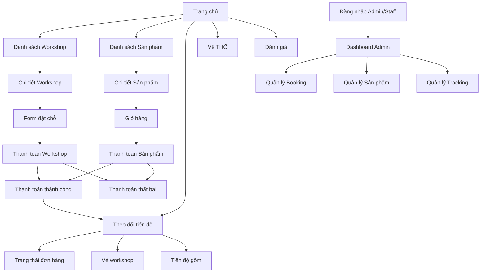

# CHƯƠNG 4. XÂY DỰNG SITEMAP, WIREFRAME, PROTOTYPE VÀ CASE STUDY

## 4.1. Mục tiêu thiết kế chương

Chương này trình bày quá trình xây dựng cấu trúc trải nghiệm người dùng cho website THỔ Studio, bao gồm sơ đồ phân cấp trang web, phác thảo wireframe, thiết kế prototype giao diện và case study mô tả luồng thao tác thực tế. Mục tiêu của chương là chứng minh hệ thống không chỉ dừng ở giao diện trình bày sản phẩm, mà còn tổ chức được một hành trình mua sắm, đặt workshop, thanh toán và theo dõi sản phẩm gốm sau workshop một cách liền mạch.

Website THỔ Studio được chia thành hai phân hệ chính. Phân hệ Storefront phục vụ khách hàng xem workshop, mua sản phẩm gốm, đặt lịch và theo dõi tiến độ. Phân hệ Dashboard phục vụ admin và nhân viên studio quản lý booking, cập nhật tiến độ sản phẩm, xử lý phản hồi và theo dõi các chỉ số vận hành.

Gợi ý chèn hình: Hình 4.1 - Tổng quan trang chủ THỔ Studio, dùng `figma-captures/desktop-home.png`.

## 4.2. Xây dựng Sitemap

Sitemap được xây dựng để mô tả cấu trúc phân cấp thông tin của toàn bộ hệ thống. Từ trang chủ, người dùng có thể đi tới các khu vực chính như Workshop, Sản phẩm, Theo dõi tiến độ, Về THỔ và Đánh giá. Các trang này tạo thành phần Storefront, nơi khách hàng thực hiện hầu hết các thao tác chính.

Ở nhánh Workshop, người dùng đi từ danh sách workshop đến trang chi tiết workshop. Tại đây, khách có thể xem thông tin lịch học, nghệ nhân phụ trách, số slot còn lại, giá vé và thực hiện đặt chỗ. Quy trình đặt chỗ hiện được tổ chức theo hướng rút gọn: khách nhập thông tin ở form booking, sau đó chuyển sang trang thanh toán để chọn phương thức thanh toán và bắt đầu thời gian giữ slot 15 phút.

Ở nhánh Sản phẩm, người dùng xem danh sách sản phẩm gốm, vào trang chi tiết sản phẩm, thêm sản phẩm vào giỏ hàng và đi tiếp đến checkout sản phẩm. Khác với workshop, sản phẩm vật lý cần địa chỉ giao hàng, phí vận chuyển và thông tin người nhận. Vì vậy hệ thống tách riêng logic checkout của workshop và sản phẩm để tránh lẫn nghiệp vụ.

Ở nhánh Theo dõi tiến độ, khách hàng nhập mã tra cứu để xem trạng thái đơn hàng, vé workshop hoặc tiến độ hoàn thiện sản phẩm gốm. Sau khi thanh toán thành công, hệ thống sinh mã tra cứu giúp khách quay lại kiểm tra tiến độ bất kỳ lúc nào.

Phân hệ Dashboard gồm các trang quản trị như Dashboard tổng quan, Quản lý booking, Quản lý sản phẩm và Quản lý tracking. Đây là khu vực nội bộ để nhân viên cập nhật trạng thái sản phẩm, xử lý các tình huống lỗi men/nứt lò, và theo dõi dữ liệu kinh doanh.

Gợi ý chèn hình: Hình 4.2 - Sitemap tổng quan Storefront và Dashboard. Có thể tự vẽ lại từ sơ đồ trong `doc/01_sitemap_wireframe.md`, hoặc dùng mermaid bên dưới để xuất ảnh.

## 4.3. Xây dựng Wireframe

Wireframe được dùng để xác định cấu trúc bố cục trước khi đi vào thiết kế giao diện chi tiết. Các wireframe tập trung vào cách phân bổ khu vực nội dung, vị trí CTA, thứ tự ưu tiên thông tin và điểm chạm chính trong từng màn hình.

### 4.3.1. Wireframe trang chủ

Trang chủ được thiết kế như điểm vào chính của trải nghiệm. Phần đầu trang gồm logo, thanh điều hướng, biểu tượng giỏ hàng và nút đặt lịch. Khu vực hero truyền tải tinh thần thương hiệu THỔ Studio thông qua hình ảnh/video về đất sét, nghệ nhân và quá trình tạo hình gốm. Bên dưới hero là các khu vực giới thiệu workshop, sản phẩm nổi bật, hành trình trải nghiệm tại THỔ và các lời kêu gọi hành động.

Trang chủ ưu tiên tạo cảm xúc và dẫn người dùng đến hai hành động chính: khám phá workshop hoặc xem sản phẩm gốm. Vì vậy, CTA được đặt ở vùng dễ nhìn, màu sắc tương phản nhưng vẫn đồng bộ với bảng màu đất nung.

Gợi ý chèn hình: Hình 4.3 - Wireframe/Prototype trang chủ desktop, dùng `figma-captures/desktop-home.png`. Nếu cần responsive, ghép thêm `tablet-home.png` và `mobile-home.png`.

### 4.3.2. Wireframe trang chi tiết workshop

Trang chi tiết workshop sử dụng bố cục hai cột trên desktop. Cột trái hiển thị ảnh lớn của workshop nhằm tạo cảm xúc trực quan. Cột phải hiển thị nội dung ra quyết định gồm tên workshop, mô tả, ngày học, khung giờ, nghệ nhân, số slot còn lại, giá vé và form đặt chỗ.

Thông tin số slot được đặt gần CTA để tạo tính cấp bách hợp lý. Form đặt chỗ chỉ yêu cầu các thông tin cần thiết như họ tên, số điện thoại hoặc email, số slot và ghi chú. Sau khi người dùng bấm "Thanh toán ngay", hệ thống chuyển sang trang thanh toán để chọn phương thức thanh toán và bắt đầu giữ slot 15 phút.

Gợi ý chèn hình: Hình 4.4 - Trang chi tiết workshop, dùng `figma-captures/desktop-workshop-detail.png`. Có thể cắt vùng form đặt chỗ và vùng thông tin slot để minh họa nghiệp vụ.

### 4.3.3. Wireframe giỏ hàng lai

Giỏ hàng lai được thiết kế để thể hiện tình huống người dùng có cả sản phẩm vật lý và vé workshop. Hai nhóm này có nghiệp vụ khác nhau nên giao diện cần phân tách rõ. Vé workshop liên quan đến số slot, thời hạn giữ chỗ và thanh toán nhanh. Sản phẩm vật lý liên quan đến số lượng hàng, tùy chọn quà tặng, custom brief, địa chỉ giao hàng và phí vận chuyển.

Trong wireframe, phần nội dung giỏ hàng nằm bên trái, phần tóm tắt đơn hàng nằm bên phải. Sidebar tóm tắt hiển thị tổng tiền và các CTA thanh toán riêng. Cách tổ chức này giúp người dùng hiểu rằng workshop và sản phẩm có thể cùng tồn tại trong hệ thống, nhưng khi thanh toán cần đi theo các luồng xử lý khác nhau.

Gợi ý chèn hình: Hình 4.5 - Giỏ hàng lai, dùng `figma-captures/desktop-cart.png`. Có thể cắt vùng sidebar tóm tắt để nhấn mạnh nút thanh toán tách luồng.

### 4.3.4. Wireframe màn hình tracker tiến độ

Màn hình tracker được thiết kế cho nhu cầu sau mua hàng và sau khi tham gia workshop. Người dùng nhập mã tra cứu để xem trạng thái hiện tại. Mã có thể đại diện cho đơn hàng sản phẩm, vé workshop hoặc sản phẩm gốm đang được hoàn thiện.

Khu vực nội dung chính của tracker gồm timeline tiến độ và thông tin chi tiết. Timeline mô tả các giai đoạn như đã thanh toán, chờ workshop, tạo hình, phơi khô, nung sơ, tráng men và hoàn thiện. Việc trình bày tiến độ theo từng bước giúp khách hàng cảm thấy sản phẩm của mình đang được theo dõi có trách nhiệm, thay vì chỉ nhận một thông báo giao hàng chung chung.

Gợi ý chèn hình: Hình 4.6 - Tracker tiến độ, dùng `figma-captures/desktop-tracking.png`. Nếu báo cáo có phần responsive, dùng thêm `mobile-tracking.png`.

### 4.3.5. Wireframe Dashboard Admin

Dashboard Admin được thiết kế cho nhóm vận hành nội bộ. Giao diện ưu tiên khả năng quét thông tin nhanh, xử lý booking, cập nhật trạng thái sản phẩm và theo dõi các cảnh báo chất lượng. Bố cục gồm thanh điều hướng, các thẻ chỉ số tổng quan, bảng dữ liệu booking/sản phẩm và khu vực cập nhật tracking.

Khác với Storefront, Dashboard không cần phong cách kể chuyện hay hero lớn. Giao diện cần gọn, rõ, nhiều thông tin nhưng vẫn dễ đọc. Các trạng thái quan trọng như chờ thanh toán, đã thanh toán, chờ check-in, đang nung, lỗi QC cần được mã hóa bằng badge màu để nhân viên thao tác nhanh.

Gợi ý chèn hình: Hình 4.7 - Dashboard Admin. Hiện thư mục `figma-captures` chưa có ảnh dashboard; nên mở route `/staff/dashboard` hoặc `/admin/dashboard` trên bản chạy web, chụp màn hình desktop và đặt tên `desktop-admin-dashboard.png`.

## 4.4. Thiết kế Prototype giao diện UI

Prototype UI được phát triển dựa trên tinh thần thủ công, ấm áp và chậm rãi của thương hiệu THỔ Studio. Bảng màu chủ đạo xoay quanh nền kem đất sét, nâu đất nung, vàng olive và cam terra cotta. Cách phối màu này giúp website tránh cảm giác thương mại quá mạnh, đồng thời vẫn đủ tương phản cho các CTA quan trọng.

Typography được chia thành hai nhóm. Nhóm tiêu đề dùng kiểu chữ có cảm giác nghệ thuật và giàu cá tính để gợi liên tưởng đến sản phẩm thủ công. Nhóm nội dung, form và bảng dữ liệu dùng kiểu chữ dễ đọc để hỗ trợ thao tác nhanh. Các thành phần giao diện như nút, card, badge, input và panel sử dụng bo góc vừa phải, không quá mềm để giữ cảm giác chuyên nghiệp.

Prototype cũng chú trọng micro-interaction. Card workshop và sản phẩm có trạng thái hover nhẹ. Nút CTA đổi màu khi rê chuột. Các bước trong tracker dùng trạng thái done/current/waiting để người dùng hiểu tiến độ chỉ bằng quan sát. Form checkout và modal QR thanh toán được thiết kế để giảm số bước, nhất là với booking workshop có giới hạn thời gian.

Gợi ý chèn hình: Hình 4.8 - Bộ màn hình prototype chính, có thể ghép 4 ảnh `desktop-home.png`, `desktop-workshop-detail.png`, `desktop-booking.png`, `desktop-tracking.png`.

### 4.4.1. Prototype trang chủ

Prototype trang chủ tập trung vào nhận diện thương hiệu và điều hướng nhanh. Người dùng có thể hiểu ngay THỔ Studio là nơi trải nghiệm gốm thủ công, có workshop và có sản phẩm gốm để mua. Các khối nội dung được sắp xếp theo thứ tự: giới thiệu thương hiệu, workshop nổi bật, sản phẩm nổi bật, hành trình trải nghiệm và thông tin hỗ trợ.

Gợi ý chèn hình: Hình 4.9 - Prototype trang chủ, dùng `figma-captures/desktop-home.png`.

### 4.4.2. Prototype chi tiết workshop và booking

Màn hình chi tiết workshop kết hợp giữa nội dung giới thiệu và form đặt chỗ. Người dùng không cần đi qua nhiều bước trung gian. Sau khi nhập thông tin và bấm thanh toán, dữ liệu được chuyển sang trang checkout. Tại checkout, người dùng chọn phương thức thanh toán, xem tổng tiền, kiểm tra thông tin đặt chỗ và nhìn thấy countdown giữ slot.

Gợi ý chèn hình: Hình 4.10 - Chi tiết workshop, dùng `figma-captures/desktop-workshop-detail.png`.
Gợi ý chèn hình: Hình 4.11 - Thanh toán workshop/QR countdown, dùng `figma-captures/desktop-booking.png`.

### 4.4.3. Prototype giỏ hàng và checkout sản phẩm

Giỏ hàng hỗ trợ cả sản phẩm thường, sản phẩm quà tặng và sản phẩm custom. Với sản phẩm vật lý, checkout yêu cầu địa chỉ giao hàng, thông tin liên hệ và phí vận chuyển. Giao diện giúp khách hàng phân biệt rõ đâu là phần thanh toán sản phẩm và đâu là phần thanh toán workshop.

Gợi ý chèn hình: Hình 4.12 - Giỏ hàng lai, dùng `figma-captures/desktop-cart.png`.

### 4.4.4. Prototype tracker tiến độ

Tracker là điểm khác biệt quan trọng của THỔ Studio. Thay vì kết thúc trải nghiệm sau khi thanh toán, hệ thống tiếp tục đồng hành với khách trong quá trình hoàn thiện sản phẩm. Mỗi trạng thái đều có mô tả rõ ràng, giúp khách hiểu sản phẩm đang ở đâu trong quy trình xưởng.

Gợi ý chèn hình: Hình 4.13 - Tracker tiến độ, dùng `figma-captures/desktop-tracking.png`.

### 4.4.5. Prototype Dashboard Admin

Dashboard Admin tập trung vào nghiệp vụ quản lý. Các màn hình cần hỗ trợ nhân viên xem danh sách booking, kiểm tra thanh toán, cập nhật trạng thái check-in, theo dõi sản phẩm sau workshop và xử lý phản hồi khách hàng. Trong báo cáo, dashboard nên được trình bày như bằng chứng rằng hệ thống có khả năng vận hành hai chiều: khách hàng nhìn thấy tracker, còn nhân viên có công cụ cập nhật tracker.

Gợi ý chèn hình: Hình 4.14 - Dashboard Admin, chụp từ `/staff/dashboard` hoặc `/admin/dashboard`.

## 4.5. Trình bày Case Study luồng mua sắm và booking

Case study thứ nhất mô tả hành trình khách hàng đặt workshop. Người dùng bắt đầu từ trang chủ, chọn mục Workshop, xem danh sách workshop và vào trang chi tiết. Sau khi đọc mô tả, xem ngày giờ, nghệ nhân và số slot còn lại, khách nhập thông tin đặt chỗ ngay trên form.

Khi khách bấm "Thanh toán ngay", hệ thống chuyển sang trang thanh toán workshop. Tại đây, khách kiểm tra lại thông tin, chọn phương thức thanh toán như MoMo hoặc VNPay, sau đó mở QR thanh toán. Countdown 15 phút bắt đầu ở bước thanh toán. Nếu khách hủy hoặc quá thời gian, slot được trả lại để người khác có thể đặt. Nếu thanh toán thành công, hệ thống tạo vé workshop, mã tra cứu và chuyển khách sang trang thành công.

Luồng này giải quyết hai vấn đề UX. Thứ nhất, người dùng không phải nhập quá nhiều thông tin trước khi thanh toán workshop. Thứ hai, thời gian giữ slot chỉ được kích hoạt khi khách thật sự vào bước thanh toán, tránh hiểu nhầm rằng chỉ cần nhập form là đã giữ chỗ.

Gợi ý chèn hình theo chuỗi:
Hình 4.15 - Danh sách workshop: `figma-captures/desktop-workshop.png`.
Hình 4.16 - Chi tiết workshop/form đặt chỗ: `figma-captures/desktop-workshop-detail.png`.
Hình 4.17 - Thanh toán QR/countdown: `figma-captures/desktop-booking.png`.
Hình 4.18 - Thanh toán thành công: `figma-captures/desktop-success.png`.

## 4.6. Trình bày Case Study luồng tracking sản phẩm

Case study thứ hai mô tả hành trình sau khi khách đã thanh toán và tham gia workshop. Sau buổi học, sản phẩm gốm của khách cần trải qua các công đoạn như tạo hình bổ sung, phơi khô, nung sơ, tráng men, nung hoàn thiện và kiểm tra chất lượng. Nếu không có tracker, khách hàng thường không biết sản phẩm của mình đang ở giai đoạn nào.

THỔ Studio giải quyết vấn đề này bằng trang theo dõi tiến độ. Khách nhập mã tra cứu và hệ thống hiển thị timeline. Mỗi bước có trạng thái riêng, mô tả ngắn và thông tin phụ trách. Khi nhân viên cập nhật trạng thái trong Dashboard, thông tin tương ứng được đồng bộ sang màn hình tracker của khách.

Trong trường hợp có lỗi vận hành như nứt lò hoặc lỗi men, hệ thống cần hiển thị thông báo phù hợp. Tracker không chỉ báo lỗi, mà còn đưa ra phương án hỗ trợ như liên hệ studio, hẹn làm lại hoặc đổi phương án xử lý. Điều này giúp trải nghiệm minh bạch hơn và giảm cảm giác bị bỏ rơi sau khi thanh toán.

Gợi ý chèn hình theo chuỗi:
Hình 4.19 - Trang tracking nhập mã/hiển thị timeline: `figma-captures/desktop-tracking.png`.
Hình 4.20 - Trang đánh giá sau khi nhận sản phẩm: `figma-captures/desktop-review.png`.
Hình 4.21 - Dashboard cập nhật tracking: chụp từ `/staff/tracking` hoặc `/admin/tracking`.

## 4.7. Bảng note hình ảnh đưa vào báo cáo

| Mã hình | Nội dung nên minh họa | File/route đề xuất | Ghi chú cắt ảnh |
|---|---|---|---|
| Hình 4.1 | Tổng quan trang chủ | `figma-captures/desktop-home.png` | Cắt hero + thanh điều hướng |
| Hình 4.2 | Sitemap Storefront & Dashboard | Mermaid trong mục 4.2 | Xuất ảnh từ Markdown/Mermaid |
| Hình 4.3 | Trang chủ responsive | `desktop-home.png`, `tablet-home.png`, `mobile-home.png` | Ghép 3 khung nếu cần chứng minh responsive |
| Hình 4.4 | Chi tiết workshop | `figma-captures/desktop-workshop-detail.png` | Cắt vùng ảnh lớn + thông tin slot |
| Hình 4.5 | Giỏ hàng lai | `figma-captures/desktop-cart.png` | Cắt vùng cart + sidebar tổng tiền |
| Hình 4.6 | Tracker tiến độ | `figma-captures/desktop-tracking.png` | Cắt timeline tiến độ |
| Hình 4.7 | Dashboard Admin | Chụp từ `/staff/dashboard` | Chưa có file capture sẵn trong repo |
| Hình 4.8 | Bộ prototype chính | Ghép `desktop-home.png`, `desktop-workshop-detail.png`, `desktop-booking.png`, `desktop-tracking.png` | Dùng làm hình tổng quan UI |
| Hình 4.9 | Trang chủ prototype | `figma-captures/desktop-home.png` | Cắt phần đầu trang |
| Hình 4.10 | Form đặt workshop | `figma-captures/desktop-workshop-detail.png` | Cắt form đặt chỗ |
| Hình 4.11 | Checkout QR/countdown | `figma-captures/desktop-booking.png` | Cắt modal QR hoặc khối thanh toán |
| Hình 4.12 | Giỏ hàng/checkout sản phẩm | `figma-captures/desktop-cart.png` | Cắt phần sản phẩm vật lý |
| Hình 4.13 | Tracker sau workshop | `figma-captures/desktop-tracking.png` | Cắt timeline và mã tra cứu |
| Hình 4.14 | Admin vận hành | Chụp từ `/admin/dashboard` | Dùng minh họa phân hệ nội bộ |
| Hình 4.15 | Danh sách workshop | `figma-captures/desktop-workshop.png` | Cắt bộ lọc + card workshop |
| Hình 4.16 | Chi tiết workshop | `figma-captures/desktop-workshop-detail.png` | Cắt phần thông tin lớp |
| Hình 4.17 | Thanh toán workshop | `figma-captures/desktop-booking.png` | Cắt QR + countdown |
| Hình 4.18 | Thanh toán thành công | `figma-captures/desktop-success.png` | Cắt mã đơn + vé workshop |
| Hình 4.19 | Tra cứu tiến độ | `figma-captures/desktop-tracking.png` | Cắt màn hình kết quả tracking |
| Hình 4.20 | Đánh giá | `figma-captures/desktop-review.png` | Cắt form review |
| Hình 4.21 | Staff cập nhật tracking | Chụp từ `/staff/tracking` | Dùng cho luồng đồng bộ tracker |

## 4.8. Kết luận chương

Thông qua sitemap, wireframe, prototype và case study, có thể thấy website THỔ Studio được thiết kế theo hướng lấy hành trình người dùng làm trung tâm. Storefront giúp khách hàng dễ dàng khám phá workshop, mua sản phẩm, thanh toán và theo dõi tiến độ. Dashboard giúp studio vận hành booking và cập nhật trạng thái sản phẩm sau workshop. Hai phân hệ này liên kết với nhau qua mã tra cứu và tracker, tạo nên trải nghiệm đầy đủ từ trước khi mua, trong khi thanh toán, đến sau khi sản phẩm được hoàn thiện.

